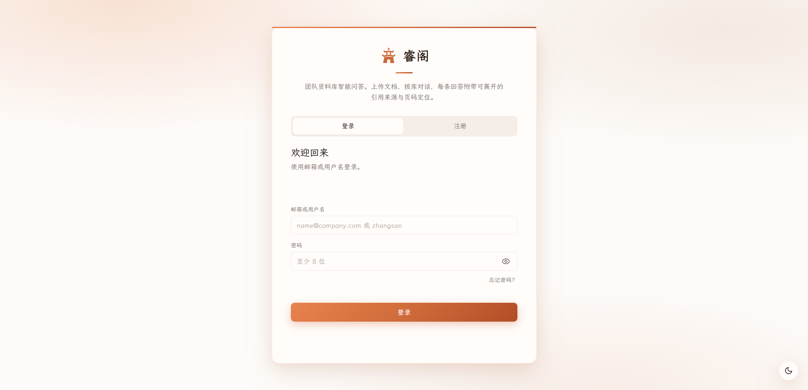
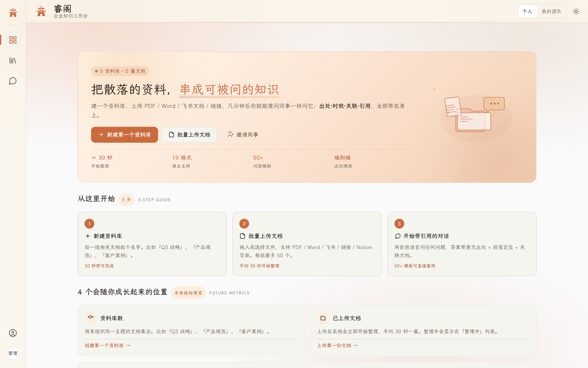
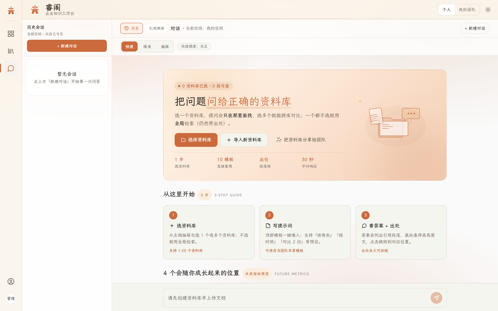
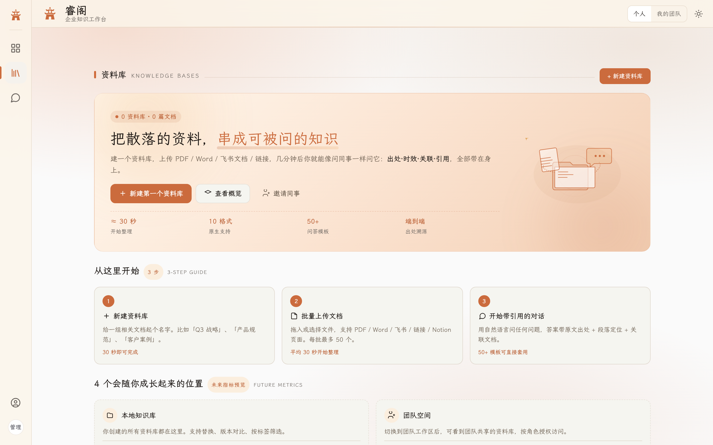
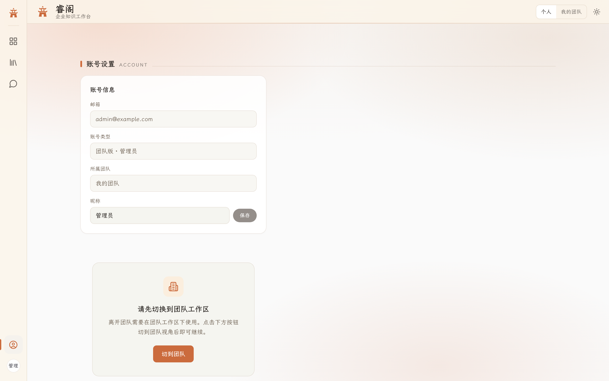

# 知岸 — RAG 知识平台

> 多格式文档上传 → 知识库对话 → **引用溯源**（文档名 + 章节 + 页码）
>
> 代码目录名 `rag-knowledge-platform`；产品对外称 **知岸**。

---

## 🖼️ 界面预览

| 登录页 | 仪表盘 | 智能问答 | 知识库列表 |
|:------:|:------:|:--------:|:----------:|
|  |  |  |  |
| **账号设置** | **组织成员** | **部门管理** | **组织设置** | **审计日志** |
|  |  |  |  |  |

---

## 🚀 核心功能

| 功能 | 说明 |
|------|------|
| 📄 **多格式文档上传** | 支持 PDF、TXT、MD、DOCX，自动解析 + 结构优先切片 |
| 🔍 **Hybrid 检索** | pgvector 向量检索 + PostgreSQL tsvector 全文检索 + RRF 融合排序 |
| 💬 **RAG 对话** | SSE 流式输出，带引用溯源（文档名 + 章节 + 页码） |
| 🛡️ **相关性门禁** | 无依据问题拒绝胡编，AC-4 安全策略保障回答可信 |
| 📊 **Dashboard 驾驶舱** | 知识库统计、文档状态、入库耗时、成功率一目了然 |
| 👥 **组织管理** | 企业版：成员管理、部门树、RBAC 角色权限矩阵 |
| 📝 **文档预览** | 在线预览 PDF/文本/Markdown，支持嵌入查看 |
| 🔐 **认证与安全** | JWT Bearer 中间件、渐进式锁屏、密码重置、审计日志 |
| ⚙️ **运维能力** | 降级熔断、重试机制、健康检查、Docker 一键部署 |
| 🧪 **评估体系** | Golden QA Hit@3 自动化、噪声鲁棒性测试、HyDE 基准测试 |

---

## 🧱 技术栈

| 层级 | 选型 |
|------|------|
| 后端框架 | Python 3.11+ / FastAPI |
| 数据库 | PostgreSQL 16 + pgvector |
| 异步任务 | FastAPI BackgroundTasks |
| 前端 | React 18 + TypeScript + Vite |
| UI 组件 | shadcn/ui + Tailwind CSS |
| 嵌入模型 | 通义嵌入 (text-embedding-v3) / Mock |
| 对话模型 | DeepSeek Chat (SSE 流式) |
| 检索 | Hybrid (pgvector + tsvector) + RRF 融合 |
| 切片策略 | 结构优先切片（章节/段落感知） |
| 容器化 | Docker Compose（PostgreSQL + API） |
| CI/CD | GitHub Actions（自动迁移 + pytest） |

详细架构见 [`docs/TECH.md`](docs/TECH.md)。

---

## 📁 仓库结构

```
rag-knowledge-platform/
├── backend/          # FastAPI 后端
│   ├── app/          # 应用代码（api / core / models / schemas / services）
│   ├── alembic/      # 数据库迁移
│   └── tests/        # pytest（含 Golden QA 评估）
├── frontend/         # React 前端（Vite + shadcn/ui）
├── docs/             # PRD、TECH、评估报告、设计文档
├── scripts/          # 部署脚本、验收测试脚本
├── docker/           # Nginx 配置、SSL、PostgreSQL
├── docker-compose.yml          # 生产栈：postgres + api
├── docker-compose.dev.yml      # 开发栈：仅 postgres
└── .env.example
```

---

## 🏗️ 快速开始

### 前置条件

- [Docker Desktop](https://www.docker.com/products/docker-desktop/)（Windows AMD64）
- 国内用户请先配置 Docker 镜像加速（见 `scripts/docker-engine.example.json`）

### 一键启动

```powershell
cd D:\MyPrograms\rag-knowledge-platform
.\scripts\docker-up.ps1
```

### 手动启动

```powershell
# 1. 配置环境变量
Copy-Item .env.example .env -ErrorAction SilentlyContinue

# 2. 预拉镜像
.\scripts\docker-pull.ps1

# 3. 构建并启动
docker compose up -d --build

# 4. 运行数据库迁移
docker compose exec api alembic upgrade head

# 5. 验收
curl http://localhost:8000/health
# → {"status":"ok","database":"ok"}
```

浏览器访问 <http://localhost:8000/docs> 查看 Swagger API 文档。

---

## 📊 Wave 进度

| Wave | 状态 | 功能描述 |
|------|------|----------|
| 0.1 | ✅ | 项目骨架、目录结构、`.env.example` |
| 0.2 | ✅ | Docker 栈 + `/health` 健康检查 |
| 0.3 | ✅ | Alembic 数据库迁移脚手架 |
| 0.4 | ✅ | pytest 骨架 + GitHub Actions CI |
| 1.1 | ✅ | 用户/组织/成员表 + 注册登录 API |
| 1.2 | ✅ | JWT Bearer 中间件 + RBAC 权限矩阵 |
| 1.3 | ✅ | 组织设置 API（admin 管理） |
| 2.1 | ✅ | 知识库 CRUD API + `require_kb_access` |
| 2.2 | ✅ | 文档 multipart 上传 + BackgroundTask 入库管道 |
| 2.3 | ✅ | 结构优先切片 + pgvector 向量写入 |
| 2.4 | ✅ | 文档预览 API（PDF/文本） |
| 2.5 | ✅ | Dashboard 统计 API |
| 3.1 | ✅ | RAG 对话 SSE（向量检索 + DeepSeek 流式） |
| 3.2 | ✅ | Citations 落库 `chat_messages` |
| 3.3 | ✅ | 无依据拒绝胡编（AC-4 相关性门禁） |
| 3.4 | ✅ | Hybrid RRF 检索（向量 + 全文 + kb_id 隔离） |
| 3.5 | ✅ | Golden QA + Hit@3 自动化评估 |
| 3.6 | ✅ | Multi-Query Expansion 多查询扩展 |
| 4.0 | ✅ | 前端全量重工（shadcn/ui 全面采用） |
| 4.1 | ✅ | 组织解散、部门管理、审计日志 |
| 4.2 | ✅ | Chat 反馈、安全过滤、降级熔断 |

---

## 📖 文档入口

| 文件 | 说明 |
|------|------|
| [`docs/PRD.md`](docs/PRD.md) | 产品需求文档 |
| [`docs/TECH.md`](docs/TECH.md) | 技术方案（架构/数据库/API 设计） |
| [`docs/DEPLOY.md`](docs/DEPLOY.md) | 生产/内网部署指南 |
| [`docs/DESIGN.md`](docs/DESIGN.md) | UI/UX 设计文档 |
| [`docs/API_FRONTEND_REFERENCE.md`](docs/API_FRONTEND_REFERENCE.md) | 前后端 API 对接参考 |
| [`docs/RAG_EVALUATION_REPORT.md`](docs/RAG_EVALUATION_REPORT.md) | RAG 检索评估报告 |
| [`docs/FULL_EVALUATION_REPORT.md`](docs/FULL_EVALUATION_REPORT.md) | 全量评估报告（Precision / F1 / NDCG / MAP） |
| [`docs/FINAL_15_INDICATOR_REPORT.md`](docs/FINAL_15_INDICATOR_REPORT.md) | 15 项核心指标报告 |
| [`docs/defense-spec.md`](docs/defense-spec.md) | 答辩防务规范 |
| [`docs/https-deployment.md`](docs/https-deployment.md) | HTTPS 部署指南 |
| [`AGENTS.md`](AGENTS.md) | AI 协作规则 |

---

## 🧪 评估指标

| 指标 | 数值 |
|------|------|
| Hit@3 | **100%** |
| Precision@5 | **0.95** |
| Recall@5 | **0.95** |
| F1@5 | **0.95** |
| MRR | **0.98** |
| NDCG@5 | **0.95** |
| MAP@5 | **0.93** |
| 平均检索延迟 | **~150ms** |

---

## 📜 许可证

毕业设计自用项目；未指定开源许可证前请勿公开传播 API Key 或 `.env`。

---

> **知岸** — 让知识有岸可依，让答案有据可查。
