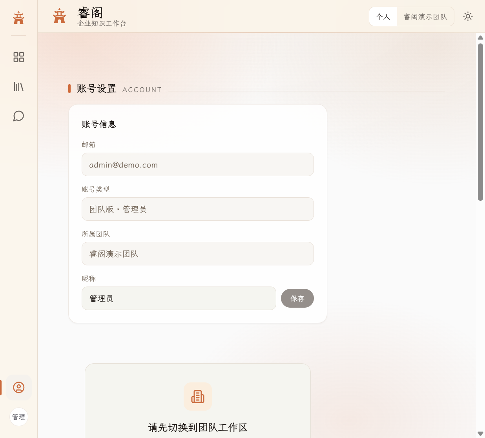
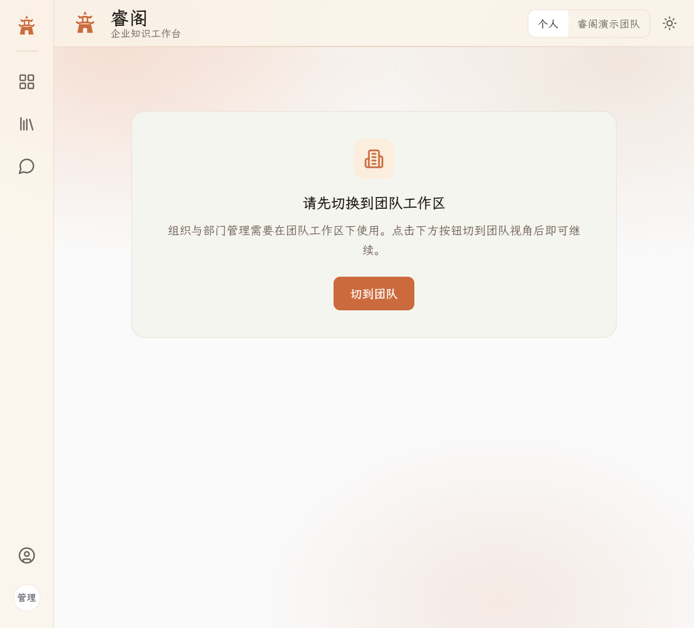
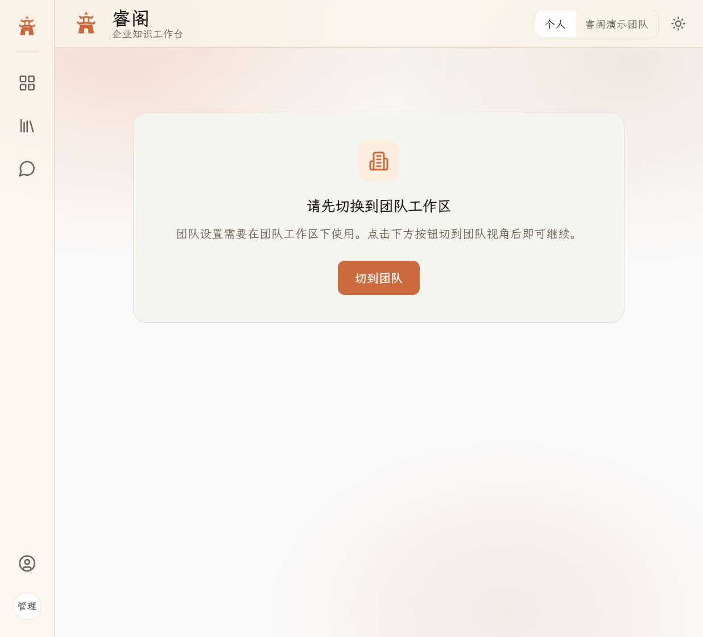

# 睿阁 — RAG 企业知识库平台

> 多格式文档上传 → 知识库对话 → **引用溯源**（文档名 + 章节 + 页码）
>
> 代码目录名 `rag-knowledge-platform`；产品对外称 **睿阁**。

---

## 🖼️ 界面预览

| | | | |
|:------:|:------:|:--------:|:----------:|
| **登录页** | **仪表盘** | **智能问答** | **资料库列表** |
|  |  |  |  |
| **账号设置** | **组织成员** | **部门管理** | **审计日志** |
|  |  |  |  |

---

## 🚀 核心功能

| 功能 | 说明 |
|------|------|
| 📄 **多格式文档上传** | 支持 PDF、TXT、MD、DOCX、XLSX、PPTX，自动解析 + 结构优先切片 |
| 🔍 **Hybrid 检索** | pgvector 向量检索 + PostgreSQL tsvector 全文检索 + **CJK 分词** + RRF 融合排序 |
| 💬 **RAG 对话** | SSE 流式输出，带引用溯源（文档名 + 段落 + 可点击跳转） |
| 🛡️ **无依据拒答** | AC-4 相关性门禁 + Prompt 注入防护，无依据问题拒绝胡编 |
| 📊 **驾驶舱** | 入库态势（实时四态）、存储健康、检索性能、Golden QA 评估 |
| 👥 **组织管理** | 企业版：成员管理（admin/member）、部门树、邀请码注册 |
| 📝 **文档预览** | 在线预览 PDF / 文本 / Markdown，XSS 防护（DOMPurify） |
| 🔐 **认证与安全** | JWT Bearer 中间件、渐进式登录限流、密码重置（SMTP）、审计日志 |
| ⚙️ **运维能力** | 降级熔断、重试机制、健康检查、Docker 一键部署 |
| 🧪 **评估体系** | Golden QA Hit@3 基线、15 项核心指标、噪声鲁棒性测试 |

---

## 🧱 技术栈

| 层级 | 选型 |
|------|------|
| 后端框架 | Python 3.11+ / FastAPI |
| 数据库 | PostgreSQL 16 + pgvector |
| 异步任务 | FastAPI BackgroundTasks（Semaphore 限并发） |
| 前端 | React 18 + TypeScript + Vite |
| UI | Tailwind CSS + shadcn/ui + 自定义 Design Token |
| 嵌入模型 | 通义 embedding（text-embedding-v3） |
| 对话模型 | DeepSeek Chat（SSE 流式） |
| 检索 | Hybrid（pgvector + tsvector）+ RRF 融合 + CJK 分词 |
| 切片策略 | 结构优先切片（章节/段落感知，heading-path 追踪） |
| 容器化 | Docker Compose（PostgreSQL + API + Nginx） |
| CI/CD | GitHub Actions（自动迁移 + pytest） |

详细架构见 [`docs/TECH.md`](docs/TECH.md)。

---

## 📁 仓库结构

```
rag-knowledge-platform/
├── backend/                    # FastAPI 后端
│   ├── app/
│   │   ├── api/                # 路由（auth / chat / documents / kb / search / admin）
│   │   ├── core/               # 配置、中间件、异常、重试、降级
│   │   ├── models/             # SQLAlchemy 模型
│   │   ├── schemas/            # Pydantic 序列化
│   │   └── services/           # 业务逻辑
│   │       ├── auth/           # 登录、注册、密码重置、限流
│   │       ├── documents/      # 上传、删除、清理、预览
│   │       ├── ingestion/      # 解析 → 切片 → 嵌入 → 写入
│   │       ├── knowledge_base/ # 资料库 CRUD + 唯一性
│   │       ├── rag/            # 检索 + 生成 + CJK 分词
│   │       ├── retrieval/      # Hybrid RRF 检索
│   │       └── search/         # 跨库搜索（文件名 + 正文）
│   ├── alembic/                # 数据库迁移（30+ 个版本）
│   └── tests/                  # pytest（含 Golden QA 评估）
├── frontend/                   # React 前端（Vite）
│   └── src/
│       ├── components/         # 组件（auth / chat / dashboard / kb / settings / ui）
│       ├── lib/                # API 客户端、hooks、工具函数
│       └── pages/              # 页面（Dashboard / Ask / Chat / Settings / Admin）
├── docs/                       # PRD、TECH、设计文档、评估报告、任务计划
├── docker/                     # Nginx 配置、Dockerfile
├── docker-compose.yml          # 生产栈：postgres + api
├── docker-compose.prod.yml     # 覆盖：前端 nginx + 持久卷
└── docker-compose.dev.yml      # 开发栈：仅 postgres
```

---

## 🏗️ 快速开始

### 前置条件

- [Docker Desktop](https://www.docker.com/products/docker-desktop/)（Windows AMD64）
- 国内用户请先配置 Docker 镜像加速（见 `scripts/docker-engine.example.json`）

### 一键启动

```powershell
cd D:\MyPrograms\rag-knowledge-platform
.\scripts\docker-up.ps1
```

### 手动启动

```powershell
# 1. 复制环境变量
Copy-Item .env.example .env

# 2. 预拉镜像（国内加速）
.\scripts\docker-pull.ps1

# 3. 构建并启动
docker compose up -d --build
docker compose -f docker-compose.yml -f docker-compose.prod.yml up -d --build

# 4. 运行数据库迁移
docker compose exec api alembic upgrade head

# 5. 验收
curl http://localhost:8000/health
# → {"status":"ok","database":"ok"}
```

浏览器访问 <http://localhost:5173>（Vite 开发服务器）或 <http://localhost>（Nginx 生产）。

### 本地开发

```powershell
# 后端（热重载）
cd backend
python -m venv venv
.\venv\Scripts\Activate.ps1
pip install -r requirements.txt
uvicorn app.main:app --reload --port 8000

# 前端
cd frontend
npm install
npm run dev  # → http://localhost:5173
```

---

## 🧪 测试账号

| 角色 | 用户名 | 密码 | 说明 |
|------|--------|------|------|
| 个人版 | `testuser_ui` | `Test@123456` | 个人空间，含脏数据测试 KB |
| 团队管理员 | `team_admin2` | `Team@123456` | 组织「测试团队」，可管理成员 |
| 团队成员 | `team_member` | `Team@123456` | 只读成员，可访问共享资料库 |

---

## 📊 迭代进度

| Wave | 状态 | 功能描述 |
|------|------|----------|
| 0–4 | ✅ | 项目骨架、Docker、数据库、CI、注册登录、JWT |
| 2.x | ✅ | 知识库 CRUD、文档上传、入库管道、预览、Dashboard |
| 3.x | ✅ | RAG 对话、Citations、AC-4、Hybrid RRF、Golden QA |
| 4.x | ✅ | 前端重工、组织管理、审计日志、安全过滤 |
| **企业化** | | |
| EW-A/B/C/D/E | ✅ | 审计日志、限流、状态机、引用失效 UX、存储清理 |
| R1–R5 | ✅ | 跨库搜索、重排序、检索评估、Anti-Abnormal |
| **抗异常** | | |
| Plan-3E | ✅ | 存储清盘、限流守卫、并发 ingestion 上限、CJK 分词 |
| Anti-XSS | ✅ | DOMPurify、Prompt 注入、Referrer 策略 |
| **视觉** | | |
| Design Rework | ✅ | 空态减法、账号设置重构、插画简化、下拉菜单统一、Portal 定位 |

---

## 📖 文档入口

| 文件 | 说明 |
|------|------|
| [`docs/PRD.md`](docs/PRD.md) | 产品需求文档（P1 节 = 企业 backlog） |
| [`docs/TECH.md`](docs/TECH.md) | 技术方案（架构/数据库/API/安全） |
| [`docs/DEPLOY.md`](docs/DEPLOY.md) | 生产/内网部署指南 |
| [`docs/DESIGN.md`](docs/DESIGN.md) | UI/UX 设计系统（Design Token） |
| [`docs/tasks/anti-abnormal-plan.md`](docs/tasks/anti-abnormal-plan.md) | 抗异常改进计划 |
| [`docs/tasks/MCP-排障手册.md`](docs/tasks/MCP-排障手册.md) | MCP 连接排障手册 |
| [`AGENTS.md`](AGENTS.md) | AI 协作规则 |

---

## 📜 许可证

本项目为自用项目，未指定开源许可证前请勿公开传播 API Key 或 `.env`。
