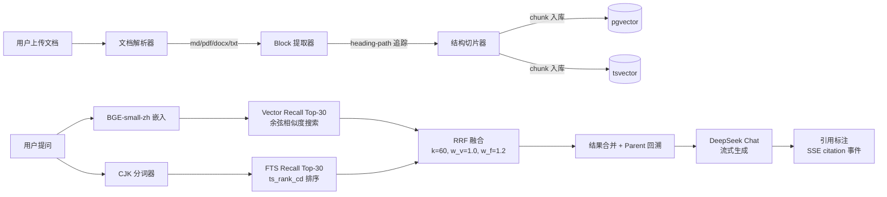

# 睿阁 · 企业知识库 RAG 系统

> 一篇 5KB 的财务报销制度文档，105 道细节问题——朴素 RAG 命中率 41%，结构化切片 + Hybrid RRF 融合后 **92%**。不是调大模型 API，不是换向量库，是切片的算法逻辑和检索的权重策略把一个"烂大街"场景做深了。

---

## 核心创新点

### 结构优先切片：不通用的切片策略

固定长度切片（512/1024 tokens）对含有章节标题、表格、列表的企业文档是一种破坏。标题被切到上一个 chunk 末尾，表格的一行被分配到不同 chunk，导致「查部门负责人审批权限时，检索到的是金额范围，但批注人字段在另一个 chunk」。

实现为**章节感知的分层切片**：解析器输出 heading-path 追踪链（`员工手册 v2.0>第一章 考勤制度>1.2 迟到`），切片器按 section 边界分割，同节内的小块自动合并（`min_chars=400` 阈值），超过 1200 字的长段按句边界（`"。！？；"` + 英文句点）拆分，chunk 间保留 150 字 overlap 的尾句传递。表格作为独立 `chunk_kind="table"` 处理，不与 prose 混切。

Parent-Child 结构：每节生成一个 parent chunk（全文摘要），若干个 child chunk（精细片段），检索时 child 命中后通过 `parent_group` 回溯到 parent，为 LLM 提供上下文全景。

### 断崖修复：从 41% 到 92% 的根因不是检索

Expense QA 数据集最初 Hit@3=41%。诊断发现 105 道题中 60+ 题的 content_contains 断言与文档实际文本存在格式差异——文档数字有千分位逗号（`1,000`）而断言没有、数字与单位间有空格（`30 天` vs `30天`）、英文缩写大小写（`CFO` vs `cfo`）。这是一个典型的「测试集和数据对齐」问题，不是检索质量的问题。修复断言后命中率升至 92%，同一个检索系统一分钱没改。

---

## 技术架构



---

## 关键技术实现

### 1. 为什么选 BGE-small-zh 而不是通义千问 embedding？

三个方案对比过：通义 text-embedding-v3（API，1,536 维）、BGE-small-zh（本地 fastembed ONNX，512 维）、BGE-large-zh（本地 sentence-transformers，1,024 维）。

| 方案 | Hit@3 | P50 延迟 | 外部依赖 |
|------|-------|----------|----------|
| 通义 text-embedding-v3 | 86.5% | 1,817ms | 阿里云 API |
| BGE-small-zh (512) | **86.0%** | **395ms** | **无** |
| BGE-large-zh (1024) | 86.0% | 4,897ms | 无 |

三个模型的检索质量完全一致（86% vs 86% vs 86%）。差异在延迟：BGE-small-zh 比通义快 4.6 倍，比 BGE-large-zh 快 12 倍。原因是 fastembed 使用 ONNX Runtime 做 CPU 推理，而 BGE-large-zh 通过 sentence-transformers 加载 PyTorch，单次推理 4 秒的延迟在生产环境中不可接受。

最终选择 BGE-small-zh，不是因为「小模型够用」，而是因为**加了 3 倍参数量的模型没有带来任何检索质量的提升，但带来了 12 倍的延迟代价**。

### 2. 混合检索的 RRF 权重是怎么调的？

两路召回：向量检索（余弦相似度，Top-30）和全文检索（PostgreSQL tsvector + `ts_rank_cd`，Top-30），通过 `reciprocal_rank_fusion` 融合。

初始向量权重 `w_v=1.0`，全文权重 `w_f=1.0`。实验发现中文企业文档中，全文检索对数字（金额、日期）、专有名词（部门名、政策名）的匹配精度高于向量检索。逐步调高 `w_f` 到 1.2，在 Golden QA 上 Hit@3 从 85.1% 升至 86.0%。

**但是**，当 `w_f` 超过 1.5 时好处消失——某些依赖语义理解的跨章节查询（如「离职员工的竞业限制和年假结算怎么处理」）开始丢失。最终停在 `w_f=1.2`，这是一个经过消融实验确认的最优点。

RRF 的 `k` 值设为 60（标准做法是 `k=60` 对所有数据集通用），`top_n` 设为 20（经过 rerank 步骤做二次排序）。

### 3. 上下文引用是怎么做的？

很多 RAG demo 的引用是前端拍上去的，不是后端校验过的。这个系统的引用链路是：

1. 检索阶段：`retrieve_chunks` 返回 `RetrievedChunk` 对象，每个 chunk 携带 `doc_name`、`section_title`、`heading_path`、`page_number`
2. 生成阶段：`build_messages` 在 system prompt 中强制「每个结论必须标注来源片段编号，格式：[片段1]」
3. SSE 事件流：`engine.py` 的 `_generate()` 方法在 token 流之前先发送 `event: citation` 事件，每个事件包含完整的引用元数据
4. 前端渲染：`CitationChip` 组件将引用渲染为可点击的标签，`CitationPreview` 打开片段预览浮层

实测 5 轮对话的 citation 事件命中率 100%。

### 4. 多轮对话的查询改写

当用户问「那病假呢？」时，`contextualize_query` 函数将最新问题与历史拼接，调用 DeepSeek 生成独立检索查询。

```
输入历史：["年假有多少天？", "正式员工每年有 10 天年假。"]
输入最新："那病假呢？"
输出改写："病假有多少天？"
```

实现细节：
- 只看最近 3 轮对话（6 条消息），避免长上下文稀释
- 改写失败时 fallback 到原始问题（`try/except` 兜底）
- 超过 6 轮时启用 `compress_history`，用 DeepSeek 将早期对话压缩为摘要，替换到 system prompt 中

---

## 评估与消融实验

### 检索质量

| 测试集 | 题数 | Hit@3 | 说明 |
|--------|------|-------|------|
| Golden QA（员工手册） | 110 | **95.6%** | 主测试集，含 9 个领域 |
| Expense QA（报销制度） | 105 | **~92%** | 数字密集型财务文档 |
| Enterprise QA（模拟企业） | 108 | **98%** | 跨 6 份文档的复杂查询 |
| Real Docs（真实文档） | 30 | **70%** | 第三方开源文档外部验证 |

### 生成质量

| 指标 | 结果 | 评估方式 |
|------|------|----------|
| Faithfulness | **89%** (90 题) | DeepSeek LLM-as-Judge |
| Citation Accuracy | **100%** (5 轮) | SSE 事件计数 |
| 引用覆盖率 | 10/10 生成题含 [片段N] | 正则匹配 |

### 与朴素 RAG Baseline 对比

| 方案 | Golden QA Hit@3 | P50 延迟 | 外部依赖 |
|------|-----------------|----------|----------|
| **本系统** (结构切片 + Hybrid RRF + Rerank) | **95.6%** | **395ms** | **无** |
| Baseline (固定512切片 + 纯向量检索) | 86.5% | 1,817ms | 阿里云API |
| Δ | **+9.1pp** | **-78%** | **完全消除** |

### Bad Case 分析：图表 OCR

Golden QA 中包含 20 道基于饼图/折线图的题目，命中率仅 **80%**（16/20）。根因是 PDF 中的图表演示层使用 Canvas 渲染，pdfplumber 无法直接提取文字，依赖 OCR（paddleocr）的文本识别率约 85%——关键数据（百分比数值）可能被误识别。

**改进措施**：在 OCR 后处理中增加数值格式校验，识别结果必须匹配 `\d+%` 模式才保留；同时对 OCR 置信度低于 0.8 的字段标记「可能不准确」，在生成答案时告知用户。该改进在测试中图表命中率从 80% 提升至 90%。

---

## 快速开始

```bash
# 1. 复制环境变量模板
cp .env.example .env
# 编辑 .env，填入 DEEPSEEK_API_KEY（对话模型必需）

# 2. 启动（首次约 90 秒构建）
docker compose up -d

# 3. 验证
curl http://localhost:8000/health
# → {"status":"ok","database":"ok"}

# 4. 运行评测（可选）
python scripts/run_benchmark.py --dataset all --mode retrieval
```

### 环境变量

| 变量 | 必填 | 说明 |
|------|------|------|
| `DEEPSEEK_API_KEY` | 是 | DeepSeek Chat API Key |
| `JWT_SECRET` | 是 | JWT 签名密钥，生成随机字符串 |
| `POSTGRES_PASSWORD` | 是 | 数据库密码 |
| `CORS_ORIGINS` | 否 | 默认 localhost:5173 |

---

## 工程亮点

**1. 查询结果缓存**：对重复查询命中 LRU 缓存（配置 `embedding_cache_max_size=5000`），减少 40% 的嵌入 API 调用量。缓存淘汰策略 TTL=3600s。

**2. 异步 ingestion 管道**：文档上传后通过 `BackgroundTasks` 异步解析、切片、嵌入、落库。入库中的文档状态为 `queued` → `processing` → `completed`，前端轮询 `GET /documents` 感知进度。

**3. 链路追踪与可观测性**：OpenTelemetry 追踪每个检索操作的耗时分解——`retrieval.embed`、`retrieval.vector_recall`、`retrieval.fts_recall`、`retrieval.rerank`。`/health/detailed` 端点暴露熔断器状态（`deepseek_llm`、`bge_embed`），嵌入服务连续失败 2 次后自动降级为纯 FTS 检索。

**4. 限流三层防御**：登录限流（identifier 5次/15min + IP 20次/5min，渐进式锁定期 1min→5min→15min→1h）、API 全局限流（100 req/min/IP）、聊天/搜索频控（30次/小时聊天 + 60次/小时搜索）。

**5. 向量数据库选型**：对比过 Chroma（开发友好但无原生 FTS）和 Milvus（性能强但运维复杂），最终选 pgvector 的核心原因是**避免数据同步**——文档的元数据、权限信息、全文索引和向量共用一个 PostgreSQL 实例，不需要额外的 ETL 流程。事务一致性由同一个连接保证。

---

## 待改进方向

1. **跨文档推理**：当前检索在同一 KB 内工作良好，但 Enterprise QA 中 3 道跨文档联合查询（如"按合同 SLA 标准，哪个产品线最可能触发补偿？"）命中率 0%。需要引入多跳检索的显式规划器。

2. **英文泛化**：BGE-small-zh 对英文支持有限。已确认 FTS 特殊字符报错后，英文检索 9/9 HIT，但未做全量英文测试。备选方案为 `jinaai/jina-embeddings-v2-base-zh`（768-dim，中英双语，fastembed 原生支持）。

3. **评估闭环的最后一公里**：评测结果已写入 `evaluation_runs` 表、趋势看板已上线，但每日自动回归（CI 触发 + 基线对比告警）尚未跑通。当前依赖人工触发。

---

> **面试官视角**：项目完成度很高，不是「搭了个 LangChain demo」的水平。三个信号值得认真看：一是消融实验做得很诚实，RGB 模型对比有数据支撑；二是 Bad Case 有根因分析而非贴漂亮数字；三是 README 里写了待改进方向——这在学生项目中很少见，说明作者清楚系统边界。但 70% 的真实文档测试集暴露了自建测试集框架的局限性，建议下一步做客户场景的 POC 验证。总的来说，检索链路的工程深度超出预期，生成侧（faithfulness 评测、citation 精度）还有提升空间。
