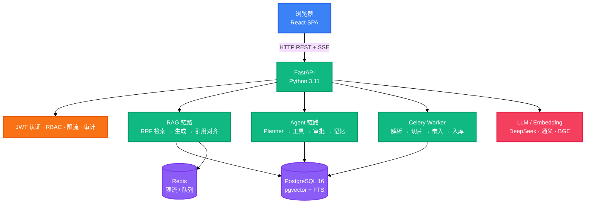

<h1 align="center">睿阁（Ruige）</h1>
<p align="center">
  <strong>企业级知识库 RAG 平台：从文档到答案，可溯源、可审计、可运营。</strong>
  <br />
  <em>多格式入库 · Hybrid 检索 · 引用溯源对话 · 企业权限与审计</em>
</p>

<p align="center">
  <a href="#快速开始"></a>
  <a href="https://github.com/1y4w1s/rag-knowledge-platform/actions/workflows/ci.yml"></a>
</p>

> 睿阁不是 ChatPDF 的平替，而是企业知识管理的基础设施：每个回答都附带文档名、章节位置和原文片段，无依据时明确拒答，不做黑盒问答。

---

## 功能特性

| 能力 | 说明 |
|------|------|
| 多格式入库 | PDF / DOCX / PPTX / XLSX / Markdown / TXT；扫描 PDF 走 OCR；按 `heading_path` 结构化切片，保留章节路径，`max_chars=1200` |
| Hybrid 检索 | pgvector（HNSW cosine，512 维）与 PostgreSQL FTS（tsquery）经 RRF 融合，权重 `w_v=1.0 / w_f=1.5`（2026-08-09 全矩阵扫参定档） |
| 引用溯源对话 | SSE 流式生成，终态按正文裁剪引用，杜绝「引用了片段但未给出」的幻觉；三级置信度 normal / low / refuse，无依据明确拒答 |
| 企业权限与审计 | 个人版 / 企业版，Owner / Admin / Member 与部门树；`kb_id` 注入所有查询，Member 写操作统一 403；50+ 审计事件可查询、可导出 |
| Agent 子系统 | 确定性 ThoroughReadPlanner（simple / standard / complex，1-3 步工具链）；11 个工具，写操作走审批，长期记忆 |
| 可观测与部署 | `/health` 三件套、手写 Prometheus 指标、OpenTelemetry 追踪、6 个熔断器与 L0-L4 显式降级；Docker Compose 内网 HTTP，非 root 容器 |

---

## 快速开始

### 前置条件

- Docker 与 Docker Compose
- 至少一个 LLM Key（DeepSeek 或通义）；嵌入默认走本地 BGE ONNX，无需 Key

### 克隆并配置

```bash
git clone https://github.com/1y4w1s/rag-knowledge-platform.git
cd rag-knowledge-platform

cat > .env <<'EOF'
JWT_SECRET=replace-with-a-long-random-string
CHAT_PROVIDER=deepseek
DEEPSEEK_API_KEY=sk-xxx            # 对话主链路（必填之一）
DEEPSEEK_BASE_URL=https://api.deepseek.com
DEEPSEEK_MODEL=deepseek-chat
TONGYI_API_KEY=                    # 备用 LLM + 嵌入（可选）
EMBEDDING_PROVIDER=bge             # bge=本地 ONNX（默认，零云依赖）；tongyi=云 API 备选
# EMBEDDING_MODEL=text-embedding-v2 # 仅 EMBEDDING_PROVIDER=tongyi 时使用
EOF
```

### 启动

```bash
docker compose -f docker-compose.yml -f docker-compose.prod.yml up -d --build
```

首次构建视机器而定，通常需要数分钟。API 服务监听 `8000`，前端入口为 `80`。

### 验证

```bash
curl http://localhost:8000/health
```

期望返回 `database: ok`（字段以实际响应为准）。浏览器访问 `http://localhost/` 打开完整前端。

---

## 使用方法

### 浏览器工作流

1. 打开 `http://localhost/` 并登录（企业版支持邀请码注册）。
2. 创建资料库，上传 PDF / Office / Markdown / TXT 文档。
3. 等待入库完成（Worker 异步解析、切片、嵌入）。
4. 发起对话，核对回答中的文档名、章节位置与原文片段；无依据时系统会明确拒答。

### 健康检查

```bash
curl http://localhost:8000/health
curl http://localhost:8000/health/detailed
```

`/health` 返回 database / redis / degradation 状态；`/health/detailed` 覆盖 embed、ocr、latency、disk、chat 等细项。

### 对话接口

对话走 SSE 流式：`POST /api/v1/knowledge-bases/{kb_id}/threads/{thread_id}/chat`，响应以流式事件返回引用与正文。核心接口见下方 API 章节。

---

## 架构


```mermaid
%%{init: {'theme': 'base', 'themeVariables': {'fontSize': '14px'}}}%%
graph TD
    A[浏览器<br/>React SPA] -->|HTTP REST + SSE| B[FastAPI<br/>Python 3.11]
    B --> C[JWT 认证 · RBAC · 限流 · 审计]
    B --> D[RAG 链路<br/>RRF 检索 → 生成 → 引用对齐]
    B --> E[Agent 链路<br/>Planner → 工具 → 审批 → 记忆]
    D --> F[(PostgreSQL 16<br/>pgvector + FTS)]
    D --> G[(Redis<br/>限流 / 队列)]
    E --> F
    B --> H[Celery Worker<br/>解析 → 切片 → 嵌入 → 入库]
    H --> F
    B --> I[LLM / Embedding<br/>DeepSeek · 通义 · BGE]

    classDef client fill:#3B82F6,stroke:#2563EB,color:#fff,stroke-width:2px
    classDef service fill:#10B981,stroke:#059669,color:#fff,stroke-width:2px
    classDef auth fill:#F97316,stroke:#EA580C,color:#fff,stroke-width:2px
    classDef data fill:#8B5CF6,stroke:#7C3AED,color:#fff,stroke-width:2px
    classDef external fill:#F43F5E,stroke:#E11D48,color:#fff,stroke-width:2px

    class A client
    class B service
    class C auth
    class D,E service
    class F,G data
    class H service
    class I external
```

系统按进程分三层：

- **API 进程**：处理实时对话、搜索与管理操作，不执行阻塞任务。
- **Worker 进程**：消费入库队列，大文件解析、OCR、嵌入异步执行。
- **DB + 向量**：PostgreSQL 16 / pgvector 统一存储元数据、全文索引与向量嵌入，Redis 承担限流与队列。

LLM / Embedding Key 仅存于服务端，前端不接触任何密钥。

---

## 核心设计决策

| 决策 | 现状 | 依据 |
|------|------|------|
| 切片 | 结构优先：按 `heading_path` 保留章节路径，而非固定长度窗口 | 固定窗口会打断段落、混合主题、丢失上下文 |
| 检索融合 | RRF 融合向量 + FTS，`w_f=1.5` | 2026-08-09 全矩阵扫参定档；企业文档精确匹配场景更关键 |
| 精排 | BGE reranker 默认关，仅排序歧义时条件触发 | 全量开 rerank 会打散已在 Top-3 的题，Hit@3 不升反跌 |
| 嵌入 | BGE-small-zh（ONNX CPU，512 维，P50 395ms） | 与通义 text-embedding-v2 同分（86%），快 4.6 倍且零云依赖 |
| 拒答 | 三级置信度 normal / low / refuse | 无依据必须拒答，禁止编造 |
| 多轮 | contextualize 改写 + 换题门闩（bigram Jaccard） | 同 thread 换主题自动清历史，避免跨题污染 |

贵能力按「题型 × 模式 × 分数信号」触发，用评测门禁证明收益后再扩默认面。

---

## 配置

| 变量 | 说明 | 默认 |
|------|------|------|
| `POSTGRES_PASSWORD` | PostgreSQL 密码；compose 必填，缺失即 fail-fast | 无 |
| `JWT_SECRET` | 会话签名密钥 | 无 |
| `CHAT_PROVIDER` | 主 LLM：`deepseek` / `tongyi` | `deepseek` |
| `DEEPSEEK_API_KEY` | 主链路 Key | 空 |
| `DEEPSEEK_BASE_URL` / `DEEPSEEK_MODEL` | 主链路地址与模型 | `api.deepseek.com` / `deepseek-chat` |
| `TONGYI_API_KEY` | 备用 LLM + 嵌入 | 空 |
| `EMBEDDING_PROVIDER` | `bge`（本地 ONNX）/ `tongyi` | `bge` |
| `GRAFANA_PASSWORD` | 监控登录密码（生产建议 ≥32 位随机字符） | 无 |

本地 `.env` 不入库；`scripts/init-secrets.ps1` 可在部署前校验密钥是否仍为占位符、权限是否受限。

---

## API（核心接口）

| Method | Path | 说明 |
|--------|------|------|
| GET | `/health` | 健康检查（database / redis / degradation） |
| POST | `/api/v1/auth/login` | 登录获取 JWT |
| POST | `/api/v1/knowledge-bases` | 创建资料库 |
| POST | `/api/v1/knowledge-bases/{kb_id}/documents` | 上传文档（multipart） |
| POST | `/api/v1/knowledge-bases/{kb_id}/threads` | 创建对话线程 |
| POST | `/api/v1/knowledge-bases/{kb_id}/threads/{thread_id}/chat` | 溯源对话（SSE 流式） |
| GET | `/api/v1/admin/audit-logs` | 审计日志（Admin，支持 CSV 导出） |
| GET | `/metrics` | Prometheus 指标（需 metrics token） |

---

## 项目结构

```
backend/
├── app/
│   ├── api/            # 路由层（≤200 行/文件）
│   ├── services/       # 业务层（认证 · 入库 · 检索 · 对话 · 审计 · 组织）
│   ├── models/         # SQLAlchemy ORM 模型
│   ├── schemas/        # Pydantic 请求/响应
│   └── core/           # 配置 · DB · Redis · 安全 · 熔断 · 可观测
└── tests/              # pytest（A 层门禁 + golden / 场景拆分）

frontend/
└── src/
    ├── pages/          # 页面组件
    ├── components/     # 业务组件（按域分目录）
    └── lib/            # API 客户端 · Hooks · Context
```

---

## 技术栈

| 层 | 技术 | 用途 |
|----|------|------|
| 后端 | FastAPI（Python 3.11）+ SQLAlchemy（async） | API 与数据访问 |
| 数据库 | PostgreSQL 16 + pgvector | 关系、向量、全文索引同实例 |
| 异步 | Celery + Redis | 入库队列，解析 / OCR / 嵌入异步执行 |
| 嵌入 | BGE-small-zh（ONNX CPU） | 零云依赖，512 维，P50 395ms |
| LLM | DeepSeek + 通义千问 | 双备熔断，Key 仅服务端 |
| 前端 | React 19 + Vite + TypeScript + Tailwind | 19 个页面，全懒加载 |
| 部署 | Docker Compose + Nginx | 非 root 容器，健康检查三板斧 |
| 可观测 | Prometheus + OpenTelemetry | 手写指标、追踪、告警 |

---

## 评测与质量门禁

| 测试集 | 题数 | Hit@3 | 说明 |
|--------|------|-------|------|
| Golden QA 硬门禁 | 11 | 11/11 | CI 强制，修改检索 / 入库必过（fixture 缺 GQ-9） |
| Golden QA 全量 | 109（测试展开 135 passed + 0 xfailed） | 通过 | GQ-1 ~ GQ-110（缺 GQ-9），只上不下 |
| Enterprise QA | 90 | 60%（CI mock）/ 71.1%（8/9 真向量 n=90） | CI 门禁基线 / 对外观测 |
| Advanced QA | 14 | 14/14 | 8/4 CI |
| CRAG English | 100 | 26% | 外部英文参考集，仅作参考 |

延迟数据来自本机 Docker 栈实测（2026-07-22）：检索端到端 P95 ≈1285ms（NW-54，SLO ≤2500ms）；对话 TTFT fast P95 ≈3125ms（NW-55，SLO ≤5000ms），thorough P50/P95 956/982ms（单次采样）。

规模（2026-08-10 实测）：后端业务 Python ≈3.3 万行（32,805 行，不含 tests）；前端源码 ≈2.9 万行（28,919 行）；后端测试 219 个 `test_*.py` 文件。CI 门禁含 Ruff、pytest A 层、Hit@3 Golden Gate、`alembic check`、config wiring 与 rag-benchmark（golden / enterprise / advanced 基线对比）。

---

## 部署

### Docker Compose

```bash
# API + Worker + 前端 web
docker compose -f docker-compose.yml -f docker-compose.prod.yml up -d --build

# 监控扩展（Prometheus + Grafana）
docker compose -f docker-compose.yml -f docker-compose.monitoring.yml up -d
```

默认面向内网 HTTP 部署，TLS 由客户侧反代负责；`/health` 返回 `database: ok` 视为部署就绪。CI 配置见 `.github/workflows/`（`ci.yml` / `benchmark.yml` / `regression.yml`）。

---

## 贡献

1. Fork 仓库并创建特性分支（`git checkout -b feat/xxx`）。
2. 提交使用 Conventional Commits（`feat:` / `fix:` / `test:` / `docs:`）。
3. 推送分支并提交 Pull Request。

详细流程见 [CONTRIBUTING.md](CONTRIBUTING.md)。改动检索、入库、模型或权限时，CI 的 Hit@3 Golden Gate 与 `alembic check` 会作为门禁把关。

---

## 许可证

本项目采用 MIT License。
