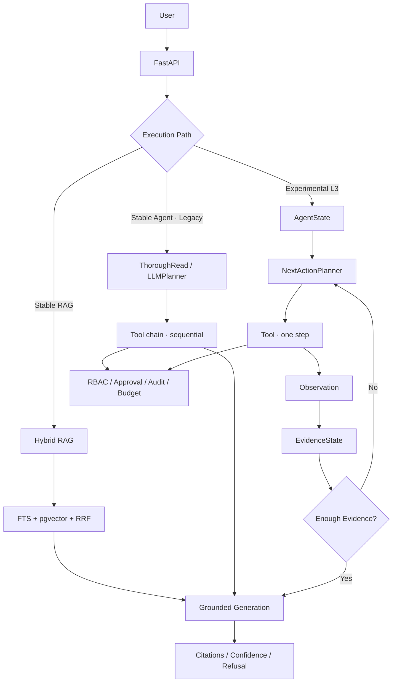

# 索隐 Suoyin

**An evaluation-driven, evidence-grounded Agentic RAG platform.**

从文档入库、Hybrid Retrieval、引用溯源，
到 Observation-driven Agent、权限治理、故障恢复与离线评测。

> Don't make the model do what the system can do better.

索隐不是一个「把向量数据库接到 LLM 上」的 RAG Demo。

它尝试回答一个更困难的问题：

**当检索失败、证据不完整、工具出错、问题需要多步调查时，
一个知识系统应该如何知道下一步该做什么，以及什么时候应该停止？**

<p align="center">
  <a href="#快速开始"></a>
  <a href="https://github.com/1y4w1s/rag-knowledge-platform/actions/workflows/ci.yml"></a>
  <a href="LICENSE"></a>
</p>

---

## Why Suoyin?

普通 RAG 链路大致是：

```text
Document → Chunk → Vector Search → LLM → Answer
```

这条链路在「一问一答、命中刚好够用」时很好用。
一旦出现下列情况，仅靠一次检索 + 一次生成就不够了：

```text
检索不到怎么办？
检索到了错误内容怎么办？
问题需要多个文档怎么办？
工具失败后怎么办？
什么时候该继续搜索？
什么时候证据已经足够？
什么时候应该拒答？
回答中的结论能不能回溯到证据？
Agent 为什么选择当前工具？
Agent 的轨迹如何评测？
```

索隐关注的是：

```text
Retrieval → Evidence → Decision → Action → Observation → Verification
```

设计取舍用一句话概括：

```text
If a database can remember it, don't ask the model to remember it.
If search can retrieve it, don't ask the model to guess it.
If policy can enforce it, don't ask a prompt to promise it.
If evaluation cannot prove its value, don't enable it by default.
```

---

## Core Capabilities

| Layer | Capability | Status |
|-------|------------|--------|
| Retrieval | PostgreSQL FTS + pgvector + RRF（`w_v=1.0 / w_f=1.5`） | Stable |
| Retrieval | 中英嵌入双列路由（BGE-zh 512 / BGE-en 384） | Stable |
| Retrieval | Conditional rerank / query rewrite / HyDE / Graph recall | Experimental（默认关） |
| Grounding | Citation alignment + confidence（normal / low / refuse） | Stable |
| Agent | ThoroughRead / LLM Planner + 11 tools + failure recovery + 写审批 | Stable |
| Agent | Observation-driven `NextActionPlanner`（L3） | Experimental（默认关） |
| Agent | Dynamic tool availability（`ToolResolver`） | Experimental（默认关） |
| Agent | `EvidenceState` + stop/retrieve gate | Experimental（结构已有；见边界） |
| Agent | Trajectory evaluation（acceptable-set，非 exact path） | Experimental |
| Agent | Critic → directed re-retrieval | Experimental（默认关） |
| Governance | RBAC / Approval / Audit / budget / breaker / rate limit | Stable |
| Memory | Working + long-term + importance / summary | Stable |
| Local-first | Local small-model capability amplification | Roadmap（benchmark target） |

**Agent autonomy is a capability, not a goal.**
功能实现 ≠ 功能应该默认启用。

---

## Observation-driven Agentic RAG（L3）

默认生产路径仍是受控的确定性 / LLM 规划（一次排出有限工具链，再顺序执行）。

L3 实验路径改成：

```text
Question
   ↓
AgentState
   ↓
NextActionPlanner
   ↓
AgentDecision
   ↓
Tool
   ↓
Observation
   ↓
EvidenceState
   ↓
NextActionPlanner
   ↓
...
```

**下一步行动可以由上一步 Observation 决定。**

Planner 的动作空间（见 `AgentActionKind`）：

```text
tool | finish | clarify | refuse
```

关键类型与模块：

| Contract | Role |
|----------|------|
| `AgentState` | L3 loop 单一状态源 |
| `NextActionPlanner` | 每步 `decide_next(state)` → 单步决策（无缓存整链） |
| `AgentDecision` | 单步动作 + reason_code |
| `Tool` / `ToolResolver` | 执行与依赖解锁（chunk/doc ID） |
| `Observation` | 压缩观察（禁止把完整 chunk/web 正文塞回 planner） |
| `EvidenceState` | 证据聚合与充分性布尔，驱动 stop/retrieve |

### Experimental by Design

L3 已进入代码树，但核心开关默认关闭：

```text
agent_l3_next_action_enabled        = False
agent_l3_dynamic_tools_enabled      = False
agent_l3_evidence_state_enabled     = False
agent_l3_trajectory_trace_enabled   = False
agent_l3_critic_retrieval_enabled   = False
rag_critic_enabled                  = False
```

这不是「忘了打开」，而是刻意的实验、灰度与回滚边界：

```text
Implementation → Tests → Offline Evaluation → Regression Check → Gray Rollout → Default Decision
```

---

## EvidenceState：已有结构，尚未 fact-level 闭环

`EvidenceState` 已包含：

```text
required_facts / covered_facts / missing_facts
chunk_ids / document_ids / contradictions
sufficient / confidence
```

当前 sufficiency 主要映射既有命中级判定（`check_evidence_sufficiency`：命中数、分数、文档多样性等），并在 flag 开启时驱动：

- 充分 → `finish`
- 不足却想 `finish` → 再检索或 `refuse`

**尚未完成**：成熟的 fact-level required / covered / missing 覆盖算法（`update_evidence_state` 明确保留 facts，覆盖逻辑另窗）。

下一阶段要从：

```text
「检索结果看起来足够相关」
```

升级到：

```text
「问题要求的关键事实是否全部获得证据支持」
```

例如：

```text
F1: 找到政策标准       ✅
F2: 找到适用范围       ✅
F3: 检查例外条件       ❌
F4: 排除冲突版本       ⚠️
```

此时 Agent 不应 `finish`，而应继续针对 F3 / F4 检索。

---

## Architecture


```mermaid
flowchart TD

    U[User] --> API[FastAPI]
    API --> ROUTER{Execution Path}

    ROUTER -->|Stable RAG| RAG[Hybrid RAG]
    ROUTER -->|Stable Agent · Legacy| LEGACY[ThoroughRead / LLMPlanner]
    ROUTER -->|Experimental L3| STATE[AgentState]

    RAG --> RET[FTS + pgvector + RRF]
    RET --> GEN[Grounded Generation]

    LEGACY --> LTOOL[Tool chain · sequential]
    LTOOL --> GEN

    STATE --> PLAN[NextActionPlanner]
    PLAN --> L3TOOL[Tool · one step]
    L3TOOL --> OBS[Observation]
    OBS --> EVID[EvidenceState]
    EVID --> GATE{Enough Evidence?}
    GATE -->|No| PLAN
    GATE -->|Yes| GEN

    GEN --> CITE[Citations / Confidence / Refusal]

    LTOOL --> POLICY[RBAC / Approval / Audit / Budget]
    L3TOOL --> POLICY
```

进程分层：API（实时）· Worker（入库异步）· PostgreSQL 16 + pgvector + Redis。LLM / Embedding Key 仅服务端。

---

## Engineering Philosophy

### Measure before enabling

```text
实现 → 测试 → Benchmark → Regression → 确认收益 → 再考虑抬默认
```

不要：

```text
论文里有 → 实现 → 默认打开
```

### Controlled autonomy

LLM 可以提出行动，但不能绕过系统边界。
权限、KB scope、写审批、审计、预算、熔断、限流由系统层保证，不靠 prompt「承诺」安全。

### Grounded over fluent

一个流畅但没有证据的答案，比明确拒答更糟。

```text
Evidence → Claim → Citation
```

优先于：

```text
Prompt → Plausible Answer
```

---

## Current Research Direction

### L4 — Evidence-Driven Local Intelligence

下一阶段重点不是 Multi-Agent 堆叠，而是：

```text
Fact decomposition
→ Evidence coverage
→ Missing-fact retrieval
→ Contradiction handling
→ Evidence-aware stopping
→ Local LLM benchmark
```

核心研究问题：

> **How far can systems engineering push a small local multimodal LLM？**
>
> 系统工程究竟能把一个本地小模型推到多远？

说明：

- Local-first / Local GLM 是 **Roadmap · benchmark target**，不是已交付的生产能力，也不是默认 chat 路径。
- 不以主观体验宣称「小模型已等价 frontier model」；是否抬默认只看可复现 benchmark。

---

## Evaluation

### Retrieval Golden QA（检索 Hit@3）

| 测试集 | 题数 | Hit@3 | 说明 |
|--------|------|-------|------|
| Retrieval Golden 硬门禁 | 11 | **11/11** | CI 强制（`GQ-1`…`GQ-12`，fixture 缺 `GQ-9`）；改检索 / 入库必过 |
| Retrieval Golden 全量 | 109 | 门禁通过 | `golden_qa.json`；`test_retrieval_golden.py` 展开 **135 passed + 0 xfailed** |
| Enterprise QA | 90（非拒答） | 60%（CI mock）/ 71.1%（真向量，2026-08-09，n=90） | CI 门禁基线 / 观测快照 |
| Advanced QA | 14（非拒答） | **14/14** | CI 基线 |
| 外部参考（CRAG sample / BEIR nfcorpus·fiqa·msmarco） | 100 / 323 / 648 / 6,980 | informational | 不参与门禁 |

延迟（本机 Docker，2026-07-22）：检索 P95 ≈1285ms（SLO ≤2500ms）；对话首 token fast P95 ≈3125ms、thorough P50/P95 956/982ms（SLO ≤5000ms）。

### Agent Golden QA（工具 / 行为契约）

| 测试集 | 题数 | 说明 |
|--------|------|------|
| Agent Golden | **168** | `golden_agent_qa.json`（150 + E5 18）；九类：RAG / RETRIEVAL / ADVERSARIAL / TOOL / MULTI_STEP / REFLECTION / MEMORY / AUTH / DEGRADE |
| L3 Trajectory | 用例集（acceptable-set） | `tests/agent_trajectory/`；**不**替换上述 168 题 golden |

> Agent trajectory does not need to match one unique golden path.
> 评估的是：是否以合理行动和合理成本完成任务。

Scorer：Task Success · Tool Selection · Stop Accuracy · Dependency · Redundant Tool · Steps。

Local LLM / Local vs Cloud / Agentic 对比矩阵：**TBD**（Roadmap benchmark target，不猜测数字）。

CI：`ci.yml`（Ruff、pytest A 层、Hit@3 Retrieval Golden Gate、`alembic check`、config wiring）、`benchmark.yml`、`regression.yml`。

---

## What Suoyin Is Not

索隐目前不是：

- 基础模型训练项目
- 已大规模生产验证的商业 SaaS
- 为堆叠 Agent / Graph / MCP 名词而存在的 Demo
- 追求无限 Agent 自主性的框架

定位：

> **A continuously evaluated Agentic RAG system built around retrieval quality, evidence grounding, constrained actions and reproducible experiments.**

---

## Roadmap

### L3 — Observation-driven Agent

- [x] State contracts（`AgentState` / `AgentDecision` / `Observation` / `EvidenceState`）
- [x] `NextActionPlanner`
- [x] Observation loop（runtime）
- [x] Dynamic tools（`ToolResolver`）
- [x] Evidence stop/retrieve gate（命中级 sufficiency）
- [x] Trajectory evaluation（acceptable-set）
- [x] Critic → directed retrieval（flag 关）
- [ ] Benchmark-based rollout（抬默认前的复测矩阵）

### L4 — Evidence-Driven Local Intelligence

- [ ] FactGoal / Fact decomposition
- [ ] Fact-level evidence coverage（required / covered / missing 闭环）
- [ ] Missing-fact retrieval
- [ ] Contradiction handling（结构已有，策略未闭环）
- [ ] Evidence-aware stop policy（fact 级）
- [ ] Local LLM / Local GLM benchmark（Roadmap target；非已交付）
- [ ] Local vs Cloud evaluation matrix

---

## 核心设计决策（Stable RAG）

| 决策 | 现状 | 依据 |
|------|------|------|
| 切片 | 结构优先：按 `heading_path` 保留章节路径，`max_chars=1200` | 固定窗口会打断段落、混合主题 |
| 检索融合 | RRF 融合向量 + FTS，`w_f=1.5` | 2026-08-09 全矩阵扫参定档 |
| 精排 | BGE reranker 默认关，仅排序歧义时条件触发 | 全量开 rerank 曾打散 Top-3，Hit@3 不升反跌 |
| 嵌入 | 中英双列：BGE-small-zh（512）+ BGE-small-en（384） | 与通义 text-embedding-v2 同分量级，更快且零云依赖 |
| 拒答 | 三级置信度 normal / low / refuse | 无依据必须拒答 |
| 多轮 | contextualize 改写 + 换题门闩 | 同 thread 换主题清历史，避免跨题污染 |
| 图谱召回 | 实体 / 关系抽取保留，召回默认关 | A/B 无提升已回滚 |

各能力按「题型 × 模式 × 分数信号」触发，先过评测门禁，再扩大默认面。

---

## 快速开始

### 前置条件

- Docker 与 Docker Compose
- 至少一个 LLM Key（DeepSeek 或通义）；嵌入默认走本地 BGE ONNX，无需 Key
- 首次入库会自动下载本地 BGE 嵌入模型，需可访问 Hugging Face 镜像

### 克隆并配置

```bash
git clone https://github.com/1y4w1s/rag-knowledge-platform.git
cd rag-knowledge-platform

cat > .env <<'EOF'
POSTGRES_PASSWORD=replace-with-a-strong-password  # compose 必填
JWT_SECRET=replace-with-a-long-random-string
CHAT_PROVIDER=deepseek
DEEPSEEK_API_KEY=sk-xxx            # 对话主链路（必填之一）
DEEPSEEK_BASE_URL=https://api.deepseek.com
DEEPSEEK_MODEL=deepseek-chat
TONGYI_API_KEY=                    # 备用 LLM + 嵌入（可选）
EMBEDDING_PROVIDER=bge             # bge=本地 ONNX（默认，零云依赖）；tongyi=云 API 备选
# EMBEDDING_MODEL=text-embedding-v2 # 仅 EMBEDDING_PROVIDER=tongyi 时使用
EOF
```

### 启动

```bash
docker compose -f docker-compose.yml -f docker-compose.prod.yml up -d --build
```

首次构建视机器而定，通常需要数分钟。API 服务监听 `8000`，前端入口为 `80`。

### 验证

```bash
curl http://localhost:8000/health
```

期望返回 `database: ok`（字段以实际响应为准）。浏览器访问 `http://localhost/` 打开完整前端。

---

## 使用方法

### 浏览器工作流

1. 打开 `http://localhost/` 并登录（企业版支持邀请码注册）。
2. 创建资料库，上传 PDF / Office / Markdown / TXT 文档。
3. 等待入库完成（Worker 异步解析、切片、嵌入）。
4. 发起对话，核对回答中的文档名、章节位置与原文片段；无依据时系统会明确拒答。

### 健康检查

```bash
curl http://localhost:8000/health
curl http://localhost:8000/health/detailed
```

`/health` 返回 database / redis / degradation 状态；`/health/detailed` 覆盖 embed、ocr、latency、disk、chat 等细项。

### 对话接口

对话走 SSE 流式：`POST /api/v1/knowledge-bases/{kb_id}/threads/{thread_id}/chat`，响应以流式事件返回引用与正文。

---

## 配置

| 变量 | 说明 | 默认 |
|------|------|------|
| `POSTGRES_PASSWORD` | PostgreSQL 密码；compose 必填，缺失即 fail-fast | 无 |
| `JWT_SECRET` | 会话签名密钥 | 无 |
| `CHAT_PROVIDER` | 主 LLM：`deepseek` / `tongyi` | `deepseek` |
| `DEEPSEEK_API_KEY` | 主链路 Key | 空 |
| `DEEPSEEK_BASE_URL` / `DEEPSEEK_MODEL` | 主链路地址与模型 | `https://api.deepseek.com` / `deepseek-chat` |
| `TONGYI_API_KEY` | 备用 LLM + 嵌入 | 空 |
| `EMBEDDING_PROVIDER` | `bge`（本地 ONNX）/ `tongyi` | `bge` |
| `GRAFANA_PASSWORD` | 监控登录密码（生产建议 ≥32 位随机字符） | 无 |

本地 `.env` 不入库；`scripts/init-secrets.ps1` 可在部署前校验密钥是否仍为占位符、权限是否受限。

实验性 Agent / Critic 开关见 `backend/app/core/config.py`（`agent_l3_*`、`rag_critic_enabled` 等），**默认均为关**。

---

## API（核心接口）

| Method | Path | 说明 |
|--------|------|------|
| GET | `/health` | 健康检查（database / redis / degradation） |
| POST | `/api/v1/auth/login` | 登录获取 JWT |
| POST | `/api/v1/knowledge-bases` | 创建资料库 |
| POST | `/api/v1/knowledge-bases/{kb_id}/documents` | 上传文档（multipart） |
| POST | `/api/v1/knowledge-bases/{kb_id}/threads` | 创建对话线程 |
| POST | `/api/v1/knowledge-bases/{kb_id}/threads/{thread_id}/chat` | 溯源对话（SSE 流式） |
| GET | `/api/v1/admin/audit-logs` | 审计日志（Admin，支持 CSV 导出） |
| GET | `/metrics` | Prometheus 指标（需 metrics token） |

---

## 项目结构

```
backend/
├── app/
│   ├── api/            # 路由层（≤200 行/文件）
│   ├── services/       # 业务层（认证 · 入库 · 检索 · 对话 · Agent · 审计）
│   │   └── agent/      # Planner / runtime / tools / EvidenceState / memory
│   ├── models/         # SQLAlchemy ORM 模型
│   ├── schemas/        # Pydantic 请求/响应
│   └── core/           # 配置 · DB · Redis · 安全 · 熔断 · 可观测
└── tests/              # pytest（A 层门禁 + golden / trajectory / 场景拆分）

frontend/
└── src/
    ├── pages/          # 页面组件
    ├── components/     # 业务组件（按域分目录）
    └── lib/            # API 客户端 · Hooks · Context
```

---

## 技术栈

| 层 | 技术 | 用途 |
|----|------|------|
| 后端 | FastAPI（Python 3.11）+ SQLAlchemy（async） | API 与数据访问 |
| 数据库 | PostgreSQL 16 + pgvector | 关系、向量、全文索引同实例 |
| 异步 | Celery + Redis | 入库队列，解析 / OCR / 嵌入异步执行 |
| 嵌入 | BGE-small-zh（ONNX CPU）+ BGE-small-en | 中英双列（512 / 384 维），零云依赖 |
| LLM | DeepSeek + 通义千问 | 双备熔断，Key 仅服务端 |
| 前端 | React 19 + Vite + TypeScript + Tailwind | 全懒加载 |
| 部署 | Docker Compose + Nginx | 非 root 容器，健康检查三件套 |
| 可观测 | Prometheus + OpenTelemetry | 自研指标、追踪、告警 |

---

## 部署

### Docker Compose

```bash
# API + Worker + 前端 web
docker compose -f docker-compose.yml -f docker-compose.prod.yml up -d --build

# 监控扩展（Prometheus + Grafana）
# 需先在 .env 设置 GRAFANA_PASSWORD，否则 compose 会 fail-fast
docker compose -f docker-compose.yml -f docker-compose.monitoring.yml up -d
```

默认面向内网 HTTP 部署，TLS 由客户侧反代负责；`/health` 返回 `database: ok` 视为部署就绪。

---

## 贡献

1. Fork 仓库并创建特性分支（`git checkout -b feat/xxx`）。
2. 提交使用 Conventional Commits（`feat:` / `fix:` / `test:` / `docs:`）。
3. 推送分支并提交 Pull Request。

详细流程见 [CONTRIBUTING.md](CONTRIBUTING.md)。改检索 / 入库须过 **Retrieval** Hit@3 Golden Gate；改 Agent 行为须关注 Agent Golden（168）与 trajectory；模型 / 权限变更另过 `alembic check`。开启任何 `agent_l3_*` 默认前须双轨回归。

---

## 许可证

本项目采用 MIT License。
