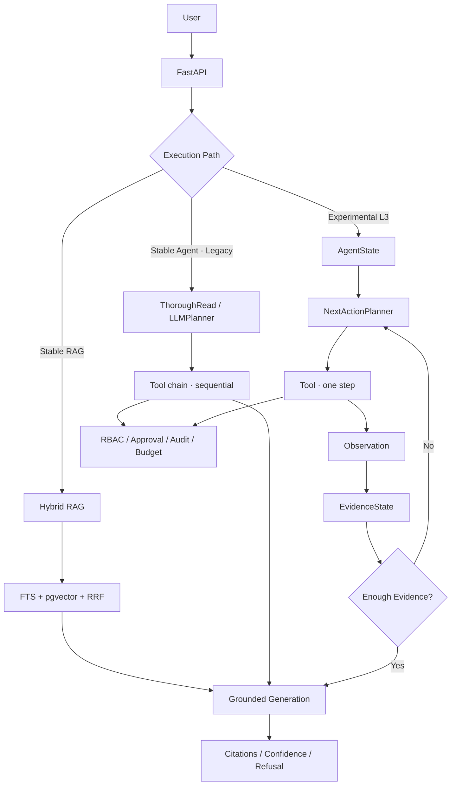

# 索隐 Suoyin

**An evaluation-driven, evidence-grounded Agentic RAG platform.**

企业知识库：多格式入库 → Hybrid Retrieval → 引用溯源对话；
在受控 Agent 路径上，用 Observation、证据状态与权限边界处理多步调查与失败恢复。

> Don't make the model do what the system can do better.

索隐不是「向量库 + LLM」的 Naive RAG Demo。
它要回答的是更难的问题：

**当检索失败、证据不完整、工具出错、问题需要多步调查时，
系统如何决定下一步做什么，以及何时应该停止或拒答？**

<p align="center">
  <a href="#快速开始"></a>
  <a href="https://github.com/1y4w1s/rag-knowledge-platform/actions/workflows/ci.yml"></a>
  <a href="LICENSE"></a>
</p>

```text
IMPLEMENTED  ≠  VALIDATED
VALIDATED    ≠  DEFAULT
Measurement on a bounded scope  ≠  general capability proof
```

治理契约（非能力清单）：
[`Feature Admission Constitution`](docs/project/feature-admission-constitution.md) ·
[`V1.0 Release Cut Line`](docs/project/v1-0-release-cut-line.md)

---

## Why Suoyin?

普通 RAG 链路大致是：

```text
Document → Chunk → Vector Search → LLM → Answer
```

一问一答、命中刚好够用时这条链路很好用。一旦出现下列情况，仅靠一次检索 + 一次生成就不够了：

```text
检索不到 / 检索到错误内容怎么办？
问题需要多个文档怎么办？
工具失败后怎么办？
什么时候该继续搜索、证据已足够、或应该拒答？
结论能否回溯到证据？Agent 轨迹如何评测？
```

索隐关注的闭环是：

```text
Retrieval → Evidence → Decision → Action → Observation → Verification
```

设计取舍：

```text
If a database can remember it, don't ask the model to remember it.
If search can retrieve it, don't ask the model to guess it.
If policy can enforce it, don't ask a prompt to promise it.
If evaluation cannot prove its value, don't enable it by default.
```

---

## What makes it Agentic RAG (vs Naive RAG)

Naive RAG 把「检索一次 → 生成一次」当作完整产品。
索隐在此之上增加了**可开关、可评测、默认可回滚**的系统层能力：

| Differentiator | 今日状态 | 说明 |
|----------------|----------|------|
| Hybrid retrieval（PG FTS + pgvector + RRF） | **DEFAULT ON** · MEASURED（CI Hit@3） | 非 Okapi BM25；lexical 腿是 PostgreSQL `tsvector` / `ts_rank_cd` |
| Citation / provenance + confidence（normal / low / refuse） | **DEFAULT ON** · P0 | 无依据须拒答；引用须可回溯 |
| Legacy Agent（ThoroughRead / LLMPlanner + 11 tools） | **DEFAULT ON** · IMPLEMENTED | 稳定交付路径；Agent Golden **存在但不阻塞 PR CI** |
| Observation-driven L3 loop（`NextActionPlanner`） | **EXPERIMENTAL** · **DEFAULT OFF** | 代码已实现；抬默认前须双轨回归 |
| Explicit `EvidenceState` + stop/retrieve gate | **EXPERIMENTAL** · gate **DEFAULT OFF** | 命中级 sufficiency 可用；fact-level 覆盖 **未闭环** |
| Dynamic tool unlock（`ToolResolver`） | **EXPERIMENTAL** · **DEFAULT OFF** | |
| Critic → directed re-retrieval（W9） | **EXPERIMENTAL** · **DEFAULT OFF** · runtime rollout **NO** | 有实现与研究证据；**≠** 通用语义 Critic 质量证明 |
| Trajectory / golden / Formal research artifacts | **MEASURED / PARTIAL**（按套件） | 记录成功，也记录为何不可升级为更强 claim |
| RBAC / approval / audit / budget / breaker / rate limit | **DEFAULT ON** · IMPLEMENTED | 系统边界，不靠 prompt「承诺」安全 |
| Memory store / window / importance / summary | **IMPLEMENTED（infra）** · master ON | **≠** memory intelligence 已验证（见下） |

每一个不同点都必须能对应到代码、配置默认值、测试或规范证据；仅「听起来像 Agent」不算。

---

## Core architecture / loop


```mermaid
flowchart TD

    U[User] --> API[FastAPI]
    API --> ROUTER{Execution Path}

    ROUTER -->|Stable RAG| RAG[Hybrid RAG]
    ROUTER -->|Stable Agent · Legacy| LEGACY[ThoroughRead / LLMPlanner]
    ROUTER -->|Experimental L3| STATE[AgentState]

    RAG --> RET[FTS + pgvector + RRF]
    RET --> GEN[Grounded Generation]

    LEGACY --> LTOOL[Tool chain · sequential]
    LTOOL --> GEN

    STATE --> PLAN[NextActionPlanner]
    PLAN --> L3TOOL[Tool · one step]
    L3TOOL --> OBS[Observation]
    OBS --> EVID[EvidenceState]
    EVID --> GATE{Enough Evidence?}
    GATE -->|No| PLAN
    GATE -->|Yes| GEN

    GEN --> CITE[Citations / Confidence / Refusal]

    LTOOL --> POLICY[RBAC / Approval / Audit / Budget]
    L3TOOL --> POLICY
```

进程分层：API（实时）· Worker（入库异步）· PostgreSQL 16 + pgvector + Redis。
LLM / Embedding Key 仅服务端。

**默认生产路径**仍是 Stable Hybrid RAG，以及受控的 Legacy Agent（一次排出有限工具链再顺序执行）。
L3 实验路径（全部 flag 默认关）才是 Observation 驱动的逐步决策：

```text
Question → AgentState → NextActionPlanner → AgentDecision
        → Tool → Observation → EvidenceState → NextActionPlanner → …
```

动作空间（`AgentActionKind`）：`tool | finish | clarify | refuse`。

---

## Current capability maturity

状态词汇（与治理契约一致）：

| Label | Meaning |
|-------|---------|
| **DEFAULT ON** | 当前默认交付路径 |
| **DEFAULT OFF** | 实现可开关，默认关闭 |
| **IMPLEMENTED** | 代码存在并可调用 |
| **PARTIAL** | 结构/路径不完整或未闭环 |
| **EXPERIMENTAL** | 研究/灰度表面；勿当作生产默认 |
| **MEASURED** | 有可复现、有范围的测量结果 |
| **NOT_APPLICABLE** | 按授权协议不计入分母（≠ PASS/FAIL） |
| **POST-V1.0** | 明确不在 v1.0 发布面 |

| Layer | Capability | Maturity |
|-------|------------|----------|
| Retrieval | PG FTS + pgvector + RRF（`w_v=1.0 / w_f=1.5`） | **DEFAULT ON** · MEASURED（CI Hit@3） |
| Retrieval | 中英嵌入双列（BGE-zh 512 / BGE-en 384） | **DEFAULT ON** · IMPLEMENTED |
| Retrieval | Conditional rerank / query rewrite / HyDE | **IMPLEMENTED / PARTIAL** · **DEFAULT OFF** · 无 ablation 前不宣称质量提升 |
| Retrieval | Graph recall | 代码保留 · **rolled back** · **DEFAULT OFF** · **NOT productized GraphRAG** |
| Grounding | Citation alignment + confidence（normal / low / refuse） | **DEFAULT ON** · IMPLEMENTED |
| Agent | ThoroughRead / LLM Planner + 11 tools + failure recovery + 写审批 | **DEFAULT ON** · IMPLEMENTED |
| Agent | Observation-driven `NextActionPlanner`（L3） | **EXPERIMENTAL** · **DEFAULT OFF** |
| Agent | Dynamic tools（`ToolResolver`） | **EXPERIMENTAL** · **DEFAULT OFF** |
| Agent | `EvidenceState` + L3 stop/retrieve gate | **EXPERIMENTAL** · gate **DEFAULT OFF**；fact-level **PARTIAL** |
| Agent | Trajectory evaluation（acceptable-set） | **EXPERIMENTAL** · suite 存在 · **非 PR CI 门禁** |
| Agent | Critic → directed re-retrieval（W9） | **EXPERIMENTAL** · **DEFAULT OFF** · rollout **NO** |
| Agent | L4 FactGoal / matcher / stop / reflection / … | **PARTIAL** · 全部 `agent_l4_*` **DEFAULT OFF** |
| Governance | RBAC / Approval / Audit / budget / breaker / rate limit | **DEFAULT ON** · IMPLEMENTED |
| Memory | Working + long-term store · window · importance · summary | **IMPLEMENTED（infra）** · master **ON**；exposure/label **OFF**；**intelligence NOT proven** |
| Local model | Product local-model profile | **STUB** · **POST-V1.0** 产品能力 |
| Local model | LM Studio eval harness | **PARTIAL**（eval-only）· **POST-V1.0** 研究 |

**Agent autonomy is a capability, not a goal.**
功能实现 ≠ 功能应该默认启用。

### Memory（honest positioning）

Memory **基础设施**已实现且 `agent_memory_enabled=True`（窗口裁剪、长期存储、importance、summary 等）。

在冻结评测子集上（见 [`docs/status/v1-known-limitations.md`](docs/status/v1-known-limitations.md)）：

- L3 exposure：**MEASURED**（10/10）
- L4 semantic utilization / L5 causal benefit：**NOT_DEMONSTRATED**（0/10）
- C2：**NO_GO** · 产品化 memory intelligence **NOT_JUSTIFIED_FOR_V1_0**

因此 README **不**将 Memory 描述为 Stable / mature / validated intelligence。

### L3 / Critic / L4（bounded）

L3 与 Critic 默认全部关闭（与 `backend/app/core/config.py` 一致）：

```text
agent_l3_next_action_enabled        = False
agent_l3_dynamic_tools_enabled      = False
agent_l3_evidence_state_enabled     = False
agent_l3_trajectory_trace_enabled   = False
agent_l3_critic_retrieval_enabled   = False
rag_critic_enabled                  = False
agent_l4_*                          = False
```

- **L3**：Observation-driven Agentic-RAG **能力存在**；高级行为 **DEFAULT OFF / EXPERIMENTAL**，不是普遍开启的生产行为。
- **Critic / W9**：实现存在；**DEFAULT OFF**；runtime rollout = **NO**；有界研究证据 ≠ 通用语义 Critic 质量。
- **L4**：FactGoal / matcher / stop / reflection 等为 **PARTIAL** 研究结构，全部 flag 关；**不是**已完成的通用 L4 自治系统。

---

## Evidence / evaluation philosophy

```text
实现 → 测试 → Offline Evaluation → Regression → 确认收益 → 再考虑抬默认
```

不要：

```text
论文里有 → 实现 → 默认打开
```

诚实失败也是有效结果。规范证据会区分例如：

- protocol invalidity
- synthetic / real binding mismatch
- degraded applicability gap（DEGRADED ∉ T2/T3 分母）
- target-scope ambiguity
- oracle leakage risk
- baseline / provenance gaps

详见 W10 关闭包：[`docs/research/w10-closure/`](docs/research/w10-closure/)。

### What has been MEASURED（scoped）

| Surface | Result | Scope / class | Forbidden overclaim |
|---------|--------|---------------|---------------------|
| Retrieval Golden Hit@3 | **11/11** | **PR CI 强制**：`test_retrieval_golden.py`（mock emb；`GQ-1`…`GQ-12` 缺 `GQ-9`）+ `rag-golden`/`benchmark-gate`（local BGE vs baseline） | 通用问答准确率 |
| Retrieval Golden 全量 | 109 cases · pytest 路径执行全量 parametrize | `golden_qa.json`；改检索/入库必过 CI | 当作全库质量证明 |
| Enterprise QA | CI gate baseline **60%**（local BGE · `rag-enterprise`）/ **71.1%**（dated 观测，2026-08-09，n=90） | PR gate + 有日期快照 | 永久 Enterprise 分数 |
| Advanced QA | **14/14** | CI baseline（`rag-advanced` · local BGE） | 通用 advanced 能力 |
| Latency（本机 Docker，2026-07-22） | 检索 P95 ≈1285ms；对话首 token 等见历史记录 | **dated snapshot** · 本窗未重测 | 当前生产 SLO 已验证 |
| Agent Golden | **168** cases | suite 存在；**非 PR CI 阻塞** | 「CI 已证明 Agent 质量」 |
| ADV frozen panel | primary **2/4** · trials **10/20** | CHARACTERIZED / FROZEN · rollout **NO** | 通用对抗能力 |
| W10 Formal **T1** | **11/11** citation-scope compliance（100%） | 仅授权 Showcase **T1-only** Formal scope `w10_showcase_t1_only_v1` · commit `6bf35b6` | Agent/RAG/答案准确率 100% |
| W10 Formal **T2 / T3** | **NOT_APPLICABLE** | DEGRADED Product After 不计入 claim-quality 分母 | 把 N/A 写成 PASS/100% |

### What has NOT been proven

```text
- general answer / grounding / Agent accuracy
- general Critic semantic quality
- Memory intelligence（utilization / causal benefit）
- L3/L4 as default production maturity
- Multimodal Agent capability
- Local-model product capability / Research Benchmark
- Multi-Agent · MCP productization · GraphRAG productization
- Evolver / self-evolution · Economic Agent
- production-scale SaaS readiness
```

### W10 Formal T1（claim discipline）

W10 研究窗已关闭（`W10_CLOSED=YES`）。**唯一**可声明的 Formal 质量句：

> T1 citation-scope compliance on the authorized Showcase T1-only Formal scope.

谓词：`final_citation_ids ⊆ gated_scope_ids`（无模糊匹配 / 无 LLM judge）。
**不要**改写成 W10 / Agent / RAG / 答案准确率 = 100%。

证据：[`docs/research/w10-closure/`](docs/research/w10-closure/) · [`formal-t1-result.json`](docs/research/w10-eb44-t1-formal-measurement/formal-t1-result.json)。

---

## Honest limitations

- **Runtime rollout = NO** for L3 / L4 / Critic / ADV capability experiments（flag 保持 OFF）。
- Memory：**infra ≠ intelligence**；C2 NO_GO。
- TOOL selection（GQ-131 冻结子集）：NO_MEASURABLE_GAIN（见 known limitations）。
- ADV ANS/CON：冻结案上仍有 Agent 触发 / 终止策略失败。
- Graph recall：质量回滚后默认关；**非**产品化 GraphRAG。
- Rerank / HyDE / Query Rewrite：可用 ≠ 默认有价值；全量 rerank 曾伤害 FAQ Hit@3。
- Canonical demo（C4）与 CI scope（C5）已闭合审计；剩余 closure 以 cut-line RELEASE BLOCKING 为准（安全默认 / 文档 / tag 完整性等）。**Install** 已 Compose-first。

完整边界：[`docs/status/v1-known-limitations.md`](docs/status/v1-known-limitations.md) ·
盘点：[`docs/research/v1-0-closure-inventory/`](docs/research/v1-0-closure-inventory/)。

---

## V1.0 scope / Post-V1.0

对齐 [`docs/project/v1-0-release-cut-line.md`](docs/project/v1-0-release-cut-line.md)：

```text
V1_0_CUT_LINE_FROZEN             = YES
NEW_CAPABILITY_REQUIRED_FOR_V1_0 = NO
FEATURE_CONSTITUTION_FROZEN      = YES
```

**v1.0 不再靠新能力重新打开。** Closure 工作是诚实性、安装、demo、CI 范围、安全默认、文档与 claim 纪律。

### V1.0 release-blocking（文档层面摘要）

1. README claim truthfulness（本窗）
2. Coherent install path
3. Canonical demo
4. Core CI green / CI scope explicit
5. Safe feature defaults
6. Understandable architecture docs
7. Accurate benchmark summary（scoped claims only）
8. Known limitations documented
9. W9 / W10 claim discipline
10. Release / tag integrity

### In V1.0 delivery surface（keep）

- Stable Hybrid RAG + citations + refuse semantics
- Legacy Agent as **default** Agent path
- Governance（RBAC / audit / approval / budget / breaker / rate limit）
- Memory **infrastructure**（诚实定位，不宣称 intelligence）
- Evaluation artifacts & claim freeze（Retrieval CI · ADV/W9/W10 honesty packs）
- Experimental L3/Critic/L4/rerank/HyDE/rewrite/graph **保持 DEFAULT OFF**

### Explicitly Post-V1.0 / NOT_V1_0

| Item | Marker |
|------|--------|
| LLM-Wiki | BACKLOG / FUTURE_EXPERIMENT |
| GraphRAG productization | BACKLOG / FUTURE_EXPERIMENT |
| Persistent Memory v2 intelligence | BACKLOG / FUTURE_EXPERIMENT |
| Multi-Agent | BACKLOG / FUTURE_EXPERIMENT |
| MCP expansion | BACKLOG / FUTURE_EXPERIMENT |
| Multimodal Agent | BACKLOG / FUTURE_EXPERIMENT |
| Evolver / self-evolving Agent | FUTURE_EXPERIMENT |
| Economic Agent | SEPARATE_PROJECT_CANDIDATE / FUTURE_EXPERIMENT |
| Research Benchmark track | BACKLOG / FUTURE_EXPERIMENT |
| New Local Model capability research | BACKLOG / FUTURE_EXPERIMENT |
| Leaderboard / fine-tuning | BACKLOG |
| Distributed infrastructure | BACKLOG（除非已有 RELEASE BLOCKING 项要求） |
| E-B45 / W11 research expansion | FORBIDDEN for v1.0 reopen |

### Convergence snapshot（dated）

> Inventory provenance：`854de3a`（C0）· W10 Formal T1：`6bf35b6` · Runtime rollout：**NO**  
> 详报 → [`docs/status/v1-convergence-status-2026-08-23.md`](docs/status/v1-convergence-status-2026-08-23.md) ·
> 驾驶舱 → [`docs/cockpit.html`](docs/cockpit.html)

| 能力线 | 状态 |
|--------|------|
| T2 / TOOL selection / MEMORY（V1 能力线） | CLOSED_FOR_V1_0（边界见 known limitations） |
| ADVERSARIAL（frozen 4-strata） | FROZEN · primary **2/4** · trials **10/20** |
| W9 Critic | IMPLEMENTED · **DEFAULT OFF** · rollout **NO** |
| W10 Formal | **CLOSED** · T1 MEASURED（citation-scope only）· T2/T3 **NOT_APPLICABLE** |
| 下一阶段 | **V1_0_CLOSURE**（诚实性 / install / demo / CI scope）· **不是** Multimodal 交付主线 |

---

## Observation-driven Agentic RAG（L3）— detail

关键类型与模块：

| Contract | Role |
|----------|------|
| `AgentState` | L3 loop 单一状态源 |
| `NextActionPlanner` | 每步 `decide_next(state)` → 单步决策（无缓存整链） |
| `AgentDecision` | 单步动作 + reason_code |
| `Tool` / `ToolResolver` | 执行与依赖解锁（chunk/doc ID） |
| `Observation` | 压缩观察（禁止把完整 chunk/web 正文塞回 planner） |
| `EvidenceState` | 证据聚合与充分性布尔，驱动 stop/retrieve |

`EvidenceState` 已包含 `required_facts / covered_facts / missing_facts`、`chunk_ids / document_ids / contradictions`、`sufficient / confidence`。
当前 sufficiency 主要映射命中级判定（命中数、分数、文档多样性等）。
**尚未完成**：成熟的 fact-level required / covered / missing 覆盖算法。

推广路径（刻意，不是遗忘）：

```text
Implementation → Tests → Offline Evaluation → Regression Check → Gray Rollout → Default Decision
```

---

## 核心设计决策（Stable RAG）

| 决策 | 现状 | 依据 |
|------|------|------|
| 切片 | 结构优先：按 `heading_path` 保留章节路径，`max_chars=1200` | 固定窗口会打断段落、混合主题 |
| 检索融合 | RRF 融合向量 + **PG FTS**，`w_f=1.5` | 2026-08-09 全矩阵扫参定档 |
| 精排 | BGE reranker **默认关**，仅排序歧义时条件触发 | 全量开 rerank 曾打散 Top-3，Hit@3 不升反跌 |
| 嵌入 | 中英双列：BGE-small-zh（512）+ BGE-small-en（384） | 与通义 text-embedding-v2 同分量级，更快且零云依赖 |
| 拒答 | 三级置信度 normal / low / refuse | 无依据必须拒答 |
| 多轮 | contextualize 改写 + 换题门闩 | 同 thread 换主题清历史，避免跨题污染 |
| 图谱召回 | 实体 / 关系抽取保留，召回 **默认关** | A/B 无提升已回滚 · **非 GraphRAG 产品化** |

各可选能力按「题型 × 模式 × 分数信号」触发，先过评测门禁，再扩大默认面。

---

## 快速开始

**Canonical install path（V1.0）：Docker Compose（`docker-compose.yml` + `docker-compose.prod.yml`）。**  
本机 venv / `docker-compose.dev.yml` / `docker-compose.api.yml` 为次要路径，不替代本节。

### 前置条件

- Docker Engine + Docker Compose v2+
- 至少一个对话 LLM Key（`DEEPSEEK_API_KEY` 或 `CHAT_PROVIDER=tongyi` + `TONGYI_API_KEY`）；嵌入默认本地 BGE ONNX，无需云 Key
- 首次入库会下载 BGE 模型（compose 已设 `HF_ENDPOINT=https://hf-mirror.com`）
- 宿主机端口空闲：`80`（web）、`8000`（api）、`5432`（postgres）、`6380`（redis 映射）
- 容器名固定为 `ruige-*`：同一时刻只能跑一套本栈

### 克隆并配置

```bash
git clone https://github.com/1y4w1s/rag-knowledge-platform.git
cd rag-knowledge-platform
cp .env.example .env
```

编辑 `.env`（**不要**保留代码内禁值）：

| 变量 | 要求 |
|------|------|
| `POSTGRES_PASSWORD` | 强随机；**禁止**字面量 `changeme`（空卷首次初始化写入库密） |
| `JWT_SECRET` | ≥32 字符随机串；**禁止** `changeme` 与 `replace-with-a-long-random-string`（启动守卫会直接拒绝） |
| `DEEPSEEK_API_KEY` 或通义 Key | 对话可用；缺 Key 时进程可起，但 `/health/ready` 为 degraded、对话不可用 |
| `EMBEDDING_PROVIDER` | 默认 `bge`（本地）；勿为了“装得上”去打开实验 flag |

生成示例（bash）：

```bash
# macOS / Linux
POSTGRES_PASSWORD=$(openssl rand -hex 16)
JWT_SECRET=$(openssl rand -hex 32)
# 写入 .env 对应行后再填 DEEPSEEK_API_KEY=...
```

PowerShell（Windows；用 UTF-8 **无 BOM** 写文件，避免 compose 读到异常字符）：

```powershell
Copy-Item .env.example .env
$pg = -join ((1..32) | ForEach-Object { '{0:x}' -f (Get-Random -Max 16) })
$jwt = -join ((1..64) | ForEach-Object { '{0:x}' -f (Get-Random -Max 16) })
$utf8 = New-Object System.Text.UTF8Encoding $false
$lines = Get-Content .env | ForEach-Object {
  if ($_ -match '^POSTGRES_PASSWORD=') { "POSTGRES_PASSWORD=$pg" }
  elseif ($_ -match '^JWT_SECRET=') { "JWT_SECRET=$jwt" }
  else { $_ }
}
[System.IO.File]::WriteAllLines((Resolve-Path .env), $lines, $utf8)
# 再手动填入 DEEPSEEK_API_KEY=...
```

可选检查：`.\scripts\init-secrets.ps1`（占位符 / 空 Key 告警）。一键起栈：`.\scripts\docker-up.ps1`（与下方 compose 命令等价，含 prod overlay）。

### 启动

```bash
docker compose -f docker-compose.yml -f docker-compose.prod.yml up -d --build
```

首次构建通常数分钟。编排会：起 Postgres（含 pgvector 扩展）+ Redis → **`migrate`（`alembic upgrade head`）成功后** → API / Celery → nginx 前端。  
API：`http://127.0.0.1:8000` · 前端：`http://localhost/`（宿主机 `80`）。

### 验证

```bash
curl http://127.0.0.1:8000/health
# 期望：HTTP 200，且 "database":"ok"（同时会查 Redis；二者都好且无熔断降级时 "status":"ok"）
curl http://127.0.0.1:8000/health/ready
# 期望：database ok 且已配置当前 CHAT_PROVIDER 的 API Key → "status":"ok"
```

浏览器打开 `http://localhost/` 应看到登录页（静态前端由 `web` 提供）。

最小应用冒烟（非 demo / 非评测；证明 schema + API 可写）：

```bash
curl -sS -X POST http://127.0.0.1:8000/api/v1/auth/register \
  -H "Content-Type: application/json" \
  -d '{"email":"install-smoke@example.com","username":"installsmoke","password":"InstallSmoke123!","account_type":"personal"}'
```

期望：`201`（或邮箱已存在时的业务错误，仍证明 API+DB 可达）。上传/对话/引用链路见下方 **Canonical Demo**。

### 已验证环境 / 限制

| 项 | 说明 |
|----|------|
| **INSTALL_VERIFIED_ENVIRONMENT** | Windows 10/11 + Docker Desktop（Compose v2+）；本仓库 C3 窗在此环境 live 重验 |
| macOS / Linux | 命令与 compose 路径预期可用，**本窗未单独重验**；请按同序执行 |
| 实验能力 | L3 / Critic / L4 / rerank / HyDE / query rewrite / graph **保持 DEFAULT OFF**；安装不得靠打开它们过关 |
| LM Studio / 本地聊天模型 | **非**安装前置；产品本地模型 profile 为 POST-V1.0 |
| 已有 `postgres_data` 卷 | 只改 `.env` 不会自动改库密；须 `ALTER USER` 对齐或删卷重建（先备份） |

---

## 使用方法

### Canonical Demo（V1.0 产品证明）

**唯一发布演示入口**：仓库脚本 `.\scripts\demo.ps1`（公共 API 垂直切片）。浏览器手工路径可作辅证，**不是** release demo。

**前置**（Canonical install 已起）：
- `/health` 中 `database=ok`，且整体 `status=ok`（若 LLM 熔断降级为 `degraded`，先等待恢复，勿当 PASS）
- `/health/ready` 为 ok：需配置 `DEEPSEEK_API_KEY`，或 `CHAT_PROVIDER=tongyi` + `TONGYI_API_KEY`
- 嵌入默认本地 BGE（`EMBEDDING_PROVIDER=bge`），无需云 Key

**已验证环境**：Windows 10/11 + Docker Desktop 29.x + Compose v5.x + PowerShell（与 C3 install 同路径）。

```powershell
.\scripts\demo.ps1
```

**冻结用例**：支持题「员工年假有几天？」→ 答案须含 `10`，引用须指向 `01-leave-policy.txt`；无关题「液氮的沸点是多少摄氏度？」→ 现网无依据拒答（`知识库中未找到相关内容`，citations=0）。

**期望**：逐层 `SYSTEM_REACHABLE` … `CITATION_SOURCE_OK`（及 `UNSUPPORTED_CASE_OK`）均为 PASS，末行 `V1_0_C4_CANONICAL_DEMO_PASS`。

**Provider 边界（诚实）**：本窗验证路径 = **本地 BGE 嵌入 + DeepSeek `deepseek-chat` 生成**。证明的是「在此配置下 V1.0 公开产品路径可跑通」，**不是** DeepSeek 为架构必需、**不是**本地生成能力评测、**不是**通用 RAG 准确率、**不是**供应商 SLA。短暂 DeepSeek 熔断属运维/供应商限制，与 demo 路径定义无关。

**证明**：公开产品路径可跑通；入库/索引；有界有据问答；引用可回溯到演示语料。  
**不证明**：通用 RAG/Agent 准确率、Critic/L3/L4、模型优劣、生产负载、多模态。

### 浏览器工作流

1. 打开 `http://localhost/` 并登录（企业版支持邀请码注册）。
2. 创建资料库，上传 PDF / Office / Markdown / TXT 文档。
3. 等待入库完成（Worker 异步解析、切片、嵌入）。
4. 发起对话，核对回答中的文档名、章节位置与原文片段；无依据时系统会明确拒答。

### 健康检查

```bash
curl http://localhost:8000/health
curl http://localhost:8000/health/detailed
```

`/health` 返回 database / redis / degradation 状态；`/health/detailed` 覆盖 embed、ocr、latency、disk、chat 等细项。

### 对话接口

对话走 SSE 流式：`POST /api/v1/knowledge-bases/{kb_id}/threads/{thread_id}/chat`，响应以流式事件返回引用与正文。

---

## 配置

| 变量 | 说明 | 默认 |
|------|------|------|
| `POSTGRES_PASSWORD` | PostgreSQL 密码；compose 必填，缺失即 fail-fast | 无 |
| `JWT_SECRET` | 会话签名密钥 | 无 |
| `CHAT_PROVIDER` | 主 LLM：`deepseek` / `tongyi` | `deepseek` |
| `DEEPSEEK_API_KEY` | 主链路 Key | 空 |
| `DEEPSEEK_BASE_URL` / `DEEPSEEK_MODEL` | 主链路地址与模型 | `https://api.deepseek.com` / `deepseek-chat` |
| `TONGYI_API_KEY` | 备用 LLM + 嵌入 | 空 |
| `EMBEDDING_PROVIDER` | `bge`（本地 ONNX）/ `tongyi` | `bge` |
| `GRAFANA_PASSWORD` | 监控登录密码（生产建议 ≥32 位随机字符） | 无 |

本地 `.env` 不入库；`scripts/init-secrets.ps1` 可在部署前校验密钥是否仍为占位符、权限是否受限。

实验性开关见 `backend/app/core/config.py`（`agent_l3_*`、`agent_l4_*`、`rag_critic_enabled`、`rerank_enabled`、`hyde_enabled`、`query_rewrite_enabled`、`graph_recall_enabled` 等），**除 Memory master 外，实验面默认均为关**。
`agent_memory_enabled` 默认 **True**（基础设施），不等于 memory intelligence 已验证。

---

## API（核心接口）

| Method | Path | 说明 |
|--------|------|------|
| GET | `/health` | 健康检查（database / redis / degradation） |
| POST | `/api/v1/auth/login` | 登录获取 JWT |
| POST | `/api/v1/knowledge-bases` | 创建资料库 |
| POST | `/api/v1/knowledge-bases/{kb_id}/documents` | 上传文档（multipart） |
| POST | `/api/v1/knowledge-bases/{kb_id}/threads` | 创建对话线程 |
| POST | `/api/v1/knowledge-bases/{kb_id}/threads/{thread_id}/chat` | 溯源对话（SSE 流式） |
| GET | `/api/v1/admin/audit-logs` | 审计日志（Admin，支持 CSV 导出） |
| GET | `/metrics` | Prometheus 指标（需 metrics token） |

---

## 项目结构

```
backend/
├── app/
│   ├── api/            # 路由层（≤200 行/文件）
│   ├── services/       # 业务层（认证 · 入库 · 检索 · 对话 · Agent · 审计）
│   │   └── agent/      # Planner / runtime / tools / EvidenceState / memory
│   ├── models/         # SQLAlchemy ORM 模型
│   ├── schemas/        # Pydantic 请求/响应
│   └── core/           # 配置 · DB · Redis · 安全 · 熔断 · 可观测
└── tests/              # pytest（A 层门禁 + golden / trajectory / 场景拆分）

frontend/
└── src/
    ├── pages/          # 页面组件
    ├── components/     # 业务组件（按域分目录）
    └── lib/            # API 客户端 · Hooks · Context
```

---

## 技术栈

| 层 | 技术 | 用途 |
|----|------|------|
| 后端 | FastAPI（Python 3.11）+ SQLAlchemy（async） | API 与数据访问 |
| 数据库 | PostgreSQL 16 + pgvector | 关系、向量、全文索引同实例 |
| 异步 | Celery + Redis | 入库队列，解析 / OCR / 嵌入异步执行 |
| 嵌入 | BGE-small-zh（ONNX CPU）+ BGE-small-en | 中英双列（512 / 384 维），零云依赖 |
| LLM | DeepSeek + 通义千问 | 双备熔断，Key 仅服务端 |
| 前端 | React 19 + Vite + TypeScript + Tailwind | 全懒加载 |
| 部署 | Docker Compose + Nginx | 非 root 容器，健康检查三件套 |
| 可观测 | Prometheus + OpenTelemetry | 自研指标、追踪、告警 |

---

## 部署

### Docker Compose

```bash
# API + Worker + 前端 web
docker compose -f docker-compose.yml -f docker-compose.prod.yml up -d --build

# 监控扩展（Prometheus + Grafana）
# 需先在 .env 设置 GRAFANA_PASSWORD，否则 compose 会 fail-fast
docker compose -f docker-compose.yml -f docker-compose.monitoring.yml up -d
```

默认面向内网 HTTP 部署，TLS 由客户侧反代负责；`/health` 返回 `database: ok` 视为部署就绪。

---

## Evaluation / CI（engineer checklist）

权威契约：[`docs/project/v1-0-release-cut-line.md`](docs/project/v1-0-release-cut-line.md) §「V1.0 CI Contract」。

| Workflow | Role |
|----------|------|
| [`ci.yml`](.github/workflows/ci.yml) | **PR blocking（Tier 1）**：Ruff、pytest A 层、Retrieval Hit@3 11/11、C4 ingest loop、safe defaults、`alembic check`、config wiring、rag-* local-BGE baseline、前端 build/test — **不需要付费 LLM**（非完全离线：BGE 可能需 HF mirror/cache） |
| [`benchmark.yml`](.github/workflows/benchmark.yml) | Tier 2 长跑 / CRAG · **非** PR 门禁 |
| [`regression.yml`](.github/workflows/regression.yml) | Deprecated · **仅** `workflow_dispatch`（不再挂 PR） |

**Determinism:** PR CI is paid-LLM independent and uses deterministic/local-model retrieval evaluation; model artifact availability may require the configured Hugging Face mirror/cache. Gates are not weakened to remove that dependency.

**Not PR-blocking（repo 有，CI 不强制）：** Agent Golden 168 · Adversarial · W9 Critic · W10 Formal · Canonical demo（`scripts/demo.ps1`）· Local-model real panels。

本地常用：

```bash
cd backend
python -m pytest tests/test_retrieval_golden.py tests/test_c4_ingestion_loop_isolation.py tests/test_v1_0_safe_defaults.py -q
# Agent Golden（可选，非 PR 门禁）
python -m pytest tests/test_agent_golden.py -q
```

改检索 / 入库 → 必须 CI Hit@3 绿。开启任何 `agent_l3_*` / Critic 默认前须双轨回归。

更多架构与踩坑：[`AGENTS.md`](AGENTS.md) · [`docs/TECH.md`](docs/TECH.md) · [`docs/status/progress.md`](docs/status/progress.md)。

---

## What Suoyin Is Not

索隐目前不是：

- 基础模型训练 / fine-tuning 项目
- 已大规模生产验证的商业 SaaS
- 为堆叠 Agent / Graph / MCP 名词而存在的 Demo
- 追求无限 Agent 自主性的框架
- 已完成的通用 L4 自治系统或 Multimodal Agent 产品

定位：

> **A continuously evaluated Agentic RAG system built around retrieval quality, evidence grounding, constrained actions and reproducible experiments — with scoped claims only.**

「Continuously evaluated」对 **Retrieval CI** 成立；对 Agent / ADV / Critic / Formal **成立于仓库内评测资产**，但不等于它们全部是 PR 门禁。

---

## 贡献

1. Fork 仓库并创建特性分支（`git checkout -b feat/xxx`）。
2. 提交使用 Conventional Commits（`feat:` / `fix:` / `test:` / `docs:`）。
3. 推送分支并提交 Pull Request。

详细流程见 [CONTRIBUTING.md](CONTRIBUTING.md)。

**新功能必须先过准入：**
[`Feature Admission Constitution`](docs/project/feature-admission-constitution.md) ·
[`Feature Lifecycle`](docs/project/feature-lifecycle.md) ·
[`Feature Proposal Template`](docs/project/feature-proposal-template.md) ·
[`V1.0 Release Cut Line`](docs/project/v1-0-release-cut-line.md)。

改检索 / 入库须过 **Retrieval** Hit@3 Golden Gate；改 Agent 行为须关注 Agent Golden（168）与 trajectory；模型 / 权限变更另过 `alembic check`。
开启任何 `agent_l3_*` / Critic 默认前须双轨回归与可复现证据。

---

## 许可证

本项目采用 MIT License。
