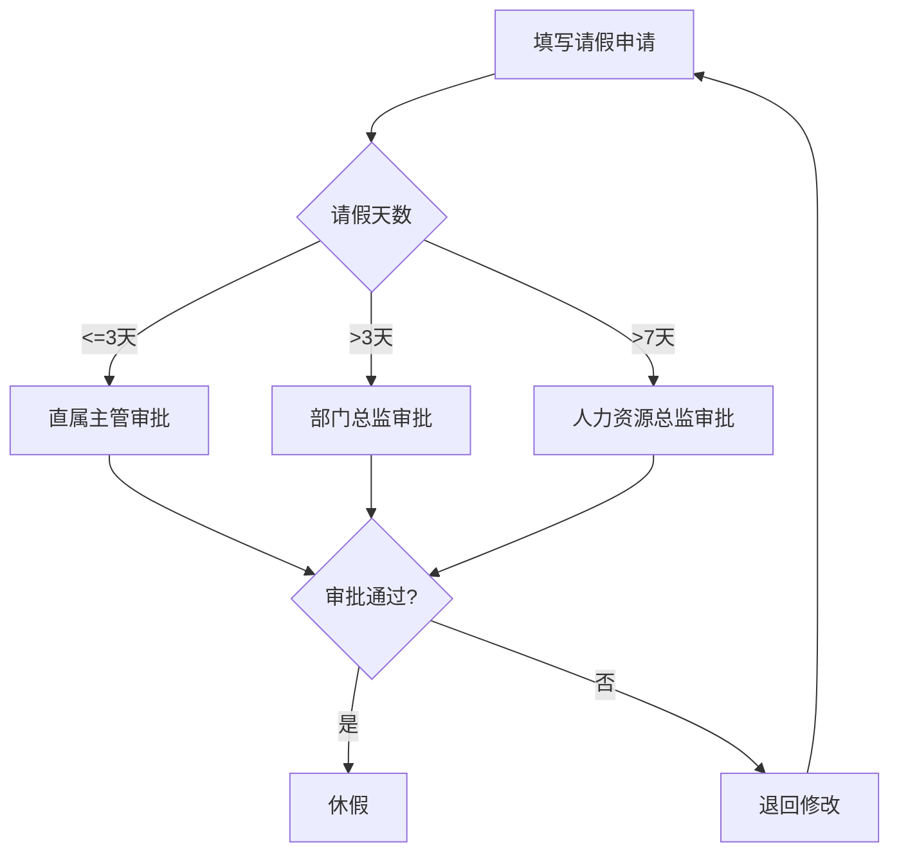

# 员工手册 v2.0

## 第一章 考勤制度

### 1.1 年假

员工年满一年后可享受年假10天。年假须提前两周申请，由直属主管审批后方可休假。

### 1.2 迟到

迟到 30 分钟以内按事假半天处理；超过 30 分钟按旷工半天处理。

### 1.3 事假与病假

事假全年累计不得超过 15 天，须提前一天申请。病假须出具二级以上医院证明，全年累计不超过 30 天。事假期间无薪，病假期间按基本工资 60% 发放。

## 第二章 薪酬福利

### 2.1 年终奖

年终奖于每年 12 月发放，发放日前需仍在职。

### 2.2 餐补

正式员工每月餐补 300 元，随工资一并发放。

| 项目 | 标准 |
| --- | --- |
| 餐补 | 300 元/月 |

### 2.3 通讯补贴

销售岗位员工每月通讯补贴 200 元，其他岗位每月 100 元。凭发票报销。

## 第三章 考勤补充

### 3.1 加班

工作日加班按基本工资 1.5 倍计算加班费，休息日加班按 2 倍计算，法定节假日加班按 3 倍计算。加班须提前填写加班审批单。

### 3.2 出差

出差期间每日补贴标准：一线城市 200 元，二线城市 150 元，其他城市 100 元。住宿费凭发票实报实销。

## 第四章 职业发展

### 4.1 培训

员工每年可参加不超过 5 天的外部培训，培训费用由公司承担。培训后需在公司服务满一年，否则按比例退还培训费用。

### 4.2 晋升

晋升评估每年 6 月和 12 月各一次。晋升条件包括：在当前岗位任职满一年、年度绩效评估为 B 级以上、无重大违纪记录。

## 第五章 离职管理

### 5.1 离职通知期

试用期员工提前 3 天通知；正式员工提前 30 天通知。未满通知期离职的，需支付相应天数的基本工资作为代通知金。

### 5.2 竞业限制

高层管理人员及核心技术人员的竞业限制期为离职后 12 个月。竞业限制期间公司按月支付补偿金，标准为离职前 12 个月平均工资的 30%。

## 第六章 财务报销

### 6.1 差旅报销

出差交通费：高铁二等座及以下凭票实报实销，飞机经济舱须提前审批。市内交通每天不超过 50 元。餐饮补贴已包含在出差补贴中，不再单独报销餐票。

### 6.2 业务招待

招待客户用餐标准：一线城市每人不超过 300 元，二线城市不超过 200 元，其他城市不超过 150 元。宴请须提前填写招待申请单，注明事由及参与人员清单。

### 6.3 办公用品采购

各部门每月办公用品预算为每人 50 元。单件超过 500 元的固定资产采购须经部门总监审批。采购须在指定供应商处进行，自行采购不予报销。

### 6.4 报销时限

费用发生后 30 天内须提交报销申请。逾期 30 至 60 天的，须书面说明原因；超过 60 天不予受理。报销金额超过 5000 元须财务总监加签。

## 第七章 信息安全

### 7.1 密码与账户安全

公司系统密码须至少 8 位，包含大小写字母、数字和特殊字符，每 90 天更换一次。禁止将账户密码告知他人，禁止共用账号。离职后账号将在 24 小时内停用。

### 7.2 数据分级与保密

公司数据分为公开、内部、机密、绝密四级。机密及以上数据禁止通过即时通讯工具传输。禁止将公司数据存储于个人设备或未经授权的云存储服务。违反保密规定者视情节严重程度给予警告、记过或解除劳动合同处分。

### 7.3 设备管理

公司配发设备仅限工作使用，禁止安装未经授权的软件。发现安全漏洞应在 2 小时内向 IT 部门报告。设备遗失须在 1 小时内报告，远程擦除数据后将追究保管责任。

## 第八章 福利制度

### 8.1 年度体检

正式员工每年享受一次免费体检，标准为每人 800 元。入职满半年即可参加当年体检。体检由公司统一安排，员工也可自行前往指定体检机构。

### 8.2 节日福利

春节、中秋、端午各发放节日礼金 500 元。妇女节（3月8日）女性员工发放 200 元礼金。员工生日当月发放 200 元生日礼金。以上福利随当月工资发放。

### 8.3 补充医疗保险

公司为正式员工购买补充医疗保险，覆盖门诊及住院费用。门诊报销比例 90%，年度上限 5000 元；住院报销比例 100%，年度上限 50000 元。直系亲属可自费加入，费用为每人每年 1200 元。

### 8.4 团建活动

每季度各部门可组织一次团建活动，人均预算 300 元。年度全员团建活动由人力资源部统一组织。

## 第九章 绩效考核

### 9.1 考核周期

绩效考核每半年一次，考核期为 1 月至 6 月和 7 月至 12 月。考核结果于次月 15 日前公布。

### 9.2 等级与评分

考核等级分为 S、A、B、C、D 五级。S 级（卓越）：评分 ≥ 95 分，占比不超过 10%；A 级（优秀）：评分 85-94 分；B 级（合格）：评分 70-84 分；C 级（待改进）：评分 60-69 分；D 级（不合格）：评分 < 60 分。连续两次 D 级将启动绩效改进计划，三次 D 级予以辞退。

### 9.3 绩效与薪酬关联

S 级年终奖系数 1.5，A 级系数 1.2，B 级系数 1.0，C 级系数 0.5，D 级无年终奖。年度绩效为 S 级的员工次年度薪资上浮 15%，A 级上浮 10%，B 级上浮 5%，C 级和 D 级不调薪。

### 9.4 申诉流程

对考核结果有异议的员工，可在结果公布后 7 个工作日内向人力资源部提交书面申诉。人力资源部应在收到申诉后 10 个工作日内组织复核会议并书面答复。复核结果为最终结论。

## 附录 A：请假审批流程图

## 附录 B：出差补贴标准对比

| 城市等级 | 每日补贴 | 住宿标准上限 | 交通标准 |
|---------|---------|------------|---------|
| 一线城市 | 200 元 | 500 元/晚 | 高铁二等座/经济舱 |
| 二线城市 | 150 元 | 350 元/晚 | 高铁二等座 |
| 其他城市 | 100 元 | 250 元/晚 | 高铁二等座 |

## 附录 C：绩效评分分布（年度示例）

S级(10%) + A级(25%) + B级(40%) + C级(15%) + D级(10%) = 100%强制分布。各部门须按此比例分配，不得随意调整。
