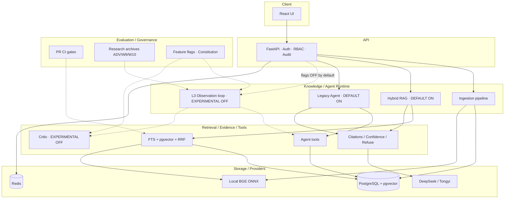

# Suoyin V1.0 — Canonical Architecture

> **Canonical** architecture surface for v1.0.  
> Baseline HEAD when frozen: `3289f65` (`ci(release): freeze v1.0 protection gates`).  
> Config SSOT: `backend/app/core/config.py` · Governance: [`project/feature-admission-constitution.md`](project/feature-admission-constitution.md) · Cut line: [`project/v1-0-release-cut-line.md`](project/v1-0-release-cut-line.md).  
> Detailed engineering notes remain in [`TECH.md`](TECH.md) (historical / deep); **this file** is the release narrative.

```text
IMPLEMENTED  ≠  VALIDATED
VALIDATED    ≠  DEFAULT
DEFAULT ON   ≠  EXPERIMENTAL
```

---

## A. System boundary

```text
User / Browser (React)
        │  HTTP / SSE
        ▼
   FastAPI API  ── auth (JWT) · RBAC · rate limit · audit
        │
        ├── Knowledge bases / documents / threads
        ├── Ingestion enqueue → Celery worker
        ├── Retrieval + grounded generation (+ citations)
        └── Agent runtime (Legacy DEFAULT · L3 EXPERIMENTAL OFF)
                │
                ▼
   PostgreSQL 16 + pgvector + FTS   ·   Redis (Celery / cache / breakers)
                │
                ▼
   Providers: local BGE embeddings · DeepSeek / Tongyi chat (server-side keys)
```

| Layer | Role |
|-------|------|
| Client | Login, KB CRUD, upload, chat UI, citation chips |
| API | Auth, workspace/`kb_id` isolation, SSE chat, admin audit |
| Knowledge / Agent | Ingest pipeline · Hybrid RAG · Legacy Agent · optional L3 loop |
| Retrieval / Evidence / Tools | FTS + pgvector + RRF · citation/confidence · Agent tools |
| Storage / Providers | Postgres · Redis · local ONNX BGE · chat LLM HTTP |
| Evaluation / Governance | Pytest goldens · CI gates · research archives · feature flags |

**Out of v1.0 product architecture** (do not draw as current path): Evolver, Multi-Agent, MCP expansion, LLM-Wiki, GraphRAG productization, Multimodal Agent, Memory v2 intelligence, local-model autonomous runtime. See Cut Line §NOT V1.0.

---

## B. Default RAG path（V1.0 product）

**DEFAULT ON** path:

```text
Upload → document queued
  → Celery ingest: parse → structure chunk (heading_path, max_chars=1200)
  → embed (BGE-zh 512 / BGE-en 384) → store chunks + vectors + tsvector
Query (KB or workspace thread)
  → auth + kb/workspace scope
  → hybrid retrieval: vector recall + PG FTS → RRF (w_v=1.0, w_f=1.5)
  → confidence classify (normal / low / refuse)
  → grounded generation (chat provider) + citation metadata
  → SSE answer with document name / location / snippet
```

| Component | State |
|-----------|--------|
| Hybrid RRF (PG FTS + pgvector) | **DEFAULT ON** |
| Citation + confidence + refuse | **DEFAULT ON** |
| RBAC / approval / audit / budget / breaker / rate limit | **DEFAULT ON** |
| Legacy Agent (ThoroughRead / LLMPlanner + tools) | **DEFAULT ON** (Agent modes) |
| Memory store / window / importance / summary | **Infra ON** (`agent_memory_enabled=True`) · intelligence **not** claimed |
| Rerank / HyDE / query rewrite / graph recall | **OPTIONAL / DEFAULT OFF** |
| L3 NextAction / dynamic tools / EvidenceState gate / Critic | **EXPERIMENTAL / DEFAULT OFF** |
| All `agent_l4_*` | **EXPERIMENTAL / DEFAULT OFF** |

Health:

| Endpoint | Meaning |
|----------|---------|
| `GET /health` | Process up · DB/Redis check · may report `degraded` under breaker |
| `GET /health/ready` | Ready for chat when DB ok **and** current `CHAT_PROVIDER` key configured |
| `GET /health/detailed` | Embed / OCR / latency / disk / chat detail |

Migrations: compose `migrate` service runs `alembic upgrade head` before API/worker. Model↔migration drift is PR-blocked (`alembic check`).

Ingestion concurrency note: Celery worker uses `--pool=threads`; ingest tasks **serialize per worker process** (loop lock + `engine.dispose()`) to avoid cross-loop asyncpg errors. See `backend/app/services/ingestion/tasks.py` · `tests/test_c4_ingestion_loop_isolation.py`.

---

## C. Agentic path

### C.1 Legacy Agent — DEFAULT ON

```text
User message + AgentMode
  → ThoroughReadPlanner / LLMPlanner (plan limited tool chain)
  → sequential tool execution (search / excerpt / grep / …)
  → observations accumulate
  → finalize → grounded answer or edit/write proposal (approval for writes)
```

Stable delivery path for thorough / edit / document modes. Suite: Agent Golden (168) — **exists**, **not** PR-blocking.

### C.2 Observation-driven L3 — EXPERIMENTAL / DEFAULT OFF

Requires flags such as `agent_l3_next_action_enabled` (all `agent_l3_*` default **False**):

```text
Question
  → init AgentState
  → NextActionPlanner.decide_next(state) → AgentDecision
  → tool / retrieve action (one step)
  → Observation (compressed; no full chunk dump into planner)
  → update EvidenceState
  → terminal decision: finish | clarify | refuse | continue
```

Action kinds (`AgentActionKind`): `tool | finish | clarify | refuse`.

Dynamic unlock (`ToolResolver`) and Critic→re-retrieval are separate flags, also **OFF**. Do not describe L3 as the default product loop.

---

## D. Evidence / citation path

Where actually supported on the **default** RAG / Legacy path:

```text
Retrieved chunks (kb-scoped)
  → classify_answer_confidence → normal | low | refuse
  → if refuse: no LLM answer body with fake citations
  → if generate: prompt + chunk context → stream
  → citations: document name + location + snippet (P0)
  → audit / metrics as configured
```

| Outcome | Meaning |
|---------|---------|
| normal | Sufficient evidence to answer with citations |
| low | Weak evidence; UI/prompt marks low confidence |
| refuse | No adequate evidence; explicit refuse (canonical demo unsupported case) |
| degraded | Provider/breaker path; `/health` may show `degraded` — not “silent invent” |

W10 Formal T1 measures **citation-scope compliance** on a frozen Showcase Formal scope only — not general answer quality. See [`benchmark-summary.md`](benchmark-summary.md).

---

## E. Evaluation path

```text
Unit / A-layer pytest          → PR_CI (Tier 1)
Retrieval golden + local-BGE   → PR_CI blocking gates
Safe-defaults / config wiring  → PR_CI
Agent Golden 168               → RELEASE_ONLY / MANUAL
ADV / W9 / W10 Formal          → RESEARCH_ARCHIVE
Canonical demo (demo.ps1)      → MANUAL product-path proof
CRAG / long benchmark.yml      → RELEASE informational
```

Contract: Cut Line §「V1.0 CI Contract」 · inventory [`research/v1-0-closure-inventory/04-ci-and-test-surface.md`](research/v1-0-closure-inventory/04-ci-and-test-surface.md).

---

## F. Safety / governance

| Mechanism | Role |
|-----------|------|
| Feature flags in `config.py` | Safe defaults; experimental surfaces stay OFF |
| `test_v1_0_safe_defaults.py` | PR lock that L3/L4/Critic/rerank/HyDE/rewrite/graph stay OFF |
| Feature Admission Constitution | IDEA→…→DEFAULT; cool idea ≠ release blocker |
| Feature Lifecycle | EXPERIMENT ≠ PRODUCT; VALIDATED ≠ DEFAULT |
| V1.0 Cut Line | What may block the tag vs backlog |
| Claim discipline | Scoped metrics only; no naked “100% Agent accuracy” |

Approval boundaries: write tools (FAQ draft, delete/restore) go through approval/audit — not prompt trust.

---

## Architecture diagram



Solid edges = default / stable delivery. Dotted edges = experimental or research-only surfaces.

---

## Capability maturity snapshot (V1.0)

Labels align with Constitution / Cut Line (no new maturity vocabulary).

| Capability | Status | Default | Evidence | V1.0 role |
|------------|--------|---------|----------|-----------|
| Hybrid Retrieval | IMPLEMENTED | ON | PR CI Hit@3 + baseline | CORE |
| Citation / refuse | IMPLEMENTED | ON | Product path · C4 demo · Formal T1 scoped | CORE |
| Legacy Agent | IMPLEMENTED | ON | Product path · Agent Golden (manual) | CORE |
| Governance (RBAC/audit/…) | IMPLEMENTED | ON | A-layer tests | CORE |
| Memory infrastructure | IMPLEMENTED (infra) | Master ON | Exposure measured; L4/L5 unproven | SHOULD (infra only) |
| L3 Observation Agent | IMPLEMENTED-EXPERIMENTAL | OFF | Scoped panels | EXPERIMENT |
| Critic / W9 | IMPLEMENTED | OFF · rollout NO | W9 research archive | EXPERIMENT |
| L4 FactGoal / … | PARTIAL | OFF | Research structures | NOT core |
| Rerank / HyDE / rewrite | IMPLEMENTED / PARTIAL | OFF | Ablations; not default-proven | EXPERIMENT |
| Graph recall | Rolled back | OFF | Quality rollback | NOT_V1_0 product |
| Local model generation | STUB / PARTIAL | OFF | Eval harness only | NOT_V1_0 |
| Multi-Agent / MCP / Evolver / GraphRAG product | ABSENT as product | — | — | NOT_V1_0 |

---

## Related

- [`benchmark-summary.md`](benchmark-summary.md) — evidence classes & numbers  
- [`status/v1-known-limitations.md`](status/v1-known-limitations.md) — accepted limits & RC blockers  
- [`research/v1-0-closure-inventory/`](research/v1-0-closure-inventory/) — C0 inventory  
- [`TECH.md`](TECH.md) — deep / historical tech notes  
