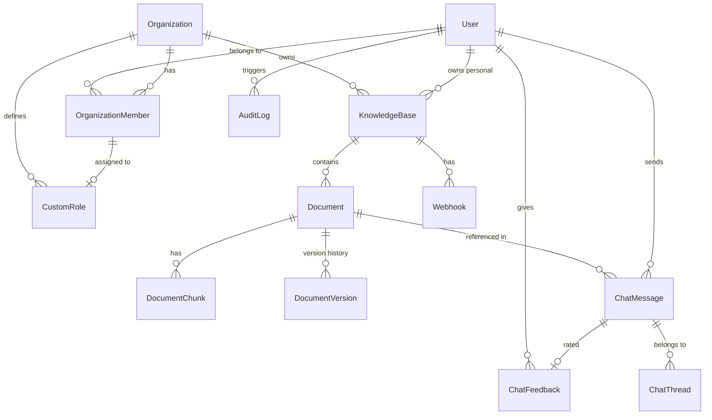

# 睿阁 — 核心数据库 ER 模型

> 交接对象：后端 / 前端开发者
> 更新日期：2026-07-17

---

## ER 图

---

## 核心表

### users

| 字段 | 类型 | 说明 |
|------|------|------|
| id | UUID PK | |
| email | VARCHAR(255) UK | 登录标识 |
| username | VARCHAR(32) UK | 登录标识 |
| password_hash | VARCHAR(128) | bcrypt |
| account_type | ENUM(personal, enterprise) | 账号类型 |
| nickname | VARCHAR(64) | 可选昵称 |
| created_at | TIMESTAMPTZ | |

### organizations

| 字段 | 类型 | 说明 |
|------|------|------|
| id | UUID PK | |
| name | VARCHAR(255) | |
| owner_id | UUID FK→users | 所有者 |
| created_at | TIMESTAMPTZ | |

### organization_members

| 字段 | 类型 | 说明 |
|------|------|------|
| id | UUID PK | |
| org_id | UUID FK→organizations | |
| user_id | UUID FK→users | |
| role | ENUM(admin, member) | **OrgRole** |
| is_owner | BOOL | 独立于 role |
| custom_role_id | UUID FK→custom_roles | 可选自定义角色 |
| UK | (org_id, user_id) | |

### knowledge_bases

| 字段 | 类型 | 说明 |
|------|------|------|
| id | UUID PK | |
| name | VARCHAR(255) | |
| owner_user_id | UUID FK→users | personal 库 |
| owner_org_id | UUID FK→organizations | 团队库 |
| created_at | TIMESTAMPTZ | |
| CK | (owner_user_id XOR owner_org_id) | 只能有一个所有者 |

### documents

| 字段 | 类型 | 说明 |
|------|------|------|
| id | UUID PK | |
| kb_id | UUID FK→knowledge_bases | |
| filename | VARCHAR(512) | |
| file_type | VARCHAR(32) | pdf, txt, md, docx, xlsx, pptx |
| file_size | BIGINT | 字节 |
| content_sha256 | VARCHAR(64) | 内容去重哈希 |
| storage_path | VARCHAR(1024) | 磁盘路径 |
| status | ENUM(queued, processing, completed, failed) | |
| error_message | TEXT | |
| chunk_count | INT | |
| uploaded_by | UUID FK→users | |
| visibility | ENUM(everyone, admin_only) | |
| current_version | INT DEFAULT 1 | 当前版本号 |
| deleted_at | TIMESTAMPTZ | 软删标记 |
| 索引 | (kb_id, deleted_at) | 列表查询 |

### document_versions

| 字段 | 类型 | 说明 |
|------|------|------|
| id | UUID PK | |
| document_id | UUID FK→documents | |
| version_number | INT | 版本号 |
| storage_path | VARCHAR(1024) | 该版本的磁盘文件 |
| file_size | BIGINT | |
| content_sha256 | VARCHAR(64) | |
| uploaded_by | UUID FK→users | |
| created_at | TIMESTAMPTZ | |

### document_chunks

| 字段 | 类型 | 说明 |
|------|------|------|
| id | UUID PK | |
| document_id | UUID FK→documents | |
| kb_id | UUID FK→knowledge_bases | 冗余，加速检索 |
| content | TEXT | 片段文本 |
| content_tsv | TSVECTOR | 全文检索向量 |
| embedding | VECTOR(1536) | pgvector 嵌入 |
| chunk_index | INT | 段落序号 |
| chunk_kind | ENUM(text, table, parent) | |
| section_title | VARCHAR(512) | 章节标题 |
| heading_path | VARCHAR(1024) | 完整标题路径 |
| page_number | INT | PDF 页码 |
| parent_chunk_id | UUID 自引用 | Parent-Child 关联 |
| 索引 | (kb_id, chunk_kind) | 检索过滤 |
| 索引 | (document_id, chunk_index) | 顺序加载 |
| 索引 | content_tsv GIN | 全文检索 |

### chat_messages

| 字段 | 类型 | 说明 |
|------|------|------|
| id | UUID PK | |
| kb_id | UUID FK→knowledge_bases | |
| user_id | UUID FK→users | |
| role | ENUM(user, assistant, system) | |
| content | TEXT | 消息内容 |
| citations | JSONB | 引用列表 |
| thread_id | UUID FK→chat_threads | 多轮对话 |
| retrieval_duration_ms | INT | 检索耗时 |
| created_at | TIMESTAMPTZ | |

### chat_feedback

| 字段 | 类型 | 说明 |
|------|------|------|
| id | UUID PK | |
| message_id | UUID FK→chat_messages | |
| user_id | UUID FK→users | |
| rating | INT(0/1) | 0=👎, 1=👍 |
| feedback_text | TEXT | 可选评论 |
| UK | (message_id, user_id) | 每人每消息一条 |

### webhooks

| 字段 | 类型 | 说明 |
|------|------|------|
| id | UUID PK | |
| kb_id | UUID FK→knowledge_bases | |
| url | VARCHAR(2048) | |
| secret | VARCHAR(128) | HMAC 签名密钥 |
| events | VARCHAR(256) | 事件类型 |
| is_active | BOOL | |
| created_by | UUID FK→users | |
| created_at | TIMESTAMPTZ | |

### custom_roles

| 字段 | 类型 | 说明 |
|------|------|------|
| id | UUID PK | |
| org_id | UUID FK→organizations | |
| name | VARCHAR(128) | |
| description | TEXT | |
| is_admin_level | BOOL | admin 级权限 |
| permissions | JSON | `{"kb_id": "read"|"write"|"admin"|"deny", "*": "read"}` |

### audit_logs

| 字段 | 类型 | 说明 |
|------|------|------|
| id | UUID PK | |
| action | VARCHAR(64) | document.upload, kb.delete, etc. |
| actor_user_id | UUID FK→users | |
| resource_type | VARCHAR(32) | document, kb, user |
| resource_id | UUID | |
| kb_id | UUID | 冗余 |
| metadata | JSONB | |
| ip | VARCHAR(45) | |
| created_at | TIMESTAMPTZ | |

---

## 表关系总结

| 关系 | 说明 |
|------|------|
| User → OrganizationMember → Organization | 多对多（通过关联表）|
| Organization → CustomRole | 一对多 |
| OrganizationMember → CustomRole | 多对一（可选）|
| User/Organization → KnowledgeBase | 多对多（owner 模型）|
| KnowledgeBase → Document → DocumentChunk | 一对多级联 |
| Document → DocumentVersion | 一对多级联 |
| User → ChatMessage → ChatFeedback | 消息→反馈 |
| KnowledgeBase → Webhook | 一对多 |

---

## 索引策略

| 表 | 关键索引 | 用途 |
|----|---------|------|
| document_chunks | GIN(content_tsv) | 全文检索 |
| document_chunks | HNSW(embedding) | 向量检索 |
| document_chunks | (kb_id, chunk_kind) | 检索范围过滤 |
| document_chunks | (document_id, chunk_index) | chunk 顺序加载 |
| documents | (kb_id, deleted_at) | 文档列表查询 |
| documents | (kb_id, content_sha256) WHERE content_sha256 IS NOT NULL | 内容去重 |
| chat_messages | (kb_id, user_id, created_at) | 对话历史排序 |
| audit_logs | (created_at) | 审计查询排序 |
