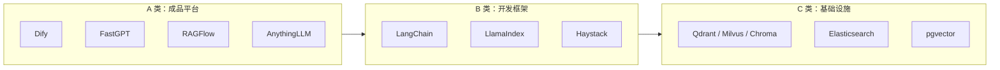
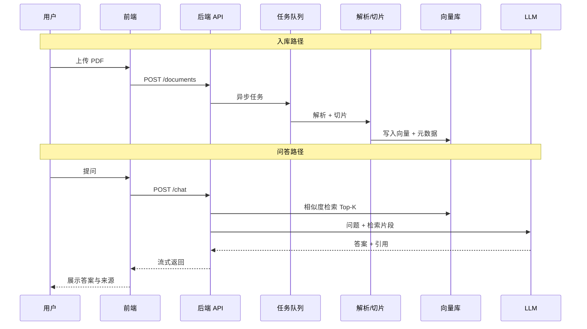

# 001 — 市面 RAG 项目调研（Research）

> **状态**：初稿，待你确认假设后再写 Plan。  
> **本阶段禁止**：写业务代码、选具体云服务账号、搭生产环境。

---

## 1. 用大白话：RAG 到底是什么？

**类比**：RAG = 开卷考试。

| 步骤 | 大白话 | 技术名词 |
|------|--------|----------|
| 1 | 你把资料放进抽屉（PDF、网页、笔记） | **Ingestion（入库）** |
| 2 | 把长资料撕成小段，贴标签 | **Chunking（切片）+ Embedding（向量化）** |
| 3 | 用户提问时，先从抽屉里找最相关的几段 | **Retrieval（检索）** |
| 4 | 把「问题 + 找到的几段」一起交给 AI 写答案 | **Generation（生成）** |
| 5 | 最好还能说「答案来自第几页」 | **Citation / 溯源** |

**为什么不用「直接把整本书塞给 AI」？**  
上下文有限、贵、慢、容易胡说。RAG 只喂相关片段，更准、更便宜。

---

## 2. 市面项目分三类（选型前先认清）

| 类型 | 代表 | 你得到什么 | 适合谁 |
|------|------|------------|--------|
| **A 成品平台** | Dify、FastGPT、RAGFlow、AnythingLLM、MaxKB、Onyx | 上传文档 → 对话 UI → 开箱即用 | 想最快 demo、少写代码 |
| **B 开发框架** | LangChain、LlamaIndex、Haystack | 自己拼管道，全可控 | 要学透、要面试讲清、要定制 |
| **C 基础设施** | 向量库 + 对象存储 + LLM API | 被 A/B 调用 | 部署时必碰，但不是「产品」 |

---

## 3. 主流开源 RAG 项目对比（2025–2026 共识）

> 来源：Dify/RAGFlow 官方定位、Milvus AI Quick Reference、社区对比文章（见文末引用）。

### 3.1 成品平台

| 项目 | GitHub 体量（约） | 核心卖点 | 强项 | 弱项 / 风险 |
|------|------------------|----------|------|-------------|
| **Dify** | ~90k–130k ⭐ | 全能 AI 应用工作室 | 可视化工作流、多模型、Agent、LLMOps | 学的是「平台配置」，底层 RAG 细节被藏住 |
| **FastGPT** | ~20k–27k ⭐ | 知识库问答专精 | QA 切片、工作流、国内文档友好 | 偏 RAG 垂直，复杂 Agent 不如 Dify |
| **RAGFlow** | ~48k–75k ⭐ | 复杂文档理解 | PDF/表格/扫描件、混合检索、知识图谱 | 偏「检索引擎」，完整 SaaS 要自己补 |
| **AnythingLLM** | ~56k ⭐ | 一体化桌面/自托管 | 本地部署简单、多格式 | 企业级权限/计费弱 |
| **MaxKB** | ~20k ⭐ | 企业知识库 + Agent | 国产、对接企业场景 | 社区相对小 |
| **Onyx** | 中等 | 企业自托管 | 合规、On-Prem | 运维成本高 |

### 3.2 开发框架

| 项目 | 定位 | 强项 | 弱项 |
|------|------|------|------|
| **LangChain** | 组件链 + Agent 生态 | 生态最大、教程多、和 Python 后端天然契合 | 抽象多，新手易迷路；要自己搭 UI/权限 |
| **LlamaIndex** | 数据索引 / 检索专精 | 索引策略、查询引擎文档好 | Agent 侧不如 LangChain 全 |
| **Haystack** | 生产级 NLP 管道 | 检索+评估成熟 | 国内资料相对少 |

### 3.3 常见技术栈组合（市面 RAG 产品「内脏」）

| 层级 | 常见选择 |
|------|----------|
| 后端 API | Python FastAPI / Node |
| RAG 编排 | LangChain 或 LlamaIndex |
| 向量库 | Qdrant、Milvus、Chroma、pgvector |
| 全文检索 | Elasticsearch / OpenSearch（混合检索时用） |
| 嵌入模型 | OpenAI text-embedding-3、BGE、M3E（中文） |
| LLM | OpenAI / DeepSeek / 本地 Ollama |
| 前端 | React / Next.js |
| 任务队列 | Celery / Redis（大文件异步解析） |

**结论**：大部分「RAG 产品」= **B 类框架 + C 类存储 + 自研 UI/权限**，而不是从零发明检索算法。

---

## 4. 四条典型路线（你该选哪条？）

| 路线 | 做法 | 上线速度 | 面试可讲清 | 推荐度（对你） |
|------|------|----------|------------|----------------|
| **① Fork 成品** | 部署 Dify/FastGPT，改皮肤 | ★★★★★ | ★☆ | ❌ 不推荐做主项目 |
| **② 框架自研** | LangChain + FastAPI + React + Qdrant | ★★★ | ★★★★★ | ✅ **首推** |
| **③ 混合** | RAGFlow 做解析，自研 API 壳 | ★★★★ | ★★★ | 文档极乱时考虑 |
| **④ 纯本地** | AnythingLLM / Ollama | ★★★★ | ★★ | 仅个人玩具 |

**为什么推 ② 而不是 ①？**  
你的 `CLAUDE.md` 要求：**决策、数据流、验证**必须是你自己的。Fork Dify 很难在面试里讲清「切片策略为什么这样选」。

---

## 5. 标准 RAG 数据流（面试必须能画）

**你要能口头讲清的 5 步**：上传 → 解析切片 → 向量化入库 → 检索 → 拼 Prompt 生成。

---

## 6. 商业化 RAG 通常比「Demo」多什么？

| 能力 | Demo 有没有 | 产品几乎必须有 |
|------|-------------|----------------|
| 单知识库问答 | ✅ | ✅ |
| 用户登录 / 权限 | ❌ | ✅ |
| 多知识库隔离 | ❌ | ✅ |
| 上传进度 / 失败重试 | 半套 | ✅ |
| 答案溯源（页码/段落） | 有时 | ✅ |
| 混合检索（关键词+向量） | 高级 | 建议有 |
| 评估（命中率） | ❌ | 上线前要有 |
| 计费 / 积分 | ❌ | 商业化再加 |

**MVP 建议（第一版只做这些）**：

1. 注册登录（单租户即可）
2. 创建一个知识库
3. 上传 PDF/TXT，后台异步入库
4. 对话页流式问答 + 显示引用来源
5. 10 条 golden QA 人工验收

**第一版不做**：支付、多租户 SaaS、复杂 Agent、知识图谱。

---

## 7. 假设确认记录（2026-07-03 用户回复）

| # | 假设 | 结论 |
|---|------|------|
| H1 | 面向个人/小团队 | ✅ **个人自用 + 毕业设计**；个人/企业账号区分 |
| H2 | FastAPI + LangChain + Qdrant + React | ⏸ 用户未明确反对，**PRD Q4 待最终确认** |
| H3 | LLM 用 API | ✅ **DeepSeek + 阿里云通义千问** |
| H4 | 文档格式 | ✅ MVP：**PDF/TXT/MD/DOCX**；OCR/PPT 第二版 |
| H5 | 登录，不付费 | ✅ 是；含个人/企业权限 |
| H6 | 与其他项目独立部署 | ✅ 是 |

---

## 8. 按 CLAUDE.md 的「六项准备」——你现在在哪、下一步干啥

| 准备项 | 状态 | 下一步（本对话可做） |
|--------|------|----------------------|
| 1 PRD | 🟡 | `docs/PRD.md` v0.1 草稿 → **请你逐行确认 + 答 Q1–Q6** |
| 2 技术文档 | ❌ | PRD 确认后写库表、API、页面跳转 |
| 3 Skills | ⏸ | 暂不装；真用到 LangChain 文档检索再说 |
| 4 AGENTS.md | ✅ 初稿 | 你确认 H1–H6 后我再锁边界 |
| 5 开发清单 | ❌ | Plan 确认后写 Wave 1–N |
| 6 驾驶舱 HTML | ❌ | 清单有了再做进度页 |

**RPI 阶段**：当前 = **Research（本文）** → 你确认假设 → **Plan** → 才 **Implement**。

---

## 9. 引用

- [Dify vs RAGFlow vs Onyx 对比](https://www.learnwithparam.com/blog/batteries-included-rag-platforms-dify-ragflow-onyx)
- [RAGFlow vs LangChain（Milvus）](https://milvus.io/ai-quick-reference/ragflow-vs-langchain-which-is-better-for-rag)
- [FastGPT vs Dify](https://dev.to/victorjia/fastgpt-vs-dify-the-chinese-rag-platform-battle-youre-missing-18eo)
- [15 Best Open-Source RAG Frameworks 2026](https://www.firecrawl.dev/blog/best-open-source-rag-frameworks)
