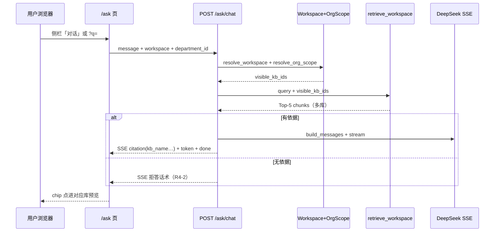

# G-1 · 工作区智能问答（方案 C）· Research

> **状态**：✅ **R 关**（2026-07-08）→ Plan 见 `discovery-smart-chat-plan.md` §1 拍板  
> **依据**：`discovery-smart-chat-prd.md` G-1-1～G-1-5 ✅ · ORG OrgScope · EW-E1 跨库搜  
> **边界**：**只调研**；**不写** Implement 代码 · **不**改 PRD 已定稿节

---

## §1 三句话摘要（门禁用）

1. **触发点**：用户在侧栏点 **「对话」** 或概览快捷提问 → 进入 **`/ask`** → 前端带 `workspace` +（团队时）`department_id` 调 **新工作区对话 API**；后端用与跨库搜 **同一套** `WorkspaceScope` + `OrgScope.visible_kb_ids` 决定搜哪些库，**不是**先选资料库再问。  
2. **数据流**：解析 scope → **跨可见库 hybrid 检索**（向量+全文→RRF→rerank→Top-5）→ 相关性 gate → SSE 流式回答；引用 payload **多带 `kb_id` + `kb_name`**；库内 `POST .../knowledge-bases/{kb_id}/chat` **原样保留**（单库、chip 无库名）。  
3. **怎么验**：pytest 新增「多库 scope 检索 + `/ask` 403/拒答」；浏览器 S1～S7（`demo_admin` 侧栏对话问年假、member 无 grant 库、点 chip 进对应库预览）；改 `retrieval` 后 **须** `test_retrieval_golden.py` 12/12 绿 + `npm run build`。

---

## §2 现状盘点（代码位置）

### 2.1 对话链路（单库 · 今天就能跑）

| 层 | 文件 | 职责 |
|----|------|------|
| API | `backend/app/api/chat.py` | `POST /knowledge-bases/{kb_id}/chat` SSE · `GET .../messages` · `GET .../citations/resolve` |
| 编排 | `backend/app/services/rag/chat.py` | `stream_chat_events`：检索 → gate → SSE → `save_chat_turn` |
| 检索 | `backend/app/services/rag/retrieval.py` | `retrieve_chunks(db, kb_id=…)` — **SQL 写死** `DocumentChunk.kb_id == kb_id` |
| 落库 | `backend/app/services/rag/persistence.py` | `chat_messages.kb_id` **NOT NULL** FK → 每轮对话绑 **一个** 资料库 |
| Schema | `backend/app/schemas/chat.py` | `CitationPayload` 六字段：**无** `kb_id` / `kb_name` |
| 限流 | `backend/app/services/auth/api_rate_limit.py` | `ApiRateLimitKind.chat` · 30 次/小时/用户（M5） |

团队库对话时，API 已解析 OrgScope 并把 `visible_kb_ids` 传入检索，但 **仅作二次过滤**，检索范围仍是 **请求 URL 里的那一个 kb_id**：

```58:70:rag-knowledge-platform/backend/app/api/chat.py
    visible_kb_ids: frozenset[UUID] | None = None
    if kb.owner_org_id is not None and kb.owner_user_id is None:
        org_scope = await resolve_org_scope(db, current_user, department_id=department_id)
        visible_kb_ids = org_scope.visible_kb_ids

    return StreamingResponse(
        stream_chat_events(
            db,
            kb_id=kb_id,
            user_id=current_user.id,
            message=body.message,
            visible_kb_ids=visible_kb_ids,
        ),
```

`retrieve_chunks` 核心约束（**工作区多库须突破此点**）：

```190:200:rag-knowledge-platform/backend/app/services/rag/retrieval.py
async def retrieve_chunks(
    db: AsyncSession,
    *,
    kb_id: UUID,
    query: str,
    top_k: int = LLM_TOP_K,
    visible_kb_ids: frozenset[UUID] | None = None,
) -> list[RetrievedChunk]:
    """向量 Top-20 + 全文 Top-20（同 kb_id），RRF 融合后 rerank 取 Top-K。"""
    if visible_kb_ids is not None and kb_id not in visible_kb_ids:
        return []
```

`_enforce_kb_scope` rerank 后 **剔除 `chunk.kb_id != 请求 kb_id`** 的结果 — 单库安全正确，多库模式需 **新 enforcement**。

### 2.2 权限 / Scope（可复用 · 与跨库搜同源）

| 模块 | 文件 | 用途 |
|------|------|------|
| 工作区 | `backend/app/services/workspace/scope.py` | `resolve_workspace` · personal vs org UUID · **缺 workspace → 403** |
| 部门 | `backend/app/services/org/scope.py` | `resolve_org_scope` / `resolve_org_scope_for_workspace` → `OrgScope.visible_kb_ids` |
| 跨库搜 | `backend/app/services/search/documents.py` | `kb_scope_clause(scope, org_scope)` — **Implement 应对齐此模式** |
| 跨库正文搜 | `backend/app/services/search/content.py` | chunk 级跨库 + 返回 `kb_name`（找文档，非对话） |
| 搜 API | `backend/app/api/search.py` | `GET /search/documents?workspace=&department_id=` 样板 |

```41:48:rag-knowledge-platform/backend/app/services/search/documents.py
def kb_scope_clause(
    scope: WorkspaceScope,
    org_scope: OrgScope | None,
) -> ColumnElement[bool]:
    clause = scope.kb_owner_clause()
    if org_scope is not None:
        clause = clause & org_scope.kb_visibility_clause()
    return clause
```

**个人空间**：`org_scope=None`，scope 仅 `owner_user_id=me` 的库。  
**团队空间**：`visible = 子树库 ∪ 公共库 ∪ grant`（与 PRD G-1-4 一致）。

### 2.3 前端（缺口：无 `/ask`）

| 项 | 现状 | PRD 目标 |
|----|------|----------|
| 路由 | `knowledge-bases/:id/chat` → `ChatPage.tsx` | 新增 **`/ask`** 工作区对话页 |
| 侧栏 | `AppSidebar.tsx`：`chatPath = /knowledge-bases/{recentKbId}/chat` | 固定 **`/ask`** |
| 概览提问 | `DashboardZoneA.tsx` → 最近库 `/chat?q=` | → **`/ask?q=`** |
| 会话 hook | `use-chat-session.ts` · `chat-api.ts` | 绑 **kbId** · `streamChat(kbId, …)` |
| 引用 chip | `formatCitationLabel`：`文档 · 章节 · p.页码` | 工作区：**`库名 · 文档 · …`** |
| 预览跳转 | `previewPathForCitation(kbId, citation)` — kbId 来自 **页面** | 工作区：每 citation **自带 kb_id** |
| 部门参数 | `scope-fetch.ts` 有 `appendScopeQuery` | **搜 API 已用** · **chat-api 目前未传** `department_id`（Implement 须对齐 ORG-3.3） |
| 未分配 | `canUseTeamBusiness` 禁用输入（`ChatPage` 已有） | `/ask` 页 **同样** |

库内对话页头仍显示资料库名 + `ChatToolbar` 库切换器 — **工作区页不应出现**（PRD G-1-2）。

### 2.4 与「找文档」分工（已有能力）

| 功能 | API | 检索对象 | 输出 |
|------|-----|----------|------|
| 找文档（文件名） | `GET /search/documents?mode=filename` | 文档 filename ILIKE | 列表 + `kb_name` |
| 找文档（正文） | `GET /search/documents?mode=content` | chunk tsvector | snippet + `kb_name` |
| **工作区对话（缺）** | **待建** | chunk hybrid + rerank + LLM | **答案 + 引用 chip** |

找文档 **不** 调 LLM；对话 **不** 应复用 search service 直接返回答案，但 **scope SQL 与 kb_name JOIN 可复用**。

---

## §3 测试覆盖（基线 · 缺口）

### 3.1 已有 · 可复用模式

| 文件 | 覆盖 | 与 G-1 关系 |
|------|------|-------------|
| `test_chat.py` | 单库 SSE · 拒答 · 落库 · citation 六字段契约 | 库内回归 **必须保持绿** |
| `test_chat_messages.py` | 历史 messages + citations | 库内历史；工作区历史见 **H4** |
| `test_org_isolation.py` | `test_chat_retrieval_rd_member_excludes_sibling_dept_chunks` · `test_api_chat_sibling_department_kb_returns_403` | **OrgScope + 单库 chat**；多库检索应 **仿此** 加矩阵 |
| `test_search_documents.py` | EW-E1 S1～S8 · 个人/团队跨库 · 多库命中 | **scope 模式直接借鉴** |
| `test_search_content.py` | 跨库正文搜 | chunk 跨库 SQL 参考 |
| `test_workspace_scope.py` | workspace 403 / personal vs org | `/ask` API **须仿** |
| `test_api_rate_limit.py` | chat 30/h → 429 | PRD：与库内 **共用** M5 |
| `test_retrieval_golden.py` | Hit@3 gate 12/12 | **改 retrieval 必跑绿** |
| `test_retrieval_security.py` | `_enforce_kb_scope` · kb 隔离 | 多库后须 **补** workspace scope 用例 |
| `test_citation_resolve.py` | 引用 resolve + source_status | chip 点预览仍走 **各库** resolve |

### 3.2 缺口（Plan 阶段须落具体用例 · 对应 PRD A1～A3）

| ID | 场景 | 预期 |
|----|------|------|
| **T-ask-1** | 个人空间 2 库有文档 · `/ask` 问命中 A | citation 来自 A · 带 A 库名 |
| **T-ask-2** | 团队 member 研发 · 问 grant 手册 | 有引用 · **无** 未 grant 薪酬库 chunk |
| **T-ask-3** | 团队 member 问兄弟部门机密 | 拒答（AC-4） |
| **T-ask-4** | 未分配 member · `/ask` | 403 或前端禁用（与 E17 一致） |
| **T-ask-5** | 缺 `workspace` | 403 |
| **T-ask-6** | 多库同主题 | ≤5 chip · **kb_name 可不同** |
| **T-ask-7** | 库内 chat 回归 | chip **仍无** kb_name |

**前端**：PRD S5/S6/S7 浏览器手工；Implement 后 `npm run build`。

---

## §4 目标数据流（Implement 前须能口述）



**逐步（大白话 · 5 步）**

| 步 | 谁 | 做什么 |
|----|-----|--------|
| 1 | 浏览器 | 用户在当前工作区打开 `/ask`，输入问题；请求带上 **workspace**（personal 或 org UUID）和 **department_id**（团队时）。 |
| 2 | API | 校验登录、M5 限流、未分配禁用；`resolve_workspace` + `resolve_org_scope_for_workspace` 得到 **visible_kb_ids**。 |
| 3 | retrieval | 在 visible 库集合内做 **向量+全文→RRF→rerank**，取 Top-5 chunk（可来自 **多个 kb_id**）。 |
| 4 | chat 编排 | `filter_relevant_chunks`；无命中 → 固定拒答；有命中 → DeepSeek 流式 + SSE 推送 citation（**含 kb_name**）。 |
| 5 | 浏览器 | 展示回答与 chip；点 chip → `/knowledge-bases/{citation.kb_id}/documents/{doc_id}` 预览。 |

---

## §5 待确认假设（含后果白话）

> Plan 窗 Implement 前须逐项 ✅ 或授权默认。

### H1 · 跨库检索怎么写 SQL

| 假设 | 人话选项 | 选这个的后果（白话） | 默认 | 状态 |
|------|----------|----------------------|------|------|
| **H1-A** | **一次查询**：`kb_id IN visible_kb_ids`，全局 RRF/rerank | 快、和单库架构接近；要改 `_vector_recall` / `_fts_recall` / `_enforce_kb_scope`；`retrieval.py` 已 ~268 行，Implement 前 **宜拆** `retrieval_workspace.py` | ✅ | 🟡 |
| **H1-B** | **按库循环**：每个 visible 库调现有 `retrieve_chunks` 再合并 | 改动小、单库测试不易坏；库多时 **多次 embedding/rerank**，延迟随库数涨；合并排序规则要写清 | — | 🟡 |

### H2 · 工作区对话 API 放哪

| 假设 | 人话选项 | 选这个的后果（白话） | 默认 | 状态 |
|------|----------|----------------------|------|------|
| **H2-A** | 新路由 `POST /api/v1/ask/chat` + 可选 `GET /api/v1/ask/messages` | URL 语义清晰；与库内 chat **完全分离**；OpenAPI 多一组 tag；前端新 client | ✅ | 🟡 |
| **H2-B** | 在 `chat.py` 加 `kb_id` 可选（缺省=工作区） | 少一个 router；容易和库内权限逻辑 **缠在一起**；ResourceGuard 前端不好复用 | — | 🟡 |

### H3 · 引用 payload 是否带库名

| 假设 | 人话选项 | 选这个的后果（白话） | 默认 | 状态 |
|------|----------|----------------------|------|------|
| **H3-A** | SSE/历史 **统一加** `kb_id` + `kb_name`；库内对话 **前端忽略** 库名展示 | 一套 schema；库内 chip 仍只显示文档名（PRD G-1-3）；工作区 chip 用 `formatCitationLabel(..., { mode: 'workspace' })` | ✅ | 🟡 |
| **H3-B** | 两套 schema（库内 / 工作区） | 库内零改动；后端分支多、测试双倍 | — | 🟡 |

### H4 · 工作区对话历史存哪

| 假设 | 人话选项 | 选这个的后果（白话） | 默认 | 状态 |
|------|----------|----------------------|------|------|
| **H4-A** | **扩表**：`chat_messages.kb_id` 可 NULL 或 sentinel + 新列 `thread_kind=workspace` | 能刷新 `/ask` 仍看历史；要 **Alembic 迁移**；EW-D4 统计/dashboard 要排除 workspace 线程 | — | 🟡 |
| **H4-B** | **不落库**：`/ask` 仅当前会话（刷新清空） | 实现最快；PRoc** PRD E3/E14「看历史 citation 失效」验收弱；与库内体验不一致 | — | 🟡 |
| **H4-C** | 仍写入 **「主命中库」** 的 kb_id | 不用迁移；多库回答 **历史归属混乱**；换库后 GET messages 对不上 | — | 🟡 |
| **H4-D** | **Wave 1 不落库**，Wave 2 再做 H4-A | 先打通问答+引用；用户刷新丢记录 | — | ❌ Plan 未选 |
| **H4-A** | **扩表** workspace thread + 历史 API | 刷新仍见历史 · E14 可验 · 要迁移 | ✅ **Plan 选用** | ✅ 2026-07-08 |

**说明**：PRD G-1-5 未强制 workspace 历史 S 用例；ORG E14 主要针对 **库内** 历史。建议 Plan **默认 H4-D**，Implement 第一原子任务只做 SSE+chip。

### H5 · 可见库为空时 UX

| 假设 | 人话选项 | 选这个的后果（白话） | 默认 | 状态 |
|------|----------|----------------------|------|------|
| **H5-A** | 前端空态 + 引导建库（PRD E9）；API 400「无可用资料库」 | 用户看得见为什么不能问；需 `/ask` 页 **先拉 KB 列表或 stats** | ✅ | 🟡 |
| **H5-B** | API 仍 200 · 直接拒答 | 实现简单；用户不知道为什么一直「未找到」 | — | 🟡 |

### H6 · golden / rerank 回归

| 假设 | 人话选项 | 选这个的后果（白话） | 默认 | 状态 |
|------|----------|----------------------|------|------|
| **H6-A** | 单库 `retrieve_chunks` **签名不变**；多库走 **新函数** | `test_retrieval_golden` 继续只测单库；**风险低** | ✅ | 🟡 |
| **H6-B** | 合并为统一 retrieve | golden 可能需重标基线；Implement 周期拉长 | — | 🟡 |

---

## §6 建议文件清单（Plan 预估 · 非 Implement）

| 文件 | 动作 | 备注 |
|------|------|------|
| `backend/app/api/ask.py`（或 `workspace_chat.py`） | 新建 | ~80 行 · workspace + department_id + SSE |
| `backend/app/services/rag/retrieval_workspace.py` | 新建 | 跨库 recall + scope enforce · 避免 `retrieval.py` 超 300 行 |
| `backend/app/services/rag/chat.py` | 小改或 `stream_workspace_chat_events` | 复用 gate / SSE / 落库（若 H4-D 则跳过 save） |
| `backend/app/schemas/chat.py` | 扩展 CitationPayload | +kb_id, kb_name（H3-A） |
| `backend/app/main.py` | include_router | +2 行 |
| `backend/tests/test_ask_chat.py` | 新建 | T-ask-1～7 |
| `frontend/src/pages/AskPage.tsx` | 新建 | 无库 toolbar · 空态 · `canUseTeamBusiness` |
| `frontend/src/lib/ask-api.ts` | 新建 | `appendScopeQuery` + stream |
| `frontend/src/routes/index.tsx` | +`/ask` | 不用 ResourceGuard（无 kb id） |
| `frontend/src/components/layout/AppSidebar.tsx` | chatPath → `/ask` | |
| `frontend/src/components/dashboard/DashboardZoneA.tsx` | navigate `/ask?q=` | 占位文案 PRD G-1-2 |
| `frontend/src/lib/chat-api.ts` | `formatCitationLabel` 分 mode | 库内不变 |
| `frontend/src/components/chat/ChatMessageList.tsx` | citation 预览用 `citation.kb_id` | |
| `docs/tasks/discovery-smart-chat-plan.md` | L 窗产出 | 原子任务 + 不做什么 |

**不改（除非 Plan 明确）**：库内 `ChatPage` 路由 · `retrieve_chunks` 单库语义 · 支付/积分 · 顶栏 ⌘K。

---

## §7 Research 退出 DoD

| # | 条件 | 状态 |
|---|------|------|
| R1 | 本文落盘 `discovery-smart-chat-research.md` | ✅ 2026-07-08 |
| R2 | 待确认假设含 **后果（白话）** 列 | ✅ H1～H6 |
| R3 | 用户能用 **3 句话** 说清触发点 / 数据流 / 怎么验（§1） | ✅ Plan §5 |
| R4 | H1～H8 拍板 → L 窗 | ✅ → `discovery-smart-chat-plan.md` |

---

## §8 下一窗交接（L · Plan）

```
@rag-knowledge-platform/AGENTS.md
@rag-knowledge-platform/docs/tasks/discovery-smart-chat-prd.md
@rag-knowledge-platform/docs/tasks/discovery-smart-chat-research.md
@rag-knowledge-platform/docs/cockpit.html

【背景】G-1 R 关 Research 已落盘 · 方案 C · 跨库检索+引用 kb_name · 库内 chat 保留

【要求】严格只做 L 窗 · 产出 discovery-smart-chat-plan.md：原子任务、不做什么、验收标准；H1～H6 默认列或用户拍板后写入；Implement 前输出计划大白话版

【验收】plan 落盘 · 门禁三题（触发点、数据流、怎么验）你能答 · 禁止写功能代码
```
