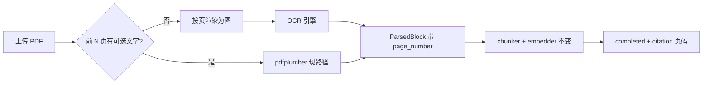

# Format-F4 · 扫描件 OCR · Research

> **状态**：✅ Research 关（2026-07-08）· 用户拍板：**用 OCR，不用多模态 LLM API**  
> **Plan**：[`format-f4-ocr-plan.md`](format-f4-ocr-plan.md)  
> **父地图**：[`enterprise-master-plan.md`](enterprise-master-plan.md) §6 Format-F · **F4**  
> **Implement**：确认 plan 后 **单开 I 窗** · 一次一条原子任务 · **禁止**同窗混 G2 thread / Agent

---

## §0 三句话摘要

1. **现有代码**：`parser.parse_pdf` 用 pdfplumber 抽字；整份 PDF 无字 → `ValueError("不支持扫描件")` → 文档 `failed`（`parser.py` L315–320）。
2. **目标**：扫描 PDF（及后续图片）在入库前 **OCR → 带 `page_number` 的纯文本** → 走现有 chunk / embed / 对话 citation；**对话仍用纯文本 LLM**，不接 vision API。
3. **风险**：OCR 错字影响检索；CPU/内存与 Docker 体积；需页数上限与 fixture 验收。

---

## §1 基线快照（2026-07-08）

| 项 | 现状 | 文件 |
|----|------|------|
| 上传白名单 | `.pdf` `.txt` `.md` `.docx` | `services/documents/upload.py` `ALLOWED_EXTENSIONS` |
| PDF 解析 | pdfplumber 按页抽字 + 跨页合并 | `services/ingestion/parser.py` |
| 扫描件 | 无 blocks → `不支持扫描件` | 同上 |
| 入库管道 | batch 10 页 · parse → chunk → embed | `services/ingestion/pipeline.py` |
| 失败重试 | API `POST .../retry` · audit `document.retry` | `lifecycle.py` |
| PRD | 扫描件 Wave 2 · MVP 提示不支持 | `docs/PRD.md` §6.2 |
| TECH | 扫描 → failed；DeepDoc/OCR = Wave 2 | `docs/TECH.md` §4.2 |
| F5 多模态 | master-plan P2 · **本线明确不做** | `enterprise-master-plan.md` §6 |

---

## §2 数据流（Implement 前须能口述）

**触发点**：BackgroundTasks `process_document_ingestion` → `parse_document`。

**不做**：对话里贴图 OCR、表格结构还原、手写体、F5 多模态 chunk。

---

## §3 待确认假设（拍板表）

> 用户 2026-07-08 口头确认「做 OCR、不用多模态」；下表默认列 **推荐**，Implement 前可改。

| 假设 | 人话选项 | 选这个的后果（白话） | 默认 | 状态 |
|------|----------|----------------------|------|------|
| **H1** | OCR 用哪套引擎 | **PaddleOCR 本地**：中文扫描件较准，Docker 镜像变大、首次下载模型；**Tesseract**：轻但中文易错，答辩要说局限；**云 OCR HTTP**：按页花钱、要 Key，仍不是多模态 LLM | **PaddleOCR** | 🟡 待 I 窗开工前确认 |
| **H2** | 第一版支持哪些格式 | **仅扫描 PDF**：只改 parser 分支，上传白名单不变；**再加 PNG/JPG**：要改 upload 白名单 + 前端 accept + 预览 | **仅扫描 PDF** | ✅ 用户确认（2026-07-08） |
| **H3** | 怎么判定「扫描件」 | **前 3 页累计可抽文字 &lt; 阈值** → 走 OCR；否则 pdfplumber | 同上 | **A** | ✅ 用户确认（2026-07-08） |
| **H4** | 单文件 OCR 页数上限 | **30 页**：超了 failed +「请拆文件」；**不设限**：大扫描册可能 OOM/超时 | **30 页** | 🟡 默认 30，可改 |
| **H5** | 与 F5 多模态关系 | **完全分开**：F4 只产出文本块；**混做 F5**：要 vision API，与当前资源冲突 | **F4 单线，不做 F5** | ✅ 用户确认（2026-07-08） |
| **H6** | OCR 失败怎么展示 | **failed + 明确中文**（如「OCR 未识别到文字」）；**静默当空库** | **failed + 文案** | ✅ 用户确认（2026-07-08） |
| **H7** | 部署依赖 | **可选**：`OCR_ENABLED=0` 时保持现行为；**强制**：没装 Paddle 就起不来 | **可选开关** | 🟡 默认可选 |

---

## §4 方案对比（TECH 大白话）

| 步骤 | 做什么 | 解决啥 | 验收 |
|------|--------|--------|------|
| 扫描检测 | 前若干页 `extract_text` 统计字数 | 避免对有文字层 PDF 误跑 OCR | 文字层 golden PDF 仍走 pdfplumber |
| 页→图 | `pdf2image` + poppler | OCR 需要像素 | 单页 fixture 能出字 |
| OCR | PaddleOCR `ocr()` 按页 | 扫描页变字符串 | fixture 含已知关键词 |
| 合并 | 每页 → `ParsedBlock(page_number=n)` | citation 仍显示第 N 页 | 对话 chip 带页码 |
| 限流 | 页数上限 + 与 upload 20/h 叠加 | 防算力爆炸 | 超页 failed 文案 |

**为什么不用多模态 LLM**：贵、页码难审计、和「引用必须可溯源」冲突；OCR 后走现有 RAG 链路即可。

**为什么不用 OCRmyPDF 单独一条线**：适合「给 PDF 加文字层再 pdfplumber」；中文场景 Paddle 直出文本更可控，plan 里 **F4-2 以 Paddle 直 OCR 为主**，OCRmyPDF 作 backlog。

---

## §5 测试与 fixture

| 项 | 说明 |
|----|------|
| **fixture** | `backend/tests/fixtures/ocr/` · 1 份 **无文字层扫描 PDF**（≤5 页）· 内嵌可断言关键词 |
| **pytest** | `test_ocr_scan_pdf_ingestion` · mock 可选（CI 无 Paddle 时 skip） |
| **golden** | 可选 1 题「扫描制度第 X 页」· 与 M13 格式矩阵联动 |
| **回归** | 现有文字层 PDF / docx golden **不能红** |

---

## §6 不做（Research 边界）

- F5 图表/多模态 API、对话输入框贴图 OCR  
- 表格 OCR 100%、手写体、公章遮挡修复  
- 改 chunk 策略 / rerank / Agent  
- 上传白名单扩 PNG/JPG（留 F4-6 backlog，见 plan）

---

## §7 Research DoD

- [x] R1 基线与文件位置已列  
- [x] R2 假设表含「后果（白话）」  
- [x] 用户确认：做 OCR、不做多模态、第一版扫描 PDF  
- [x] Plan 文件已链出  
