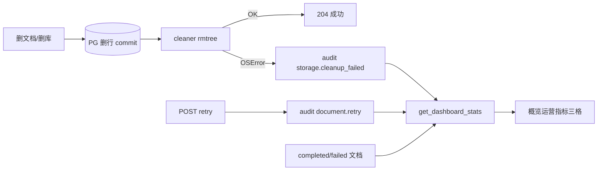

# Plan-3E-6 · 可观测（入库失败率 · 重试 · 磁盘清理失败）· Plan

> **状态**：✅ **Plan-3E-6 整波关单**（2026-07-08）· 3E-6a～d 全部 I 关  
> **Research**：`plan-3e-6-research.md`  
> **父 plan**：`kb-pages-polish-plan.md` §Plan-3E **3E-6**  
> **Implement**：确认本节后 **单开 I 窗**，严格一条原子任务；**禁止**同窗混 R3-3 / query 改写 / 顶栏 / 支付 / OCR

---

## §0 做 & 不做

| 做 | 不做 |
|----|------|
| `cleaner` 返回磁盘清理失败计数；caller 写 `storage.cleanup_failed` 审计 | 磁盘失败时**回滚** DB 删除（保持 3E-4「只打日志不阻塞」） |
| `GET /dashboard/stats` 展示入库成功率、近 7 日重试、磁盘清理失败累计 | 新建 `/metrics` / Prometheus / Grafana |
| 概览页「运营指标」三格（RAG 条上方/并列） | 顶栏 ⌘K · Plan-10/D-5/D-6 Dashboard 大改 |
| pytest：cleaner 失败 mock · retry 审计 · dashboard 聚合回归 | R3-3 query 改写 Implement · 入库 pipeline 自动重跑 |
| OrgScope / department_id 下指标与 visible_kb 一致（ORG-3.5 已接，回归） | 新表 `ops_counters` · `documents.retry_count` 列 |
| 过关同步 `cockpit.html` · `AGENTS.md` 3E-6 ✅ | 支付 · OCR · 软删回收站（3E-5） |

---

## §1 基线快照（L 窗对照代码 · 2026-07-07）

| 项 | 状态 | 说明 |
|----|------|------|
| pytest | **347 passed** | 开工 I 窗前先跑绿 |
| `ingestion_success_rate` | ✅ API 已有 | `stats.py` 全量 completed÷终态 |
| `document_retry_count_7d` | ✅ API 已有 | audit `document.retry` 近 7 日聚合 |
| `storage_cleanup_failure_count` | 🟡 API 可读、**写入链未闭环** | stats 数 audit，但 **cleaner 失败尚不写 audit** |
| `DashboardOpsMetrics.tsx` | ✅ 前端已有 | ORG-3.5 交付；RAG 条上方三格 |
| `cleaner.py` | 🟡 仅 `logger.warning` | **3E-6a 主工作量** |
| `test_audit_events` retry | ✅ `test_document_retry_writes_audit_log` | **3E-6c ✅** |
| cleaner OSError 集成测 | ✅ `test_storage_cleaner.py` | **3E-6c ✅** |

> **ORG-3.5 与 3E-6 关系**：组织域 Implement 时已提前交付 **3E-6b（stats + OrgScope）** 与 **3E-6d（前端 OpsMetrics）**。本 plan **3E-6b/d 的 I 窗 = 回归关单**，不重复造字段/UI；**3E-6a + 3E-6c 为剩余 P0**。

---

## §2 默认拍板（Research H1～H5 · 用户授权「都行」· 2026-07-07）

| 假设 | 人话 | 默认 | 状态 |
|------|------|------|------|
| **H1** | 指标出口 | 扩 `GET /dashboard/stats`（与 golden/延迟同权限） | **A** | ✅ 用户确认 |
| **H2** | retry 怎么数 | 近 7 日 audit `document.retry` 条数 | **A** | ✅ 用户确认 |
| **H3** | 磁盘失败怎么记 | cleaner 返回失败数 → caller 写 `storage.cleanup_failed` audit | **A** | ✅ 用户确认 |
| **H4** | 入库成功率窗口 | 保持全量 completed÷(completed+failed) | **A** | ✅ 用户确认 |
| **H5** | 前端放哪 | Dashboard RAG 条上方「运营指标」三格 | **A** | ✅ 用户确认 |

---

## §3 原子任务（I 窗按序 · 一次一条）

### 3E-6a · cleaner 返回值 + 删路径写 audit

| 项 | 内容 |
|----|------|
| **目标** | 删文档/删库后若磁盘删不干净，**持久化**到 `audit_logs`，Dashboard 能累计 |
| **cleaner** | `remove_document_tree` / `remove_kb_tree` 返回 `CleanupResult`（或等价 dict）：`file_errors: int`、`tree_errors: int`；内部仍 catch `OSError`，**不抛错** |
| **lifecycle** | `delete_document`：DB commit 后调 cleaner；若 `file_errors + tree_errors > 0` → `write_audit_log(action="storage.cleanup_failed", resource_type="document", kb_id, resource_id=doc_id, metadata={file_errors, tree_errors, …})` |
| **crud** | 删库 `remove_kb_tree` 后同理写 audit（`resource_type="knowledge_base"`） |
| **文件** | `services/storage/cleaner.py` · `services/documents/lifecycle.py` · `services/knowledge_base/crud.py` |
| **不做什么** | 不阻塞 204/删库成功；不改 ingestion pipeline 写 audit；不动 query/RAG |

**DoD**

- [x] cleaner 两函数有明确返回类型；OSError 路径 `tree_errors`/`file_errors` +1
- [x] 删 doc API 仍 **204**；删库仍成功；仅多一条 audit
- [x] `pytest` 基线不红（347+）

---

### 3E-6b · Dashboard stats 聚合（OrgScope 回归关单）

| 项 | 内容 |
|----|------|
| **目标** | 确认三项指标 API 契约稳定，且 **workspace + department_id** scope 正确 |
| **已有** | `stats.py`：`ingestion_success_rate`、`document_retry_count_7d`、`storage_cleanup_failure_count`；`schemas/dashboard.py`；`_count_audits_in_scope` |
| **I 窗动作** | **仅当 3E-6a 改动了 stats 才动本文件**；否则跑回归：`test_dashboard.py` · `test_org_isolation.py` 运营指标段 |
| **不做什么** | 不新路由；不 migration；不改近 7 日窗口（H4） |

**DoD**

- [x] `GET /dashboard/stats` 含三字段；personal/org/切部门数字与 visible_kb 一致
- [x] `pytest tests/test_dashboard.py tests/test_org_isolation.py -q` 绿

---

### 3E-6c · pytest：cleaner 失败 · retry 审计 · 端到端计数

| 项 | 内容 |
|----|------|
| **cleaner mock** | 新建 `tests/test_storage_cleaner.py`（或扩 `test_documents.py`）：`monkeypatch` `shutil.rmtree`/`unlink` 抛 `OSError` → DELETE doc **仍 204** → audit 有 `storage.cleanup_failed` → dashboard `storage_cleanup_failure_count` +1 |
| **retry 审计** | `test_audit_events.py` 增 `test_document_retry_writes_audit_log`：failed doc → POST retry → `document.retry` 计数 +1 |
| **删库路径** | 可选同文件：删库 + mock rmtree 失败 → audit + dashboard（与 doc 对称） |
| **不做什么** | 不测 Prometheus；不扩 golden |

**DoD**

- [x] 至少 1 条 cleaner 失败集成测（doc 路径必做）
- [x] retry 审计用例绿
- [x] 全量 `pytest` 绿（350 passed，本地需 Postgres）

---

### 3E-6d · 前端运营指标条（回归关单）

| 项 | 内容 |
|----|------|
| **已有** | `DashboardOpsMetrics.tsx` · `ops-metrics.ts` · `dashboard-api.ts` 类型 · `DashboardPage` 挂载（RAG 条上方） |
| **I 窗动作** | 若 3E-6a～c 未改 API 字段名 → **仅** `npm run build` + 浏览器点验；若文案/空态需微调，限本组件 ≤120 行 |
| **不做什么** | 不动 Plan-10 找文档 · D-5/D-6 · 顶栏 · 组织域页面 |

**DoD**

- [x] 概览见「入库成功率 %」「近 7 日重试次数」「磁盘清理失败」三格
- [x] `demo_member` 也能看（只读统计，与 PRD 一致）
- [x] `npm run build` 绿

---

## §4 页面操作版验收（Plan-3E-6 整波关单）

| # | 你怎么点 | 预期画面 |
|---|----------|----------|
| **S1** | `demo_admin` 登录 → 概览（有库、有文档） | RAG 指标下方或上方见 **「运营指标」** 三格：成功率 %、7 日重试、磁盘失败 |
| **S2** | 进某库 → 造一条 **failed** 文档（或上传坏文件）→ 回概览 | **入库成功率**下降；统计卡/ Banner 仍可点「失败」进库 |
| **S3** | 对该 failed 文档点 **重试** → 回概览 | **近 7 日重试** +1 |
| **S4** | （测试环境）跑带 cleaner mock 的 pytest 或 staging mock 删 doc | **磁盘清理失败** ≥1；删 doc 接口仍成功、列表行已消失 |
| **S5** | 企业账号 **切部门** → 概览 | 三格数字随部门变；与当前部门可见库一致 |
| **S6** | `demo_member` 登录 → 概览 | 仍能看到三格（无文件名泄露焦虑设计：仅计数） |

**乱操作 / 边界**

| 乱操作 | 系统怎么处理 | 你怎么验 |
|--------|--------------|----------|
| 磁盘删失败但 DB 已删 | API 仍 204；audit + Dashboard 计数 +1；日志 warning | pytest mock OSError |
| 零终态文档（全 queued） | 成功率显示「暂无」/ null | 新库无 completed/failed |
| 7 日前 retry | 不计入 7 日重试（仍可能在 audit 表） | 改测试时钟或插旧 audit |
| 切 workspace 硬刷 | stats 随 workspace/department 变，不串库 | 个人 vs 团队对比 |

---

## §5 大白话（Implement 前须听懂）

**一句话**：管理员打开概览，除了 RAG 好不好用，还能看见 **「上传成功率高不高、最近重试几次、删文件时磁盘有没有清不干净」**——出问题能追责、能运营，不用 SSH grep 日志。

| 名词 | 人话 |
|------|------|
| 入库成功率 | 已经处理完的文档里，多少 % 成功入库（不是 queued 那些） |
| 近 7 日重试 | 最近一周里，管理员对失败文档点了几次「重试」 |
| 磁盘清理失败 | 数据库里删掉了，但硬盘文件夹没删掉——系统记一笔，概览上累加 |
| OrgScope | 切部门后，数字只算你当前部门能看到的库 |
| audit_logs | 后台「谁何时做了什么」流水账；Dashboard 从这些行里数数 |

**这回不做**：自动修复磁盘、Prometheus 大屏、入库失败自动写 audit（仍只 DB `error_message`）、query 改写、支付 OCR。

---

## §6 门禁三题（Implement 前自答）

1. **触发点**：删文档 `DELETE .../documents/{id}` · 删库 `DELETE .../knowledge-bases/{id}` · 概览加载 `GET /dashboard/stats`  
2. **数据流**：DELETE → DB 删行 commit → `cleaner` 清盘 → 失败计数 → `write_audit_log(storage.cleanup_failed)` → stats 聚合 audit → 前端 `DashboardOpsMetrics` 三格  
3. **怎么验**：§4 浏览器 S1～S6 + §3 各原子任务 DoD + `pytest` 347+ 绿  



---

## §7 风险与缓解

| 风险 | 缓解 |
|------|------|
| ORG-3.5 已做 b/d，Implement 重复劳动 | §1 基线快照；b/d 只做回归 |
| cleaner 改签名撞 EW-A1 | 3E-6a 单 PR 内改 lifecycle + crud + tests |
| audit 表大，7 日 count 慢 | 已有 `created_at` + `action`；scope join kb |
| member 看到失败数焦虑 | 仅计数、无文件名（与「N 篇失败」脚注一致） |

---

## §8 L 关 DoD

- [x] L1 本文落盘，原子任务 3E-6a～d + 不做什么 + 验收  
- [x] L2 §2 H1～H5 标 ✅（用户「都行」授权 2026-07-07）  
- [x] L3 §5 大白话 + §6 门禁三题  
- [x] L4 `cockpit.html` 下一步 → **3E-6a Implement**  
- [ ] 用户口头确认 §0 边界 + §3 顺序 → 方可开 **I 窗 3E-6a**

---

## §9 I 窗交接提示词（复制新开对话）

```
@rag-knowledge-platform/AGENTS.md
@rag-knowledge-platform/docs/tasks/plan-3e-6-plan.md
@rag-knowledge-platform/docs/tasks/plan-3e-6-research.md
@rag-knowledge-platform/docs/cockpit.html

【背景】Plan-3E-6 L ✅ · ORG-3.5 已交付 3E-6b/d 前端+stats 聚合 · pytest 347 绿 · 缺口：cleaner 不写 audit（3E-6a）

【要求】严格只做 plan **3E-6a** 一条：cleaner 返回失败计数 + lifecycle/crud 写 storage.cleanup_failed · 不阻塞 DB 删除

【验收标准】
- cleaner 两函数有 CleanupResult · OSError 累加计数
- DELETE doc 仍 204 · 失败时 audit 一行
- pytest 347+ 绿 · 不动 R3-3/query/顶栏/支付/OCR
- 完工汇报 + 面试四件套 · cockpit 标 3E-6a ✅ 下一步 3E-6c
```
