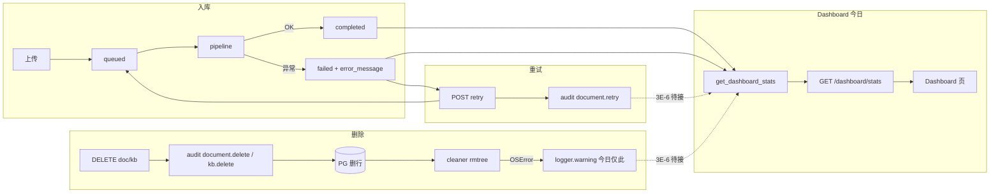

# Plan-3E-6 可观测 — Research

> **状态**：✅ R 关（2026-07-07）· H1～H5 用户授权「都行」· L 窗 → `plan-3e-6-plan.md`  
> **依据**：`kb-pages-polish-plan.md` §Plan-3E · `TECH-SEC` P1「可审计、可运营」· `AGENTS.md` 企业优先级 1  
> **会话类型**：R 窗 · **禁止 Implement**

---

## 1. 三句话摘要

1. **已有**：`GET /dashboard/stats` 已算 `ingestion_success_rate`（completed÷终态）和 `documents_by_status.failed`；入库失败写 `documents.error_message`；重试/删文档写 `audit_logs`（`document.retry` / `document.delete`）；删磁盘失败只在 `cleaner.py` 打 **warning 日志**，**无计数、无审计、无 Dashboard**。
2. **缺口**：前端概览**未展示**入库成功率；**无**重试次数聚合；**无** DELETE 磁盘失败可运营指标；入库 pipeline 自动失败**不写 audit**。
3. **建议最小路径**：扩 `GET /dashboard/stats`（对齐 EW-C3 模式）+ `cleaner` 返回失败信号 → 写 audit → Dashboard「运营指标」条；**不新建**独立 metrics 表（第一刀）。

---

## 2. Plan-3E-6 要的三项 vs 现状

| 指标 | Plan 要求 | 现状 | 缺口 |
|------|-----------|------|------|
| **入库失败率** | 运营可见 | 后端 `ingestion_success_rate` + `documents_by_status.failed`；StatCard 脚注可点「N 篇失败」 | API 有、**UI 未展示成功率%**；无「近 7 日」窗口（全量终态） |
| **retry 次数** | 运营可见 | `lifecycle.retry_document` → `audit_logs.action=document.retry` | **无聚合**；`test_audit_events.py` **未覆盖** retry 审计 |
| **DELETE 磁盘失败计数** | 运营可见 | `storage/cleaner.py` `OSError` → `logger.warning` only | **零持久化**；删库/删 doc 测试只验目录消失，**不测** cleaner 失败路径 |

---

## 3. 代码位置（Implement 时会动）

| 职责 | 文件 | 说明 |
|------|------|------|
| Dashboard 聚合 | `backend/app/services/dashboard/stats.py` | 已有 RAG/入库指标；扩字段入口 |
| API 契约 | `backend/app/schemas/dashboard.py` · `backend/app/api/dashboard.py` | 响应模型 |
| 磁盘清盘 | `backend/app/services/storage/cleaner.py` | `remove_document_tree` / `remove_kb_tree` |
| 删 doc / retry | `backend/app/services/documents/lifecycle.py` | 调 cleaner；写 audit |
| 删库 | `backend/app/services/knowledge_base/crud.py` | 调 `remove_kb_tree` |
| 入库失败 | `backend/app/services/ingestion/pipeline.py` | `_mark_failed` → DB only |
| 审计 | `backend/app/services/audit/log.py` · `models/audit_log.py` | retry/delete 已有 action |
| 前端类型 | `frontend/src/lib/dashboard-api.ts` · `rag-metrics.ts` | 接新字段 |
| 前端展示 | `DashboardRagMetrics.tsx` 或新建 `DashboardOpsMetrics.tsx` | EW-C3 放 RAG 条；运营指标建议**并列新 section** |
| 测试 | `backend/tests/test_dashboard.py` · 新建 `test_storage_cleaner.py` 或扩 `test_documents.py` | 无 cleaner 失败用例 |

---

## 4. 测试基线

| 区域 | 文件 | 覆盖 |
|------|------|------|
| Dashboard stats | `test_dashboard.py` | `ingestion_success_rate` 100% / null ✅ |
| 文档 retry/delete | `test_documents.py` | API 行为 ✅；磁盘清 ✅ |
| 审计事件 | `test_audit_events.py` | upload/delete/login ✅；**retry ❌** |
| 删库清盘 | `test_knowledge_bases.py` EW-A1 | 成功路径 ✅ |
| cleaner 失败 | — | **无** |

开工前：`cd backend && pytest` 应 **273 passed**（与 cockpit W6-2 一致）。

---

## 5. 数据流（Implement 前须能讲清）

---

## 6. 🟡 待确认假设

### H1 · 指标出口：扩 Dashboard API vs 独立 `/metrics`

| 人话选项 | 选这个的后果（白话） |
|----------|---------------------|
| **A：扩 `GET /dashboard/stats`**（推荐） | 概览页多一行「运营指标」，和 golden/检索延迟同一套权限（workspace scope）；改 `stats.py` + 前端一条组件；**member 也能看到组织级失败数**（只读统计，符合 PRD） |
| **B：新路由 `/dashboard/ops` 或 Prometheus** | 运维同学开心，但你得多维护一套 API、前端可能不接；适合以后上 Grafana，**第一刀偏重** |

| 假设 | 默认 | 状态 |
|------|------|------|
| H1 | **A** 扩 stats | ✅ 用户确认（2026-07-07） |

### H2 · retry 次数怎么数

| 人话选项 | 选这个的后果（白话） |
|----------|---------------------|
| **A：近 7 日 `audit_logs` 数 `document.retry`**（推荐） | 不用改表；和「近 7 日提问」口径一致；**不含** pipeline 自动重跑（本来就没有自动重跑） |
| **B：documents 表加 `retry_count` 列** | 每次 retry +1，历史可追溯单 doc；要 migration + 回填逻辑，**工作量大** |

| 假设 | 默认 | 状态 |
|------|------|------|
| H2 | **A** audit 聚合 7 日 | ✅ 用户确认（2026-07-07） |

### H3 · DELETE 磁盘失败怎么记

| 人话选项 | 选这个的后果（白话） |
|----------|---------------------|
| **A：`cleaner` 返回失败次数，caller 写 `audit_logs` action=`storage.cleanup_failed`**（推荐） | 删 doc/删库后若磁盘删不掉，Dashboard 能看到累计；DB 已删行，**不会回滚**，符合现有 3E-4「失败只打日志不阻塞」 |
| **B：仅 structlog + DEPLOY.md 教 grep** | 零代码，但 Plan-3E-6 的「Dashboard 或日志聚合」**算没做完** |
| **C：新表 `ops_counters`** | 最准，但 migration + 后台 job，**Overkill** |

| 假设 | 默认 | 状态 |
|------|------|------|
| H3 | **A** cleaner 返回值 + audit | ✅ 用户确认（2026-07-07） |

### H4 · 入库失败率展示窗口

| 人话选项 | 选这个的后果（白话） |
|----------|---------------------|
| **A：保持现逻辑** completed/(completed+failed) **全量 workspace** | 和现有 pytest 一致；一个老失败 doc 会一直拉低成功率，直到重试成功或删掉 |
| **B：改为近 7 日 `processing_completed_at` / failed 窗口** | 更「运营态」；要改 SQL + 改 `test_dashboard.py` 断言 |

| 假设 | 默认 | 状态 |
|------|------|------|
| H4 | **A** 全量（先展示已有字段） | ✅ 用户确认（2026-07-07） |

### H5 · 前端放哪

| 人话选项 | 选这个的后果（白话） |
|----------|---------------------|
| **A：RAG 条下方加「运营指标」3 格**（入库成功率 · 7 日重试 · 磁盘清理失败） | 用户打开概览就能看见；文件预计新建 `DashboardOpsMetrics.tsx` ≤120 行 |
| **B：仅 admin 组织设置页** | member 看不到；和 Plan「Dashboard 或日志聚合」字面略偏 |

| 假设 | 默认 | 状态 |
|------|------|------|
| H5 | **A** Dashboard 新 section | ✅ 用户确认（2026-07-07） |

---

## 7. 建议 Plan 原子任务（L 窗再细化，此处仅 Research 产出）

| # | 任务 | 不做什么 |
|---|------|----------|
| 3E-6a | `cleaner` 返回 `{file_errors, tree_errors}`；lifecycle/crud 失败时 `write_audit_log(storage.cleanup_failed)` | 不阻塞 DB 删除 |
| 3E-6b | `stats.py` 增 `document_retry_count_7d`、`storage_cleanup_failure_count`（audit 聚合，scope 过滤）；可选显式返回 `ingestion_success_rate` 已有 | 不新表 |
| 3E-6c | pytest：cleaner 失败 mock · dashboard 新字段 · `test_audit_events` 补 retry | — |
| 3E-6d | 前端 `DashboardOpsMetrics` + `dashboard-api` 类型 | 不动 Plan-10/D-5/D-6 |

**验收（页面操作版）**

1. admin 登录 → 概览见「入库成功率」「近 7 日重试次数」「磁盘清理失败次数」  
2. 造一条 failed doc → 成功率下降；点重试 → 7 日重试 +1  
3. （测试环境 mock）cleaner 抛 OSError → 磁盘失败计数 +1，删 doc API 仍 204  

---

## 8. 风险

| 风险 | 缓解 |
|------|------|
| audit 表大，7 日 count 慢 | `audit_logs.created_at` + `action` 索引；scope 通过 kb join |
| member 看到失败数「焦虑」 | 仅计数无文件名；与现有「N 篇失败」脚注一致 |
| cleaner 改签名撞 EW-A1 | 单 PR 内改 lifecycle + crud + tests |

---

## 9. R 关 DoD

- [x] R1 落盘本文  
- [x] R2 三句话摘要可口述  
- [x] 用户确认 H1～H5（「都行」· 2026-07-07）→ L 窗 `plan-3e-6-plan.md` ✅
