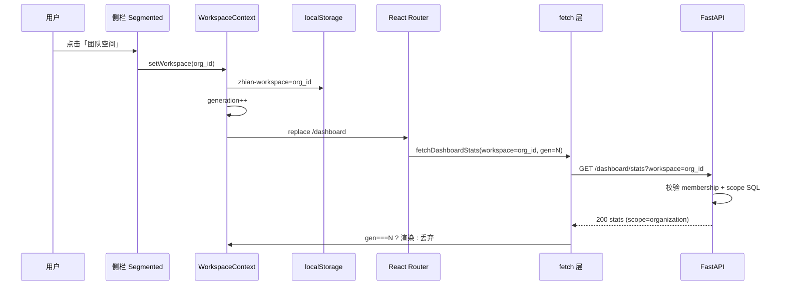

# workspace · Research

> **状态**：✅ **Research 关门**（2026-07-05）· §1～§6 ✅ · 壳层 › chevron ✅ · **Plan W1 ✅** · **下一：I 窗 W1-1**  
> **依据**：`workspace-prd-ws1.md` ✅ · `workspace-prd-ws2.md`（WS-2-1/2/3/9 ✅ · V 冻结 shell v2）  
> **Plan**：`docs/tasks/workspace-plan.md`（L 阶段 · 骨架已建）  
> **边界**：本调研 **不写 React**、**不改预览 HTML**；Implement 前须关 R 阶段 DoD

---

## §1 切换工作区 · 请求数据流（✅ 2026-07-05）

**这节定什么**：用户点侧栏 segmented 切换「我的空间 ↔ 团队」时，浏览器里**请求按什么顺序走**；和现在 `account_type` 方案的差别。

### 1.1 三句话摘要（面试 / 门禁用）

1. **今天**：后端靠 JWT + `account_type` 二选一——个人账号只查 `owner_user_id`，企业账号只查 `owner_org_id`；前端**没有**「工作区」概念，API **不带** `workspace` 参数。  
2. **W1 目标**：前端维护「当前工作区」（`personal` 或 `org_id`），存 `localStorage`；每次拉列表 / 概览统计时在 URL 上带 `?workspace=…`，并给在途请求打**代际序号**，旧响应丢弃。  
3. **切换动作**：用户点 segmented → 写新 workspace + 代际 +1 → `replace` 跳 `/dashboard` → Dashboard 用新 workspace 调 `GET /dashboard/stats?workspace=…` → 后端校验「这人能不能看这个 org」→ 只聚合该空间下的库/文档数字 → 页面刷新；若 workspace 无效则 **403**，前端回落 personal。

### 1.2 现状（代码里已有）

| 层 | 今天怎么做 | 关键文件 |
|----|------------|----------|
| **身份** | 登录后 JWT；`GET /auth/me` 返回 `account_type`、`org_id`、`org_role` | `backend/app/api/auth.py` · `backend/app/services/auth/org_context.py` |
| **后端 scope** | `account_type === personal` → `KnowledgeBase.owner_user_id == me`；`enterprise` → `owner_org_id == org_id` | `backend/app/services/dashboard/stats.py` `_kb_scope_clause` · `backend/app/services/knowledge_base/crud.py` `list_knowledge_bases` · `backend/app/core/deps.py` `_assert_kb_ownership` |
| **前端身份** | `AuthProvider` 存 user；`isOrgAdmin = enterprise && org_role===admin` | `frontend/src/lib/auth-context.tsx` |
| **侧栏** | 企业 admin 始终显示「成员管理 / 组织设置」；**无** segmented 切换器 | `frontend/src/lib/AppSidebar.tsx` |
| **最近库** | 全局单键 `zhian-recent-kb-id`，**不分** personal/team | `frontend/src/lib/use-sidebar-chat-kb-id.ts` |
| **列表 / 概览 API 调用** | `GET /knowledge-bases`、`GET /dashboard/stats` **无** query 参数 | `frontend/src/lib/knowledge-base-api.ts` · `frontend/src/lib/dashboard-api.ts` |

**与 PRD 差距（WS-1-4）**

| 现况 | W1 目标 |
|------|---------|
| `account_type` 决定看哪套库 | `workspace=personal \| org_id` 决定 scope |
| 个人用户永远看不到团队库（即使已是 member） | 同一账号可在「我的空间」与「团队空间」间切换 |
| 企业用户看不到个人库 | 切到 personal 只看个人库 |

### 1.3 目标 · 切换一次工作区（页面操作版 · 8 步）

> PRD：WS-2-1 §1.2 · §1.6 E7 · WS-2-3 E1

| 步 | 谁 | 做什么 | 你怎么在浏览器里看见 |
|----|-----|--------|----------------------|
| 1 | 用户 | 点侧栏 segmented（例：我的空间 → 团队） | 选中态变到团队段 |
| 2 | 前端 | 写 `localStorage` 当前 workspace（`personal` 或 `org_id`） | — |
| 3 | 前端 | `workspaceGeneration++`；**abort** 旧 stats / 列表等 in-flight 请求 | Network 里旧请求 canceled |
| 4 | 前端 | `navigate('/dashboard', { replace: true })` | URL 到概览；若之前在库详情则**不**留跨空间页 |
| 5 | 前端 | 侧栏导航项重算：personal 隐藏管理项；team+admin 显示 | 成员管理/组织设置出现或消失 |
| 6 | 前端 | `fetchDashboardStats({ workspace })` | Network：`GET …/dashboard/stats?workspace={org_id}` |
| 7 | 后端 | 解析 `workspace` → 校验 membership → `_kb_scope_clause(workspace)` 聚合 | 200 + `scope: organization` + 团队库数字 |
| 8 | 前端 | 丢弃 generation 过期的响应；渲染新统计卡 | 资料库数/文档数与团队列表一致 |

**缺 workspace / 非法 org_id（E3）**：后端 **403** 或 fail-closed 回落 personal（plan 定一种）；前端 interceptor 清 workspace 键 + toast「工作区已重置」+ 重拉 personal stats。

### 1.4 数据流图（Implement 前须能指到）



### 1.5 首批须接 `workspace` 的 API（W1 内核 · 调研清单）

| API | 今天 | W1 scope 规则 | PRD |
|-----|------|---------------|-----|
| `GET /knowledge-bases` | 按 `account_type` | `personal` → owner_user_id；`org_id` → owner_org_id + membership | WS-2-2 §2.1 |
| `GET /dashboard/stats` | 按 `account_type` | 同上；`recent_kb_id` **仅当前 workspace** 内 | WS-2-3 §3.1 |
| `POST /knowledge-bases` | personal 或 enterprise 写 | workspace=team 时 member → 403 | WS-2-2 §2.2 |
| `GET/PATCH/DELETE /knowledge-bases/{id}` | kb 归属校验 | 资源须 ∈ 当前 workspace（ResourceGuard + L3） | WS-2-1 E6 |
| `GET /auth/me` | 不变 | 启动时对齐 membership；**不**代替 workspace 参数 | WS-2-1 E3 |

**暂不强制 workspace query（W1 可后置）**：`/organization/*`（仍靠 org_role）、`/settings/account`、单资源 chat/documents（靠 `kb_id` + `require_kb_access`，ResourceGuard 补 L1）。

### 1.6 §1 待确认假设

| # | 假设 | 人话选项 | 选这个的后果（白话） | 默认 | 状态 |
|---|------|----------|----------------------|------|------|
| H1 | API 忘带 workspace 参数 | **一律报错 403** | 旧页面一调接口就失败，**必须** W1 前后端一起改完才能用；不会出现「有时看个人库有时看团队库」的混数据 | 403 | ✅ 用户确认 2026-07-05 |
| H2 | 团队账号能否看个人库 | **能** | 同一人可在「我的空间」看到自己的个人库，在「团队空间」看团队库；两套数字分开 | PRD 已定 | ✅ |
| H3 | 最近用过的库存在哪 | **按空间分键存** | 在个人空间记的「最近库」不会带到团队空间；切换后对话/上传进对的库，不会串 | `zhian-recent-kb:{workspace}` · §4 | ✅ §4 定稿 |
| H4 | `/me` 要不要带组织名、是否 Owner | **可 W1 或 W2 分批** | W1 不做：侧栏可能暂时少「创建者」标签，不影响切换和列表；W2 再做 Popover/标签更齐 | 分批 | 🟡 |

---

## §2 后端 gap（account_type → workspace query）（✅ 2026-07-05）

**这节定什么**：W1 后端要**新建什么、改哪些文件**；`account_type` 哪些保留、哪些换成 `workspace` 参数。

### 2.1 核心新增 · `resolve_workspace`

| 项 | 定稿（Research 建议） |
|----|----------------------|
| 新文件 | `backend/app/services/workspace/scope.py`（≤150 行） |
| 入参 | `current_user` + `workspace: str`（Query：`personal` 或 UUID 字符串） |
| 出参 | `WorkspaceScope(kind, org_id?, sql_clause)` |
| `personal` | SQL：`KnowledgeBase.owner_user_id == current_user.id`（**不看** account_type） |
| `org_id` | 查 `organization_members`：无记录 → **403**「无权访问该工作区」；有 → `owner_org_id == org_id` |
| 缺参 / 空串 | **403**（H1 fail-closed，与 §1.6 H1 一致） |
| 非法 UUID | **400** 或 **403**（plan 二选一，建议 400） |

**为何单独文件**：`stats.py`、`crud.py`、`names.py` 三处 today 各写一遍 `if account_type`；W1 抽一次，以后 RAG 跨库搜也复用。

### 2.2 必改文件清单

| 文件 | 今天 | W1 改什么 |
|------|------|-----------|
| `api/knowledge_bases.py` | 无 Query | `list_kbs` / `create_kb` 增 `workspace: str = Query(...)` |
| `api/dashboard.py` | 无 Query | `read_dashboard_stats` 增 `workspace` |
| `services/knowledge_base/crud.py` | `list` / `create` / `_assert_can_create_kb` 看 account_type | 传入 `WorkspaceScope`；team + member → 403 建库 |
| `services/knowledge_base/names.py` | 重名校验 scope 看 account_type | 改用 `WorkspaceScope` |
| `services/dashboard/stats.py` | `_kb_scope_clause(current_user)` | 改用 `WorkspaceScope`；`member_count` **仅** team workspace |
| `core/deps.py` | `_assert_kb_ownership`：enterprise **不能**读 personal kb | **修**：若 `kb.owner_user_id == me` → 允许读/写（按 action）；org kb 仍校验 membership |

**W1 暂不改（靠 kb_id + 修过的 deps 够用）**

| 文件 | 原因 |
|------|------|
| `api/documents.py`、`api/chat.py` | 已有 `require_kb_access(kb_id)`；修 deps §2.2 后 personal kb 可访问 |
| `api/organization/*` | 仍用 `require_org_role`；前端 L1 拦「非 team workspace」即可 |
| `services/auth/service.py` 注册 | 注册三步属 W5+；W1 只假设 membership 已存在 |

### 2.3 与现 `account_type` 的关系

| 用途 | W1 处理 |
|------|---------|
| JWT / `/me` 返回 account_type | **保留**（兼容旧前端字段） |
| 列表 / stats **数据范围** | **改**为 `workspace` Query |
| `require_org_role` 企业管理 API | **保留** account_type + org_role |
| 加成员时 `flip personal→enterprise` | **保留**（W5 注册重构时再删；Research 记 🟡 tech debt） |

### 2.4 `create_kb` 写归属（team workspace）

```
workspace=personal  → kb.owner_user_id = me；owner_org_id = null
workspace={org_id}  → kb.owner_org_id = org_id；owner_user_id = null
                      且 org_role ∈ {admin}（member → 403，与 WS-2-2 一致）
```

### 2.5 pytest 矩阵（W1-1 / W1-2 验收）

| # | 场景 | 预期 |
|---|------|------|
| T1 | personal 用户 · `?workspace=personal` | 200；仅 personal 库 |
| T2 | enterprise admin · `?workspace=personal` | 200；仅 **自己的** personal 库（可为 0） |
| T3 | enterprise admin · `?workspace={org_id}` | 200；仅 team 库；`scope=organization` |
| T4 | enterprise member · POST kb · team workspace | 403 |
| T5 | 任意用户 · **缺** workspace | 403 |
| T6 | 伪造他人 `org_id` | 403 |
| T7 | enterprise · `GET kb/{personal_kb_id}`（自己的 personal 库） | 200（deps 修复后） |

**测试文件**：扩 `tests/test_dashboard.py` + `tests/test_knowledge_bases.py`（或新 `tests/test_workspace_scope.py` ≤400 行）。

### 2.6 §2 待确认假设 🟡

| # | 假设 | 人话选项 | 选这个的后果（白话） | 默认 | 状态 |
|---|------|----------|----------------------|------|------|
| H5 | enterprise 用户有没有 personal 库 | **接受「空间在，库可能 0 个」** | 团队账号切到「我的空间」可能是空列表——不是 bug，是还没建个人库；和 PRD「永远有个人空间」一致 | 是 | ✅ 用户确认 2026-07-05 |
| H6 | 加成员时是否 flip account_type | **W1 先不动** | 短期：被加进团队的人账号仍显示「团队版」，但靠 workspace 切换看库；长期：和「个人/团队两空间」有点拧，**W5 注册重构时再删 flip**；W1 少改一块、风险小 | W1 不动 | ✅ 用户确认 2026-07-05 |
| H7 | stats 里 scope 字段叫什么 | **继续用 personal / organization** | 前端概览页不用改字段名，只多传 workspace 参数；若改成 team 之类，Dashboard 代码要多改一轮 | 现 schema | ✅ 用户确认 2026-07-05 |

---

## §3 前端 gap（WorkspaceContext · generation · interceptor）（✅ 2026-07-05）

**这节定什么**：W1 前端要**新建什么 Context/存储**、**哪些 api 文件加 `?workspace=`**、**generation 与 403 回落怎么接**；Implement 前须能用大白话讲清。

### 3.1 三句话摘要（面试 / 门禁用）

1. **今天**：只有 `AuthProvider`（谁登录、是否团队管理员）；拉列表/概览 **不带** workspace；侧栏 **无** segmented；`isOrgAdmin` 看 `account_type`，不是「当前在哪个空间」。  
2. **W1 目标**：新增 `WorkspaceContext`——记住「当前在看我的空间还是团队」、存 `localStorage`、切换时 **generation+1** 并 `replace` 到 `/dashboard`；`dashboard-api` / `knowledge-base-api` 的 list·stats·create **统一 append** `?workspace=`。  
3. **防串台**：每次请求记下当时的 generation；响应回来时若 generation 已变 → **丢弃不渲染**；403 且与 workspace 有关 → interceptor **清键 + 回落 personal + toast**「工作区已重置」（与 §1.3 E3、WS-2-1 E3 同路径）。

### 3.2 现状（代码里已有）

| 层 | 今天怎么做 | 关键文件 |
|----|------------|----------|
| **身份** | `AuthProvider`：`user`、`isOrgAdmin = enterprise && admin` | `frontend/src/lib/auth-context.tsx` |
| **Provider 树** | `AuthProvider` → `RouterProvider`；**无** Workspace | `frontend/src/main.tsx` |
| **侧栏** | 固定导航；admin 始终显示成员/团队设置；**无** segmented | `frontend/src/components/layout/AppSidebar.tsx` |
| **列表 / 概览 API** | `GET /knowledge-bases`、`GET /dashboard/stats` **无** query | `knowledge-base-api.ts` · `dashboard-api.ts` |
| **写权限 UI** | `canWriteKnowledgeBase` 看 `account_type` + `org_role` | `org-permissions.ts` · `DashboardPage` |
| **路由守卫** | `OrgAdminGuard`：非 admin → `/dashboard`；**无** workspace 维度 | `OrgAdminGuard.tsx` · `routes/index.tsx` |
| **最近库** | 单键 `zhian-recent-kb-id`；侧栏对话 fallback 调 **无 workspace** 的 list | `use-sidebar-chat-kb-id.ts` |
| **403 处理** | 各 api 自己 `throw Error`；**无** workspace 全局回落 | `api-error.ts`（仅文案映射） |
| **logout** | 只清 token + user | `auth-storage.ts` · `auth-context.tsx` |

**与 PRD 差距（WS-2-1 §1.2 · WS-2-2 §2.1 · WS-2-3 §3.1）**

| 现况 | W1 目标 |
|------|---------|
| 数据范围由后端 `account_type` 决定 | 前端显式传 `workspace=personal \| org_id` |
| 企业 admin 永远看团队库 | 可切「我的空间」看个人库（可为 0，§2 H5） |
| 成员管理入口看 `isOrgAdmin` | W2 改为 **team workspace + admin**；W1 先保留 + 补 `WorkspaceGuard` 骨架 |
| 快速切换可能闪错数字 | `workspaceGeneration` 丢弃过期响应（E7） |

### 3.3 核心新增

| 项 | 定稿（Research 建议） |
|----|----------------------|
| **`workspace-context.tsx`**（≤200 行） | React Context：`workspace`、`generation`、`setWorkspace`、`resetToPersonal`；`useWorkspace()` hook |
| **`workspace-storage.ts`**（≤150 行） | 键 `zhian-workspace`（值 `personal` 或 org UUID）；同步读写；**不**放 generation（generation 仅内存） |
| **Provider 挂载** | `main.tsx`：`AuthProvider` → **`WorkspaceProvider`** → `RouterProvider` |
| **初始值** | 无键 → `personal`；有键 → 校验格式；非法 UUID → 清键 → `personal`（细节 §4） |
| **`setWorkspace(ws)`** | 写 storage → `generation++` → `navigate('/dashboard', { replace: true })` → 侧栏/页面 listeners 重拉 |

**WorkspaceContext 对外形状（Implement 草案）**

```ts
type WorkspaceId = "personal" | string; // org UUID

interface WorkspaceContextValue {
  workspace: WorkspaceId;
  generation: number;
  isTeamWorkspace: boolean; // workspace !== "personal"
  setWorkspace: (next: WorkspaceId) => void;
  resetToPersonal: (reason?: string) => void; // 403 / /me 对齐
}
```

### 3.4 必改文件清单

| 文件 | 今天 | W1 改什么 |
|------|------|-----------|
| `lib/dashboard-api.ts` | 无 query | `fetchDashboardStats({ workspace, generation? })` → `?workspace=`；返回前校验 generation |
| `lib/knowledge-base-api.ts` | 无 query | `fetchKnowledgeBases` / `createKnowledgeBase` append `workspace` Query |
| `pages/DashboardPage.tsx` | mount 拉 stats 一次 | 依赖 `workspace` + `generation`；切换时 abort 逻辑或丢弃过期 |
| `lib/use-sidebar-chat-kb-id.ts` | 单键 recent | 改读 **分 workspace 键**（键格式 §4）；list fallback 带 workspace |
| `lib/org-permissions.ts` | 看 account_type | `canWriteKnowledgeBase(user, workspace)`：personal 可写；team 仅 admin（WS-2-2） |
| `lib/auth-context.tsx` | logout 清 auth | logout 时 **联动** `clearWorkspaceStorage()` + recent 分键（§4 E10） |
| `lib/auth-storage.ts` 或 workspace-storage | — | `clearAuthSession` 扩展或 workspace 模块提供 `clearWorkspaceOnLogout()` |

**W1 暂不改 UI 壳（属 W2 · 预览已冻结）**

| 文件 | 原因 |
|------|------|
| `AppSidebar.tsx` segmented / Popover | W2 抄 `preview-shell-v2.css` + frozen HTML |
| `DashboardPage` member badge 文案 | W4 接 workspace scope 即可 |
| `chat-api.ts` / `document-api.ts` | 靠 `kb_id` + 后端 `require_kb_access`；ResourceGuard 属 W1-6 骨架 |

### 3.5 `workspaceGeneration` 机制

| 步 | 谁 | 做什么 |
|----|-----|--------|
| 1 | 用户 / W2 segmented | `setWorkspace(teamId)` |
| 2 | Context | `generation` 从 N → N+1；可选 `AbortController.abort()` 取消 in-flight |
| 3 | 页面 / hook | `fetchDashboardStats({ workspace, expectedGen: N+1 })` |
| 4 | 响应 | 若 `expectedGen !== context.generation` → **return，不 setState** |
| 5 | UI | 仅 generation 匹配的 stats 渲染到卡片 |

**为何需要**：WS-2-1 **E7**——连点切换时旧 stats GET 可能晚到，会把团队数字闪到个人页。

### 3.6 403 · workspace interceptor（回落路径）

| 触发 | 行为 |
|------|------|
| `GET/POST …?workspace={org_id}` 返回 **403**（非 membership / H1 缺参） | 调用 `resetToPersonal()`：清 `zhian-workspace` → generation++ → toast「工作区已重置」→ 用 `personal` 重拉 stats |
| 硬闯 URL（L1） | `WorkspaceGuard` / `ResourceGuard`（W1-6）→ `replace` + toast；**不发**敏感请求（WS-2-1 L2） |
| 401 | 仍走现有 login 过期逻辑；**不**混 workspace 回落 |

**Implement 建议**：在 `dashboard-api` / `knowledge-base-api` 的 403 分支识别 `detail` 含「工作区」或统一错误码后调 `resetToPersonal`；或抽 thin `lib/workspace-api-error.ts`（≤80 行）避免四处 copy。

### 3.7 与 §2 后端 / H7 对齐

| 前端 | 后端（§2） |
|------|------------|
| 所有 list/stats/create 必带 `workspace` | 缺参 → 403（H1） |
| `DashboardStats.scope` 仍读 `personal \| organization` | H7 不改 schema |
| team 空列表 / 空 stats | H5：不是 bug |
| enterprise 账号仍可能有 `account_type=enterprise` | H6：W1 不动 flip；切换靠 workspace |

### 3.8 §3 待确认假设

| # | 假设 | 人话选项 | 选这个的后果（白话） | 默认 | 状态 |
|---|------|----------|----------------------|------|------|
| H8 | generation 要不要配 AbortController | **W1 先只用 generation 丢弃** | 实现快：旧请求仍占带宽但 UI 不闪错数；加 abort 更干净但每个页面要传 signal | 仅 generation | ✅ Plan W1 2026-07-05 |
| H9 | api 层怎么拿 workspace | **读 `workspace-storage` 同步函数** | 改 `fetchKnowledgeBases` 内部自己 append query，页面不用每次传参；Context 只负责写 storage | storage 单源 | ✅ Plan W1 2026-07-05 |
| H10 | 403 回落谁触发 | **list/stats/create 的 api 文件内调 reset** | 403 一发生就回落 personal，Dashboard 不用写第二套；要在 api 层能调到 Context（用 callback 注册或 event） | api 内回落 | ✅ Plan W1 2026-07-05 |

### 3.9 壳层排版拍板（✅ 2026-07-05 · V shell v2 同步）

> **用户确认**：截断 **策略 C** · 密度 **preview-shell-v2 现行** · 全称入口 **chevron ›**（照片/国际 SaaS 感；行为同 PRD Popover，与 seg 切换仍分离）。

| 项 | 定稿 | Implement / 预览 |
|----|------|------------------|
| 长名截断 | **策略 C（C3a→C3b）** | `formatOrgLabel` + T1～T8 单测 |
| 密度 | **0.72rem seg · 220px 侧栏** | 抄 `preview-shell-v2.css` |
| 看全称控件 | **› chevron**（非「全称」文字） | `aria-label="查看团队全称"` · `title` 存库全称 · Popover 不变 |
| 交互 | seg 文字 **仅切换**；› **仅** toggle Popover | WS-2-1 §1.1.2 · S8 · X3 |
| 预览单源 | `preview-shell-v2.css` + 三份 `preview-*-ws2-*.html` | **2026-07-05 已同步 ›** |

**与 PRD 原文**：`workspace-prd-ws2.md` §1.1.2 写「全称」或 chevron——**Implement 以 › 为准**；验收 S8/X3 改为「点 › 开 Popover」。

**答辩口播**：「侧栏右边小箭头看法定全称；切换仍点团队名文字段。」

---

## §4 localStorage 键与启动对齐（✅ 2026-07-05）

**这节定什么**：浏览器 **记哪些键**、**什么时候读/清**、**脏数据怎么和 `/me` 对齐**；收口 §1.6 **H3**，Implement W1-5 可直接照表写 `workspace-storage.ts`。

### 4.1 三句话摘要（面试 / 门禁用）

1. **今天**：只有 `zhian_access_token` + `zhian_user`；最近库 **单键** `zhian-recent-kb-id`；**无** workspace 键——刷新后 scope 仍靠 `account_type`。  
2. **W1 目标**：新增 `zhian-workspace`（值 `personal` 或 org UUID）；最近库改为 **`zhian-recent-kb:personal`** / **`zhian-recent-kb:{org_id}`** 分键；`generation` **只放内存**。  
3. **对齐**：启动 / 窗口重新聚焦时拿 `/me` 的 `org_id` 校验 LS——无效 team workspace → **清键 + 回落 personal + toast**「工作区已重置」（WS-2-1 **E3/E8**）；登录成功 / logout → **清 workspace + 全部 recent 分键**（**E10**）。

### 4.2 键清单（W1 定稿）

| 键 | 值 | 谁写 | 谁读 | 备注 |
|----|-----|------|------|------|
| `zhian_access_token` | JWT | login | 各 api | 已有 · `auth-storage.ts` |
| `zhian_user` | JSON `StoredUser` | login · `/me` 刷新 | AuthProvider | 已有 |
| **`zhian-workspace`** | `personal` **或** org UUID 字符串 | `setWorkspace` | WorkspaceProvider 启动 · api 层 | **新增** |
| **`zhian-recent-kb:personal`** | kb UUID | 进个人库详情/对话 | 侧栏对话 fallback · D-1 CTA | **新增** · 替代单键 |
| **`zhian-recent-kb:{org_id}`** | kb UUID | 进团队库详情/对话 | 同上 · team workspace | **新增** |
| ~~`zhian-recent-kb-id`~~ | — | — | — | **W1 迁移后删除**（§4.7） |

**不在 LS 存**：`workspaceGeneration`（§3.5）、Popover 开闭、Banner dismiss（`org-long-name-hint-dismissed:{org_id}` 属 WS-1 · W5+）。

**recent 键 helper（Implement 草案）**

```ts
function recentKbKey(workspace: "personal" | string): string {
  return workspace === "personal"
    ? "zhian-recent-kb:personal"
    : `zhian-recent-kb:${workspace}`;
}
```

### 4.3 现状 vs W1（代码 gap）

| 场景 | 今天 | W1 |
|------|------|-----|
| 刷新后「在哪个空间」 | 无概念；靠 account_type 隐式 scope | 读 `zhian-workspace`；缺省 → `personal` |
| 个人 ↔ 团队切换后「对话」进哪库 | 单 recent 键 **串台** | 读 **当前 workspace** 对应分键 |
| 被移出团队后仍打开站 | LS 无 workspace · 无对齐 | `/me` 对齐 → E3 回落 |
| 换账号 | 只清 token/user | + 清 workspace + **所有** `zhian-recent-kb:*` |
| Auth 启动 `/me` | 更新 `zhian_user` | **追加** `alignWorkspaceWithMe(user)` |

### 4.4 启动 / 刷新流程（`alignWorkspaceWithMe`）

> 调用点：`WorkspaceProvider` mount（`user !== null`）· Auth `applySession` 后 · `visibilitychange` → visible（E8）· 403 interceptor 回落后。

| 步 | 条件 | 动作 |
|----|------|------|
| 1 | 读 `zhian-workspace` | 无键 / 空串 → 当作 `personal` |
| 2 | 值 = `personal` | ✅ 保留（含「团队账号看个人库」H5） |
| 3 | 值 = org UUID | 格式非法（非 UUID）→ **E3 回落** |
| 4 | UUID 合法 | 与 `/me.org_id` 比：无 org · 不等 · `org_role` 缺失 → **E3 回落** |
| 5 | UUID = `/me.org_id` | ✅ 保留 team workspace |
| 6 | personal-only 用户 | LS 若存 team org_id → **E3 回落**（无 team 段 UI 也不应留脏键） |

**E3 回落（统一函数 `resetToPersonal(reason?)`）**

```
removeItem("zhian-workspace")   // 或写回 "personal" — 二选一，Implement 统一写 "personal"
memory: workspace = "personal"; generation++
toast「工作区已重置」（H13：每次 E3 都 toast，含冷启动）
若当前路由需 team（L1）→ replace /dashboard
```

**与 API 403 的关系**：后端 403 membership → api 层调 **同一** `resetToPersonal()`（§3.6），不另写一套清键逻辑。

### 4.5 登录 / logout / 换账号（E10）

| 事件 | 清什么 | 初始 workspace |
|------|--------|----------------|
| **login 成功** `applySession` | 清 `zhian-workspace` + **全部** `zhian-recent-kb:*` + 删 legacy `zhian-recent-kb-id` | **`personal`**（不恢复上一账号的 team） |
| **logout** | 同上 + 现有 `clearAuthSession` | — |
| **register 成功** | 同 login | `personal`（注册预览 C 路径；团队创建 W5+） |

**为何 login 不恢复上次 team**：E10 — 避免 A 账号 team 键泄漏给 B 账号；用户再切 team 一次即可。

### 4.6 窗口 focus / 多 Tab（E8）

| 触发 | 行为 |
|------|------|
| `document.visibilitychange` → `visible` | `fetchCurrentUser()` → 更新 `zhian_user` → **`alignWorkspaceWithMe`** |
| Tab A 被移出团队 · Tab B 仍显示 team | B 聚焦时 `/me` 无 membership → E3 · 数字/列表重拉 personal |
| **不做** 定时轮询 `/me` | W1 仅 focus 对齐；降复杂度 |

AuthProvider 已有 mount 时 `/me`；WorkspaceProvider **须在 user 就绪后**再 align，避免读 LS 时尚无 `org_id`。

### 4.7 旧键迁移（一次性 · W1-5）

| 条件 | 动作 |
|------|------|
| 存在 `zhian-recent-kb-id` 且无 `zhian-recent-kb:personal` | 复制值 → `zhian-recent-kb:personal` |
| 迁移后 | `removeItem("zhian-recent-kb-id")` |
| team 分键 | **不**从旧单键猜 team 库（防串台） |

在 `workspace-storage.ts` 导出 `migrateLegacyRecentKbKey()`；App 启动调用一次。

### 4.8 与 §3 / PRD 对照

| PRD | Research 落点 |
|-----|----------------|
| WS-2-1 E3 脏 org_id | §4.4 步 3～6 + resetToPersonal |
| WS-2-1 E8 多 Tab | §4.6 visibilitychange |
| WS-2-1 E10 换账号 | §4.5 |
| WS-2-2 E8 删库清 recent | `clearRecentKb(currentWorkspace)` |
| WS-2-2 S7 / E10 | 分键 §4.2 |
| §1.6 H4 组织名/Owner | **不进 LS** · `/me` 扩展属 **W2** · W1 对齐只用 `org_id` + `org_role` |

### 4.9 必改文件（W1-5）

| 文件 | 改什么 |
|------|--------|
| **新建** `lib/workspace-storage.ts` | 键常量 · get/set workspace · recent 分键 · clearAll · migrateLegacy |
| `lib/workspace-context.tsx` | 启动调 align · export resetToPersonal |
| `lib/auth-context.tsx` | login/logout 调 `clearWorkspaceAndRecentKeys()` |
| `lib/use-sidebar-chat-kb-id.ts` | 读 `recentKbKey(currentWorkspace)` · persist 带 workspace |
| 进 KB 详情/对话处 | `persistRecentKbId(kbId, workspace)`（Dashboard D-1 等） |

### 4.10 §4 待确认假设

| # | 假设 | 人话选项 | 选这个的后果（白话） | 默认 | 状态 |
|---|------|----------|----------------------|------|------|
| H11 | 旧单键 `zhian-recent-kb-id` | **迁移到 personal 分键后删除** | 老用户刷新后个人「最近库」还在；团队 recent **不从旧键猜** | 迁移 | ✅ 用户确认 2026-07-05 |
| H12 | `/me` 对齐触发时机 | **启动 + visibility visible** | 多 Tab 切回来会对齐；不做后台轮询，省请求 | focus 对齐 | ✅ 用户确认 2026-07-05 |
| H13 | E3 回落 toast | **每次 reset 都 toast** | 冷启动脏 org_id 用户看见「工作区已重置」；不会静默用错空间 | 每次 toast | ✅ 用户确认 2026-07-05 |

**H4（§1.6）**：W1 **不**等 `/me` 带 org 展示名；Popover 可暂用 `organization/settings` GET 或 stats 扩展 — **W2 再定**，与 LS 无关。

---

## §5 守卫清单（L1/L2/L3 映射）（✅ 2026-07-05）

**这节定什么**：硬闯 URL / 改前端 / 改 API 时 **谁拦、拦在哪一层**；W1-6 要新建/改哪些 Guard；与现 `OrgAdminGuard` **差在哪**。

### 5.1 三句话摘要（面试 / 门禁用）

1. **三层纵深**：**L1 路由**不挂载无权限页 + toast；**L2** 被拦页 **不发**敏感请求；**L3 后端** 403 JSON——改前端也拿不到数据。  
2. **三个守卫**：**WorkspaceGuard** = 必须处在 **团队工作区**；**OrgAdminGuard** = 必须 **admin**（仅设置页）；**ResourceGuard** = 这个 **kb/doc 属于当前工作区**。  
3. **今天 gap**：`/organization/*` 只包了 `OrgAdminGuard`（看 account_type），**无** workspace · **错误地**把 Member 挡在花名册外——W1 按 PRD 拆开（§5.4）。

### 5.2 L1 / L2 / L3 分工（定死 · 不混用）

| 层 | 做什么 | 浏览器里怎么验 |
|----|--------|----------------|
| **L1** | Guard 不渲染子页面；`Navigate replace` → 安全页 + toast | 硬闯 URL **看不到**目标页 DOM |
| **L2** | 被 L1 拦的路由 **不 mount** → 页面 `useEffect` 里的 GET **不发出** | DevTools Network **无** members/settings 列表请求 |
| **L3** | FastAPI：`workspace` Query · `require_kb_access` · `require_org_role` | 改 DOM 强点按钮 → **403** JSON |

| 场景 | L1 | L3 |
|------|----|----|
| 改地址栏进管理页 | replace + toast | — |
| XHR 越权 | interceptor / 页内 err | **403** + detail |

**Toast 文案（四档 · PRD 定稿）**

| 档 | 文案 | 典型触发 |
|----|------|----------|
| T1 | 无权限访问该页面 | Member 硬闯 **组织设置**（E1） |
| T2 | 请先切换到团队工作区 | Admin 在 **personal** 硬闯 `/organization/*`（E2） |
| T3 | 该资源不在当前工作区 | Bookmark 别空间 **kb/doc**（E6） |
| T4 | 工作区已重置 | E3 / 403 workspace（§4） |

### 5.3 守卫定义（谁管啥）

| 守卫 | 校验什么 | 不校验什么 |
|------|----------|------------|
| **`WorkspaceGuard`** | `useWorkspace().workspace !== "personal"`（即 team + `/me.org_id` 有效） | org_role · 具体 kb |
| **`OrgAdminGuard`** | `org_role === admin`（Owner 同权） | 是否在 team workspace（外层 WorkspaceGuard 负责） |
| **`ResourceGuard`** | 路由 `kb_id`（+ 可选 `doc_id`）归属 **当前 workspace** | 管理页 · 列表页 |

**嵌套顺序（组织设置）**

```
WorkspaceGuard → OrgAdminGuard → OrganizationSettingsPage
```

**花名册（Member 只读 · WS-2-3 / WS-2-8）**

```
WorkspaceGuard → MembersPage   // ❌ 不要 OrgAdminGuard
```

页内按 `org_role` 切换 **管理模式 vs 只读模式**（已有 MembersPage 逻辑 · W2 侧栏文案「团队成员」）。

### 5.4 路由 × 守卫矩阵（W1 Implement）

| 路由 | 今天 | W1 守卫 | L1 失败 → | Toast |
|------|------|---------|-----------|-------|
| `/dashboard` | 无 | — | — | — |
| `/knowledge-bases` | 无 | —（列表靠 `?workspace=` scope） | — | — |
| `/knowledge-bases/:id` | 无 | **ResourceGuard** | `replace` `/dashboard` | T3 |
| `/knowledge-bases/:id/chat` | 无 | **ResourceGuard** | 同左 | T3 |
| `/knowledge-bases/:id/documents/:docId` | 无 | **ResourceGuard** | 同左 | T3 |
| `/organization/members` | **OrgAdminGuard** ❌ | **WorkspaceGuard** only | personal 或未对齐 team → `/dashboard` | T2 |
| `/organization/settings` | OrgAdminGuard | **WorkspaceGuard** + **OrgAdminGuard** | Member → `/dashboard` | T1 |
| `/settings/account` | 无 | — | — | — |

**侧栏可见性（W2 · 非安全边界）**：personal 隐藏管理项；team + Member 显示「团队成员」；team + Admin 显示「成员管理 / 团队设置」。**硬闯仍以 Guard 为准**（PRD WS-1-6）。

### 5.5 ResourceGuard · 判定规则（L1 + 对齐 L3）

**时机**：路由 mount（`:id` 变化 · workspace 变化 · 浏览器后退 E9 **再跑**）。

**算法（Implement 草案 · ≤120 行 `ResourceGuard.tsx`）**

| 步 | 动作 |
|----|------|
| 1 | 读 `workspace` from Context · 读 `kb_id` from params |
| 2 | `GET /knowledge-bases/{id}`（**不带** workspace Query · 靠 kb 归属 + §2 deps 修 personal kb） |
| 3 | `personal` workspace：`kb.owner_user_id === me.id` |
| 4 | team workspace：`kb.owner_org_id === workspace org_id` |
| 5 | 不匹配 / 404 / 403 → **不渲染 children** · toast T3 · `replace` `/dashboard` |
| 6 | 匹配 → 渲染 children；详情页内 doc API 仍走 L3 |

**doc_id**：Guard 只校验 **kb** 归属；doc 不存在由详情/预览页 404 处理（kb 对了 doc 错仍 404 · 不泄漏别库 doc）。

**与 §2 deps 修复**：enterprise 用户访问 **自己的 personal kb** 在 personal workspace 下 200（T7）；在 team workspace 下访问 personal kb_id → ResourceGuard **拦**（E6）。

### 5.6 WorkspaceGuard · 判定规则

| 条件 | 结果 |
|------|------|
| `workspace === "personal"` | **拦** · toast **T2** · `/dashboard` |
| `workspace === org_id` 且 `/me.org_id` 对齐 | **过** |
| workspace 脏（应对齐前） | `alignWorkspaceWithMe` 先跑（§4）· 仍 personal 则拦 |

**L2**：MembersPage / SettingsPage 的 `useEffect` fetch **仅在 Guard 通过后 mount**。

### 5.7 L3 后端映射（Guard 的「最后一道门」）

| API 族 | L3 机制 | Research 落点 |
|--------|---------|---------------|
| 列表 / stats / create kb | `?workspace=` + `resolve_workspace` | §2 |
| `GET/PATCH/DELETE /knowledge-bases/{id}` | `require_kb_access` + 修 `_assert_kb_ownership` | §2.2 · deps |
| `/organization/settings` PATCH | `require_org_role(admin)` | 已有 |
| `/organization/members` GET | enterprise membership（Member **可读**） | 已有 · POST/DELETE admin |
| chat / documents | `require_kb_access(kb_id)` | 已有 · 不靠 workspace Query |

**禁止**：L1 拦了仍 prefetch members；ResourceGuard 失败仍渲染库名占位。

### 5.8 现状 gap · 必改文件（W1-6）

| 文件 | 今天 | W1 |
|------|------|-----|
| `OrgAdminGuard.tsx` | 仅 `isOrgAdmin` | **保留** · 仅包 settings |
| **新建** `WorkspaceGuard.tsx` | 无 | team workspace 校验 + toast T2 |
| **新建** `ResourceGuard.tsx` | 无 | kb 归属 + toast T3 |
| `routes/index.tsx` | members/settings 均 `OrgAdminGuard` | members → **WorkspaceGuard**；settings → **两者** |
| kb 详情/对话/预览 route | 无 Guard | 外包 **ResourceGuard** |
| `AppSidebar.tsx` | `isOrgAdmin` 显菜单 | W2：再加 workspace · Member 花名册入口 |

### 5.9 E 系列 × 守卫对照（WS-2-1 §1.6.2 摘录）

| E | 守卫 / 层 | Research |
|---|-----------|----------|
| E1 Member → settings | L1 OrgAdmin + Workspace | §5.4 T1 |
| E2 Admin + personal → org 管理 | L1 WorkspaceGuard T2 | §5.6 |
| E3 脏 workspace | §4 reset · 非 Guard | §4 |
| E4 详情页切 workspace | `setWorkspace` → replace dashboard | §1.3 |
| E6 别空间 kb URL | **ResourceGuard** L1 + L3 | §5.5 |
| E9 后退 | Guard **remount** 再判 | §5.5 时机 |
| E10 换账号 | 清 LS · 无 Guard | §4.5 |

### 5.10 §5 待确认假设

| # | 假设 | 人话选项 | 选这个的后果（白话） | 默认 | 状态 |
|---|------|----------|----------------------|------|------|
| H14 | ResourceGuard 失败跳哪 | **`replace` `/dashboard`** | 和 E4 切 workspace 一致；用户回概览再点侧栏 | `/dashboard` | ✅ 用户确认 2026-07-05 |
| H15 | `/organization/members` 去掉 OrgAdminGuard | **是 · 仅 WorkspaceGuard** | Member 团队空间可进只读花名册（S3/S9）；与现码不同 **必须改 routes** | 是 | ✅ 用户确认 2026-07-05 |
| H16 | ResourceGuard 怎么验 kb | **mount 时 GET kb 一次** | 多一次请求但 L2 可靠；通过才渲染子页 | GET kb | ✅ 用户确认 2026-07-05 |

---

## §6 测试 · 风险 · Research DoD（✅ 2026-07-05 · R 关门）

**这节定什么**：W1 Implement **怎么证明没坏**；**最大风险**；Research 阶段 **退出清单**；下一关 **L / Plan** 交接。

### 6.1 三句话摘要（面试 / R2 门禁）

1. **测什么**：后端 **pytest T1～T7**（workspace Query + deps 修 personal kb）；前端 **Network 见 `?workspace=`** + **E1/E3/E6 乱操作** + Guard toast；`formatOrgLabel` **T1～T8 单测** 属 W2。  
2. **最大风险**：W1 **前后端必须同发**（H1 403）· 现 `OrgAdminGuard` 包 members **与 PRD 反** · enterprise 读 personal kb 依赖 **deps 修复**（§2 T7）。  
3. **关 R 门**：§1～§6 落盘 · H1～H7/H11～H16 **已确认** · H8～H10 **默认带入 Plan**（§6.6）· 你能用 §1/§3/§5 各 3 句讲清数据流 / Context / 守卫。

### 6.2 后端 pytest（W1-1 / W1-2 · 扩展现有或 `test_workspace_scope.py`）

| ID | 场景 | 预期 | Research |
|----|------|------|----------|
| T1 | personal 用户 · `?workspace=personal` | 200 · 仅 personal 库 | §2.5 |
| T2 | enterprise admin · `?workspace=personal` | 200 · 仅自己的 personal 库（可为 0） | §2 H5 |
| T3 | enterprise admin · `?workspace={org_id}` | 200 · 仅 team 库 · stats `scope=organization` | §2 H7 |
| T4 | enterprise member · POST kb · team workspace | 403 | §2.4 |
| T5 | 任意 · **缺** workspace | 403 | §1 H1 |
| T6 | 伪造他人 `org_id` | 403 | §2 |
| T7 | enterprise · GET **自己的** personal `kb_id` | 200（deps 修后） | §2.2 deps |

**跑法**：`pytest backend/tests/test_workspace_scope.py`（或扩 `test_dashboard.py` + `test_knowledge_bases.py`）· Docker API rebuild 后验 OpenAPI。

**W1 不做**：Guard 的 pytest（纯前端 L1）；chat/documents 加 workspace Query。

### 6.3 前端人工验收（W1 完工 · 可复制）

**账号**：`demo_admin` / `demo_member`（或答辩脚本 enterprise 双角色）

| # | 操作 | 预期 |
|---|------|------|
| M1 | 登录 admin · DevTools Network | `GET …/dashboard/stats?workspace=personal` |
| M2 | （W2 有 segmented 后）切 team · 留 `/dashboard` | `?workspace={org_id}` · 数字与 team 列表一致 |
| M3 | 快速连点切换（或 W1 临时 hook） | 数字 **不闪** 成另一空间（generation） |
| M4 | Application 改 `zhian-workspace` 为假 UUID · 刷新 | toast「工作区已重置」· personal stats |
| M5 | logout · 再登录另一账号 | 无上一账号 workspace / recent 键（E10） |
| M6 | Member · team · 地址栏 `/organization/members` | **200** 只读花名册（H15） |
| M7 | Member · `/organization/settings` | replace dashboard · toast 无权限 · **无** settings GET |
| M8 | Admin · personal · `/organization/members` | toast 请先切团队 · replace dashboard |
| M9 | personal 空间 · 地址栏 team 的 `kb_id` 详情 | toast 资源不在当前工作区 · dashboard |
| M10 | `npm run build` | 绿 |

**预览对照（Implement 前 UX）**：`preview-sidebar-ws2-1.html` E1/E2/E6 · `preview-dashboard-ws2-3.html` E1/E4。

### 6.4 风险与缓解

| 风险 | 后果 | 缓解 |
|------|------|------|
| **H1 前后端不同步** | 旧前端无 workspace → 全站 403 | W1 **同一 PR** 或连续 I 窗：先后端再前端；Deploy 前 build+pytest |
| **account_type 与 workspace 双轨** | 开发者混用判断 | Research 已定：列表/stats **只认 workspace**；`account_type` 仅 JWT/组织 API（§2.3） |
| **deps 未修 personal kb** | T7 红 · enterprise 看不到个人库 | W1-1 **含** `_assert_kb_ownership` 修复 |
| **members 仍包 OrgAdminGuard** | Member 答辩场景挂 | W1-6 **必改** routes（§5 H15） |
| **Docker 镜像未 rebuild** | 新路由 404 | 踩坑区：改 backend 后 `docker compose build api` |
| **H6 flip 未删** | 账号类型与两空间叙事略拧 | W5 注册重构；W1 文档已记 tech debt |
| **Guard GET kb 双请求** | 详情页多一次 RTT | W1 接受（H16）；W3 可缓存 kb meta |

### 6.5 假设收口（H1～H16）

| # | 主题 | 状态 |
|---|------|------|
| H1～H2 | workspace Query · 双空间 | ✅ §1 |
| H3 | recent 分键 | ✅ §4 |
| H4 | `/me` 组织展示名 | 🟡 **W2** · 不进 W1 |
| H5～H7 | personal 空库 · flip · scope 字段 | ✅ §2 |
| H8～H10 | generation · api 读 storage · 403 回落 | ✅ Plan W1 2026-07-05 |
| H11～H13 | 迁移 · focus 对齐 · toast | ✅ §4 |
| H14～H16 | Guard 跳转 · members 路由 · GET kb | ✅ §5 |

### 6.6 Research 阶段 DoD（R 关门 ✅）

| # | 退出条件 | 状态 |
|---|----------|------|
| R1 | `workspace-research.md` §1～§6 落盘 · 假设含后果 | ✅ |
| R2 | 你能讲清：代码在哪 · 测什么 · 风险（§6.1） | 🟡 **请你口头过一遍** |
| R3 | 与 PRD / cockpit 索引一致 | ✅ 2026-07-05 |
| R4 | **不写** React / 不改预览（本阶段边界） | ✅ |

**Research ✅ 已关门** → 下一活跃阶段：**L · Plan W1 原子任务定稿**（H8～H10 在 Plan 第一节确认即可）。

### 6.7 W1 文件总览（Implement 地图 · 供 Plan 抄）

| 层 | 新建 | 修改 |
|----|------|------|
| 后端 | `services/workspace/scope.py` | `api/knowledge_bases.py` · `api/dashboard.py` · `crud` · `stats` · `names` · `deps.py` |
| 前端 | `workspace-storage.ts` · `workspace-context.tsx` · `WorkspaceGuard.tsx` · `ResourceGuard.tsx` | `main.tsx` · `dashboard-api` · `kb-api` · `auth-context` · `routes` · `use-sidebar-chat-kb-id` |
| 测试 | `test_workspace_scope.py`（可选） | 扩 dashboard/kb tests |
| 文档 | — | `workspace-plan.md` W1 细化 · `cockpit.html` |

---

## 文档索引

| 文档 | 内容 |
|------|------|
| `workspace-prd-ws1.md` | 工作区定义 · 注册 · Owner/Admin |
| `workspace-prd-ws2.md` | 9 页验收 · L1/L2/L3 · E 系列 |
| `workspace-plan.md` | W1～W4 原子任务（L 阶段） |
| `docs/TECH.md` TECH-5 | RBAC · kb_id 隔离 |
